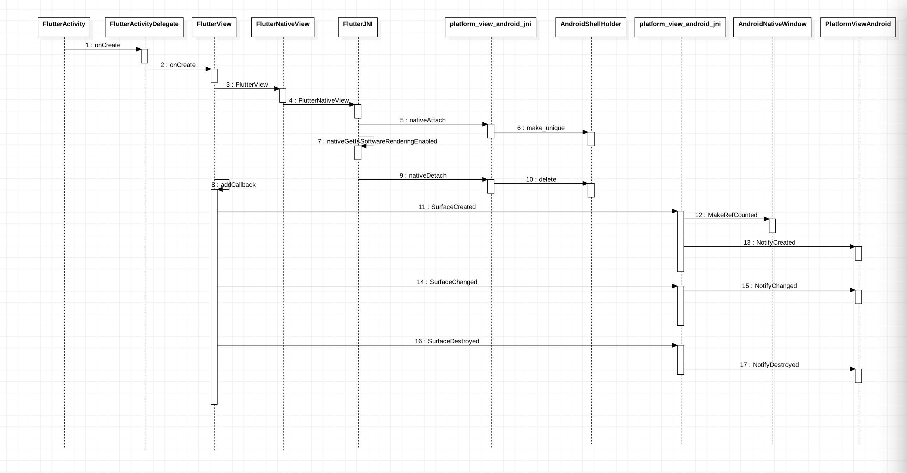

# FlutterActivityDelegate初始化UI相关的内容

FlutterUI提供了Flutter for Android 的包，`FlutterActivity`,`FlutterFragmentActivity`,在平台侧初始化Flutter engine中的信息，上一篇中分析了Dart文件加载Android侧的代码[Android加载Dart文件](../flutterAndroidInit)，第二步就是把Flutter相关的代码绘制出来，通过两个步骤初始化:`platform_view_android_jni.cc`这个类作为Android平台的UI调用的JNI接口

执行下述的三步操作，能够创建Flutter engine执行环境，传递Android端的SurfaceView给到Flutter engine，方便Flutter engine绘制相关的UI界面，执行完成上述步骤，Android侧的SurfaceView已经注入到flutter引擎中，后续的文件见控制上面两个步骤在flutter引擎中是如何工作。



## 1.调用的nativeAttach:

  * `io.flutter.embedding.engine.FlutterJNI`
  * `engine/src/flutter/shell/platform/android/platform_view_android_jni.cc`,初始化flutter engine 运行环境Platform，GPU，IO,UI,MessageLoop,初始化DartVM，加载第三方库，skia，ICU等，
  *  加载配置`//engine/src/flutter/common/settings.cc`

## 2.SurfaceView

   *  public void surfaceCreated(SurfaceHolder holder) {}
   *  public void surfaceChanged(SurfaceHolder holder, int format, int width, int height) {}
   *  public void surfaceDestroyed(SurfaceHolder holder) {}

## 3. nativeDetach

删除`engine/src/flutter/shell/platform/android/android_shell_holder.cc`清理运行环境



## FlutterActivityDelegate

使用代理类来处理相关的事件，Flutter是一个UI库

  * 初始化windown窗口
  * 获取Intent参数
  * 全部Flutter抽取完成
  * 初始化FlutterView,主要管理SurfaceView的初始化，注册系统事件
  * 添加SurfaceView到Activity窗口

```Java
public final class FlutterActivityDelegate implements FlutterActivityEvents, Provider, PluginRegistry {

    public void onCreate(Bundle savedInstanceState) {
        <!-- 判断平台特性，处理相关window逻辑 -->
        if (VERSION.SDK_INT >= 21) {
            Window window = this.activity.getWindow();
            window.addFlags(-2147483648);
            window.setStatusBarColor(1073741824);
            window.getDecorView().setSystemUiVisibility(1280);
        }
        <!-- 获取intent参数 -->
        String[] args = getArgsFromIntent(this.activity.getIntent());
        <!-- 全部Flutter相关的文件初始化完成 -->
        FlutterMain.ensureInitializationComplete(this.activity.getApplicationContext(), args);
        this.flutterView = this.viewFactory.createFlutterView(this.activity);
        if (this.flutterView == null) {
        <!-- FlutterNativeView主要用于FlutterView操作JIN的方法逻辑进行封装 -->
            FlutterNativeView nativeView = this.viewFactory.createFlutterNativeView();
            this.flutterView = new FlutterView(this.activity, (AttributeSet)null, nativeView);
            this.flutterView.setLayoutParams(matchParent);
            <!-- 添加SurfaceView到Activity窗口中 -->
            this.activity.setContentView(this.flutterView);
            <!-- 插件Flutter的启动界面 -->
            this.launchView = this.createLaunchView();
            if (this.launchView != null) {
                this.addLaunchView();
            }
        }

        if (!this.loadIntent(this.activity.getIntent())) {
            String appBundlePath = FlutterMain.findAppBundlePath(this.activity.getApplicationContext());
            if (appBundlePath != null) {
                this.runBundle(appBundlePath);
            }

        }
    }
```


### FlutterView

1.初始化DartExecutor执行相关的逻辑
2.负责处理FlutterUI相关的内容，创建SurfaceView提供给DartVM渲染FlutterUI代码
3.注册常规的Platform事件


```Java
public FlutterView(Context context, AttributeSet attrs, FlutterNativeView nativeView) {
    //FlutterNativeView FlutterUI与JNI传递信息的类，确保不为空
    if (nativeView == null) {
        this.mNativeView = new FlutterNativeView(activity.getApplicationContext());
    } else {
        this.mNativeView = nativeView;
    }

    this.dartExecutor = new DartExecutor(this.mNativeView.getFlutterJNI());
    <!-- 判断是否开启软件渲染 engine/src/flutter/common/settings.cc -->
    this.mIsSoftwareRenderingEnabled = FlutterJNI.nativeGetIsSoftwareRenderingEnabled();
    this.mAnimationScaleObserver = new FlutterView.AnimationScaleObserver(new Handler());
    this.mMetrics = new FlutterView.ViewportMetrics();
    <!-- mSurfaceCallback回调方法 -->
    this.mSurfaceCallback = new Callback() {
        public void surfaceCreated(SurfaceHolder holder) {
            FlutterView.this.assertAttached();
            FlutterView.this.mNativeView.getFlutterJNI().onSurfaceCreated(holder.getSurface());
        }

        public void surfaceChanged(SurfaceHolder holder, int format, int width, int height) {
            FlutterView.this.assertAttached();
            FlutterView.this.mNativeView.getFlutterJNI().onSurfaceChanged(width, height);
        }

        public void surfaceDestroyed(SurfaceHolder holder) {
            FlutterView.this.assertAttached();
            FlutterView.this.mNativeView.getFlutterJNI().onSurfaceDestroyed();
        }
    };
    <!-- 使用平台通道和Flutter engine进行通信 -->
    this.navigationChannel = new NavigationChannel(this.dartExecutor);
    this.keyEventChannel = new KeyEventChannel(this.dartExecutor);
    this.lifecycleChannel = new LifecycleChannel(this.dartExecutor);
    this.systemChannel = new SystemChannel(this.dartExecutor);
    this.settingsChannel = new SettingsChannel(this.dartExecutor);
    this.mFlutterLocalizationChannel = new MethodChannel(this, "flutter/localization", JSONMethodCodec.INSTANCE);
    PlatformPlugin platformPlugin = new PlatformPlugin(activity);
    MethodChannel flutterPlatformChannel = new MethodChannel(this, "flutter/platform", JSONMethodCodec.INSTANCE);
    flutterPlatformChannel.setMethodCallHandler(platformPlugin);
    this.addActivityLifecycleListener(platformPlugin);
    this.mImm = (InputMethodManager)this.getContext().getSystemService("input_method");
    this.mTextInputPlugin = new TextInputPlugin(this);
    this.androidKeyProcessor = new AndroidKeyProcessor(this.keyEventChannel);
    this.setLocales(this.getResources().getConfiguration());
    this.sendUserPlatformSettingsToDart();
}
```


### FlutterNativeView

构造函数中调用attach调用`FlutterJNI`中的nativeAttach调用JNI方法进入`platform_view_android_jni.cc`初始化`AndroidShellHolder`，FlutterNativeView主要处理UI和JNI层的逻辑，`FlutterJNI`,直接与JNI通信的逻辑，调用Attach对Flutter engine运行环境进行调用，初始化环境
```Java

public FlutterNativeView(Context context, boolean isBackgroundView) {
    this.mNextReplyId = 1;
    this.mPendingReplies = new HashMap();
    this.mContext = context;
    this.mPluginRegistry = new FlutterPluginRegistry(this, context);
    this.mFlutterJNI = new FlutterJNI();
    this.mFlutterJNI.setRenderSurface(new FlutterNativeView.RenderSurfaceImpl());
    this.mFlutterJNI.setPlatformMessageHandler(new FlutterNativeView.PlatformMessageHandlerImpl());
    this.mFlutterJNI.addEngineLifecycleListener(new FlutterNativeView.EngineLifecycleListenerImpl());
    <!-- 主要功能是初始化AndroidShellHolder的管理类 -->
    this.attach(this, isBackgroundView);
    this.assertAttached();
    this.mMessageHandlers = new HashMap();
}

```

### AndroidShellHolder

`engine/src/flutter/shell/platform/android/platform_view_android_jni.cc`,flutterView在初始化时完成`android_shell_holder`的初始化，方法注册进入JNI，主要的作用是对`AndroidShellHolder`进行初始

```C++
static jlong AttachJNI(JNIEnv* env,
                       jclass clazz,
                       jobject flutterJNI,
                       jboolean is_background_view) {
  fml::jni::JavaObjectWeakGlobalRef java_object(env, flutterJNI);
  // 初始化shellholder
  auto shell_holder = std::make_unique<AndroidShellHolder>(
      FlutterMain::Get().GetSettings(), java_object, is_background_view);
  if (shell_holder->IsValid()) {
    return reinterpret_cast<jlong>(shell_holder.release());
  } else {
    return 0;
  }
}
```
!!! WARNING "从这里开始就是初始化相关的环境，包括MessageLoop,Platform,GPU,UI,IO线程进行创建，加载第三方库，创建DartVM提供一个可以运行Dart代码的环境。后续文件回调Flutter Engine进行初始化进行扩展"

### FlutterView

本地SurfaceView初始化完成之后提供给FlutterUI绘制的接口，Flutter使用skia引擎绘制2D图像，把Platform相关的View注入到Flutter engine中提供可以绘制的UI给skia进行图像绘制

```Java

this.mSurfaceCallback = new Callback() {
  public void surfaceCreated(SurfaceHolder holder) {
      FlutterView.this.assertAttached();
      FlutterView.this.mNativeView.getFlutterJNI().onSurfaceCreated(holder.getSurface());
  }

  public void surfaceChanged(SurfaceHolder holder, int format, int width, int height) {
      FlutterView.this.assertAttached();
      FlutterView.this.mNativeView.getFlutterJNI().onSurfaceChanged(width, height);
  }

  public void surfaceDestroyed(SurfaceHolder holder) {
      FlutterView.this.assertAttached();
      FlutterView.this.mNativeView.getFlutterJNI().onSurfaceDestroyed();
  }
};

```
`engine/src/flutter/shell/platform/android/platform_view_android_jni.cc`,android本地Surface创建时调用android本地窗口进行绘制ANativeWindow_fromSurface,使用AnativeWindow本地接口提供给本地接口使用

```Java
static void SurfaceCreated(JNIEnv* env,
                           jobject jcaller,
                           jlong shell_holder,
                           jobject jsurface) {
  // Note: This frame ensures that any local references used by
  // ANativeWindow_fromSurface are released immediately. This is needed as a
  // workaround for https://code.google.com/p/android/issues/detail?id=68174
  fml::jni::ScopedJavaLocalFrame scoped_local_reference_frame(env);
  auto window = fml::MakeRefCounted<AndroidNativeWindow>(
      ANativeWindow_fromSurface(env, jsurface));
  ANDROID_SHELL_HOLDER->GetPlatformView()->NotifyCreated(std::move(window));
}


static void SurfaceChanged(JNIEnv* env,
                           jobject jcaller,
                           jlong shell_holder,
                           jint width,
                           jint height) {
  ANDROID_SHELL_HOLDER->GetPlatformView()->NotifyChanged(
      SkISize::Make(width, height));
}


static void SurfaceDestroyed(JNIEnv* env, jobject jcaller, jlong shell_holder) {
  ANDROID_SHELL_HOLDER->GetPlatformView()->NotifyDestroyed();
}

```

至此，Android端的View的初始化就已经完成，等待DartVM执行相关的代码来完成相关的绘制工作,Android端的 View 的初始化比较简单，后续再对JNI层的代码进行分析。
