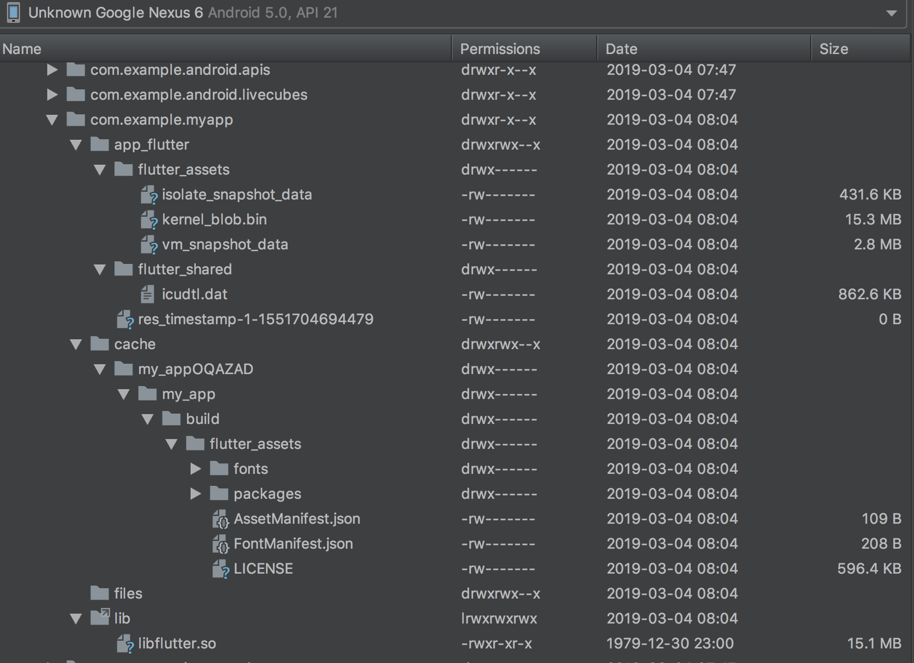

# Flutter 编译后的产物

Flutter本质上是什么？

Flutter运行在什么上面？

Flutter需不需要和Native有所交互？
a
Flutter的难点是什么，是界面开发吗？

Flutter的竞争对手是谁，它们占据绝对优势了吗？

Flutter是否会成为你的核心竞争力？

理解 Flutter 编译产物之前需要理解 `Flutter 的编译模式`。 任何语言在运行之前都需要编译，常见的编译模式如 `JIT 和 AOT`。JIT 可以在运行时即时编译，优势是可以动态下发和执行代码，劣势也是对应的会影响设备运行速度。AOT 即提前编译生成类 C 的二进制代码，优势是可以较快速度生成和执行平台代码，劣势就是需要提前知道对应平台的架构，甚至要为不同平台架构生成不同的代码。

JIT 编译后产物
Flutter 在代码编写阶段(Debug)是采用 JIT 方式编译代码，所有相关的 Dart 代码编译之后打包在 APK 下的 assets 目录下，是由对应的 libs 目录下的 .so 库中虚拟机执行。

libs 目录下对应的不同架构平台的 Flutter 执行虚拟机；

另外 assets 目录下 kernel_blob.bin 是 Flutter 引擎的底层接口和 Dart 语言基本功能部分代码；

platform.dill 则是实现了 Flutter 页面逻辑的代码，也包括 Flutter Framework 和其他由 pub 依赖的库代码，和 Dart VM 相关的 kernel 代码，仅和 Dart 版本以及 engine 编译版本有关。固定。

AOT 编译后产物
Flutter 在 Release 模式下关闭了所有调试信息和断言，包的大小都做了优化。

FLutter 在 Release 模式下采用 AOT 模式，solate_snapshot_data、vm_snapshot_data、isolate_snapshot_instr、vm_snapshot_instr。对比 JIT 模式下，不认识的产物有：isolate_snapshot_instr 和 vm_snapshot_instr，其实它俩代表着 VM 和 isolate 启动后所承载的指令等数据。在载入后，直接将该块内存执行即可；

snapshot 文件由 Flutter SDK 中的 flutter/bin/cache/artifacts/engine/android-arm-release/darwin-x64/gen_snapshot 命令生成，vmsnapshot* 是 Dart 虚拟机运行所需要的数据和代码指令，isolatesnapshot* 则是每个 isolate 运行所需要的数据和代码指令。

理解 Flutter 编译产物的性质，有助于我们更加方便的集成 Flutter/Dart 运行时或者 Debug 时所需要的依赖到现有 Android / iOS 工程中，从而更加方便的模块化开发。

#  Android 代码加载Flutter文件
Flutter在开发完成之后会打包到apk中，最终和apk一起发布，下载安装之后App启动的时候是如何启动flutter的代码？？

## Apk打包之后生成相关的文件
APK 中Flutter中打包，相关文件位置:

## Apk安装到手机上之后生成的文件
Apk安装到手机上之后，拷贝相关的文件到目录中:

## 拷贝Flutter相关的代码，并且启动flutter：`flutter.jar`

# Android Apk 运行时加载Flutter代码
# Flutter调用Android原生接口
