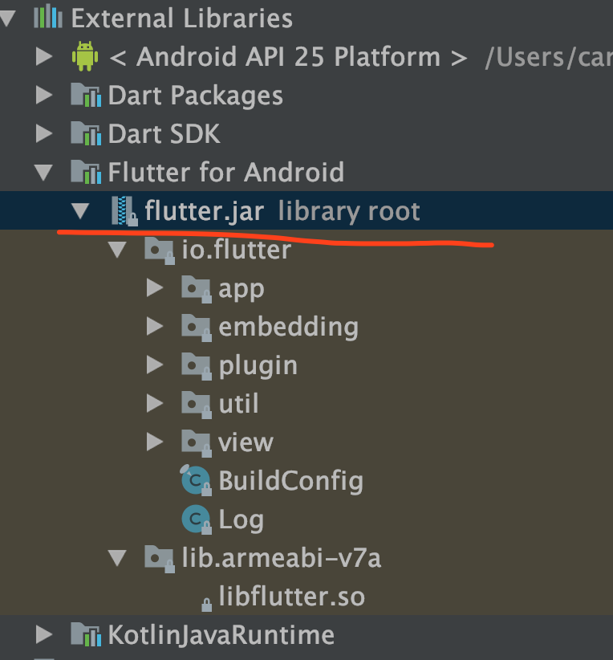
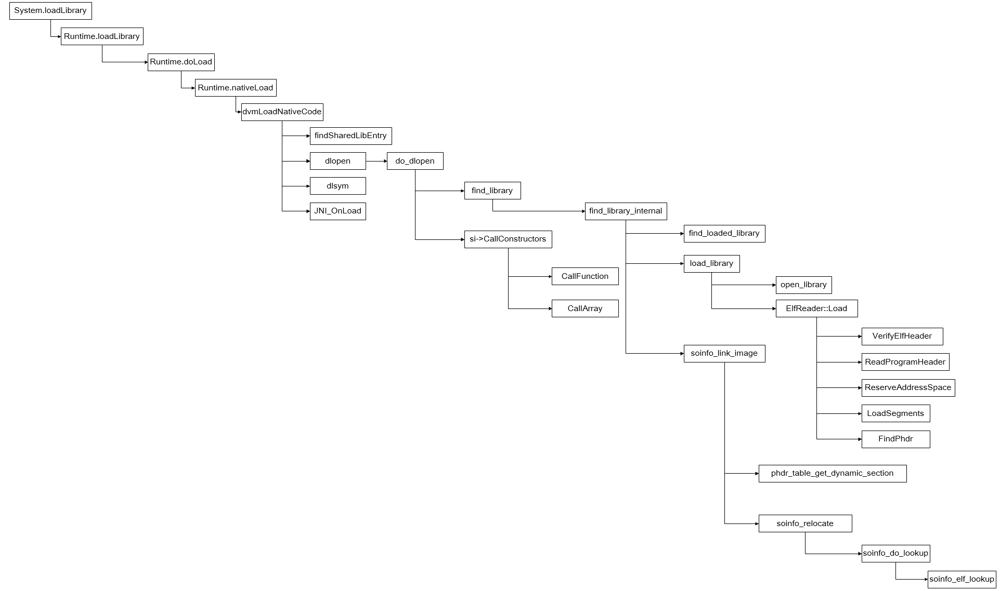

# Android启动加载Flutter流程


## Android初始化

Flutter Engine编译完成之后会生成一个`FlutterJar`包,提供给Android和Flutter代码交互的过程


Flutter代码在Android端代码启动时，是如何加载相关的Dart代码，进行执行，最终在手机端是如何显示出来的

!!! info "Android初始化过程"

    * 1.Android Application启动
    * 2.FlutterMain类初始化Flutter相关的文件，请查看flutter的Apk包中的文件结构
    * 3.抽取Apk包中的Flutter相关的资源
    * 4.System.loadLibrary(“flutter”)加载`libflutter.so` 引擎文件
    * 5.JNI第一次加载so库时，会自动调用JNI_OnLoad方法,关联Flutter java平台代码到JNI中
    * 6.在FlutterMain.cc中调用`Init()`初始化在java端抽取的flutter代码，把相关的文件路径传递到JNI中，进行初始化，JNI层可以读取的文件路径


## Application中进行初始化：

!!! info "STEP"

    * 1.Application中调用FlutterMain.startInitialization(this);
    * 2.初始化配置文件的路径和文件名配置，方便读取不同位置的flutter文件
    * 3.抽取Aot优化过的代码
    * 4.加载资源文件到资源查找路径中
    * 5.加载so库:System.loadLibrary("flutter");
    * 6.FlutterActivity:对View、事件一系列动作的初始化

android应用启动Application初始化Dart相关的代码


## 初始化Flutter文件

### Application启动Flutter.jar进行初始化

```java
public class FlutterApplication extends Application {
    private Activity mCurrentActivity = null;

    public FlutterApplication() {
    }

    @CallSuper
    public void onCreate() {
        super.onCreate();
        FlutterMain.startInitialization(this);
    }

    public Activity getCurrentActivity() {
        return this.mCurrentActivity;
    }

    public void setCurrentActivity(Activity mCurrentActivity) {
        this.mCurrentActivity = mCurrentActivity;
    }
}
```

### 抽取Flutter相关代码，加载Flutter.so库
flutter在apk中的文件需要加载才能够运行dart代码

1.初始化配置文件
2.抽象相关的代码Apk包Asset目录中的数据抽取到apk包下的目录中
3.System.loadLibrary("flutter");初始化so库

```java
public void startInitialization(@NonNull Context applicationContext, @NonNull FlutterLoader.Settings settings) {
    if (this.settings == null) {
        if (Looper.myLooper() != Looper.getMainLooper()) {
            throw new IllegalStateException("startInitialization must be called on the main thread");
        } else {
            this.settings = settings;
            long initStartTimestampMillis = SystemClock.uptimeMillis();
            this.initConfig(applicationContext);
            this.initResources(applicationContext);
            System.loadLibrary("flutter");
            VsyncWaiter.getInstance((WindowManager)applicationContext.getSystemService("window")).init();
            long initTimeMillis = SystemClock.uptimeMillis() - initStartTimestampMillis;
            FlutterJNI.nativeRecordStartTimestamp(initTimeMillis);
        }
    }
}
```

初始化配置文件，在apk包安装到手机之后，在apk的目录下可以找,初始化查找的路径

```java
private void initConfig(@NonNull Context applicationContext) {
    Bundle metadata = this.getApplicationInfo(applicationContext).metaData;
    if (metadata != null) {
        this.aotSharedLibraryName = metadata.getString(PUBLIC_AOT_SHARED_LIBRARY_NAME, "libapp.so");
        this.flutterAssetsDir = metadata.getString(PUBLIC_FLUTTER_ASSETS_DIR_KEY, "flutter_assets");
        this.vmSnapshotData = metadata.getString(PUBLIC_VM_SNAPSHOT_DATA_KEY, "vm_snapshot_data");
        this.isolateSnapshotData = metadata.getString(PUBLIC_ISOLATE_SNAPSHOT_DATA_KEY, "isolate_snapshot_data");
    }
}
```

apk是一个文件压缩包，flutter代码发在apk包中的Assert中，需要出去出来发在apk的安装目录中，通过`ExtractTask`类解析抽取，`AssetManager`管理器可以抽取出相关的Flutter代码，会根据目录下的时间戳文件来判断文件是否已经被抽取过`res_timestamp`
```java
    private void initResources(@NonNull Context applicationContext) {
        (new ResourceCleaner(applicationContext)).start();
        String dataDirPath = PathUtils.getDataDirectory(applicationContext);
        String packageName = applicationContext.getPackageName();
        PackageManager packageManager = applicationContext.getPackageManager();
        AssetManager assetManager = applicationContext.getResources().getAssets();
        this.resourceExtractor = new ResourceExtractor(dataDirPath, packageName, packageManager, assetManager);
        this.resourceExtractor.addResource(this.fullAssetPathFrom(this.vmSnapshotData)).addResource(this.fullAssetPathFrom(this.isolateSnapshotData)).addResource(this.fullAssetPathFrom("kernel_blob.bin"));
        this.resourceExtractor.start();
    }
```
到目前为止只是android在启动时进行静态的加载数据，

### 初始化UI界面、Plug，事件监听回调方法

1.在主线程中初始化Flutter文件的安装路径
2.`FlutterLoader`主要负责抽取Flutter的相关文件到从apk包中的asset文件夹下抽取到安装目录文件下

FlutterEngine是一个so库，只有加载到Java的执行路径中才能初始化Dart虚拟机，提供Dart运行的环境，在接下来的文章中将一些分析FlutterEngine初始化过程，在Android中Application启动完成，已经初始化进程之后，就可以开启Activity，在清单文件中配置的启动Activity类继承了`FlutterActivity`

1.初始化Androidwindow属性，提供一个全屏状态个Flutter来使用
2.等待Flutter引擎初始化完成
3.createFlutterView 提供给开发者自己定义Flutter SurfaceView的机制
4.如果`createFlutterView`用户没有定制，那么使用系统默认的SurfaceView
5.`FlutterView`提供了面向用户操作的类，`FlutterNativeView`提供了Android代码和Flutter的互操作机制
6.调用`setContentView`添加SurfaceView
7.添加第一帧到系统，可以避免Flutter初始化的时候出现白屏现象

经过上面的初始化过程，已经初始化完成UI界面，但是还有Flutter.so文件的加载工作还没有完成


```java
public void onCreate(Bundle savedInstanceState) {
    if (VERSION.SDK_INT >= 21) {
        Window window = this.activity.getWindow();
        window.addFlags(-2147483648);
        window.setStatusBarColor(1073741824);
        window.getDecorView().setSystemUiVisibility(1280);
    }

    String[] args = getArgsFromIntent(this.activity.getIntent());
    加载flutter.so库，通过FlutterJNI.nativeInit方法
    FlutterMain.ensureInitializationComplete(this.activity.getApplicationContext(), args);
    this.flutterView = this.viewFactory.createFlutterView(this.activity);
    if (this.flutterView == null) {
        FlutterNativeView nativeView = this.viewFactory.createFlutterNativeView();
        this.flutterView = new FlutterView(this.activity, (AttributeSet)null, nativeView);
        this.flutterView.setLayoutParams(matchParent);
        this.activity.setContentView(this.flutterView);
        this.launchView = this.createLaunchView();
        if (this.launchView != null) {
            this.addLaunchView();
        }
    }

    if (!this.loadIntent(this.activity.getIntent())) {
        String appBundlePath = FlutterMain.findAppBundlePath();
        if (appBundlePath != null) {
            this.runBundle(appBundlePath);
        }

    }
}
```
FlutterView初始化时需要加载Flutter相关的资源

1.初始化`FlutterNativeView`监听`Flutter.so`库的事件监听，加载，卸载so库的事件
    `FlutterPluginRegistry`:注册系统层级的插件管理对象
    `DartExecutor`:真正的管理FlutterAndroid侧的插件绑定及解绑定,事件级别的的处理
    `FlutterJNI`:监听Flutter侧回调Android端的代码逻辑，so库层级的事件处理
    `FlutterUiDisplayListener`:Flutter初始化完成之后会回到到Android端的UI改变监听
2.
```java
public FlutterView(Context context, AttributeSet attrs, FlutterNativeView nativeView) {
    super(context, attrs);
    this.nextTextureId = new AtomicLong(0L);
    this.mIsSoftwareRenderingEnabled = false;
    this.didRenderFirstFrame = false;
    this.onAccessibilityChangeListener = new OnAccessibilityChangeListener() {
        public void onAccessibilityChanged(boolean isAccessibilityEnabled, boolean isTouchExplorationEnabled) {
            FlutterView.this.resetWillNotDraw(isAccessibilityEnabled, isTouchExplorationEnabled);
        }
    };
    Activity activity = getActivity(this.getContext());
    if (activity == null) {
        throw new IllegalArgumentException("Bad context");
    } else {
        if (nativeView == null) {
            this.mNativeView = new FlutterNativeView(activity.getApplicationContext());
        } else {
            this.mNativeView = nativeView;
        }

        this.dartExecutor = this.mNativeView.getDartExecutor();
        this.flutterRenderer = new FlutterRenderer(this.mNativeView.getFlutterJNI());
        this.mIsSoftwareRenderingEnabled = this.mNativeView.getFlutterJNI().nativeGetIsSoftwareRenderingEnabled();
        this.mMetrics = new FlutterView.ViewportMetrics();
        this.mMetrics.devicePixelRatio = context.getResources().getDisplayMetrics().density;
        this.setFocusable(true);
        this.setFocusableInTouchMode(true);
        this.mNativeView.attachViewAndActivity(this, activity);
        this.mSurfaceCallback = new Callback() {
            public void surfaceCreated(SurfaceHolder holder) {
                FlutterView.this.assertAttached();
                FlutterView.this.mNativeView.getFlutterJNI().onSurfaceCreated(holder.getSurface());
            }

            public void surfaceChanged(SurfaceHolder holder, int format, int width, int height) {
                FlutterView.this.assertAttached();
                FlutterView.this.mNativeView.getFlutterJNI().onSurfaceChanged(width, height);
            }

            public void surfaceDestroyed(SurfaceHolder holder) {
                FlutterView.this.assertAttached();
                FlutterView.this.mNativeView.getFlutterJNI().onSurfaceDestroyed();
            }
        };
        this.getHolder().addCallback(this.mSurfaceCallback);
        this.mActivityLifecycleListeners = new ArrayList();
        this.mFirstFrameListeners = new ArrayList();
        注册系统级别的插件监听
        this.navigationChannel = new NavigationChannel(this.dartExecutor);
        this.keyEventChannel = new KeyEventChannel(this.dartExecutor);
        this.lifecycleChannel = new LifecycleChannel(this.dartExecutor);
        this.localizationChannel = new LocalizationChannel(this.dartExecutor);
        this.platformChannel = new PlatformChannel(this.dartExecutor);
        this.systemChannel = new SystemChannel(this.dartExecutor);
        this.settingsChannel = new SettingsChannel(this.dartExecutor);
        final PlatformPlugin platformPlugin = new PlatformPlugin(activity, this.platformChannel);
        this.addActivityLifecycleListener(new ActivityLifecycleListener() {
            public void onPostResume() {
                platformPlugin.updateSystemUiOverlays();
            }
        });
        this.mImm = (InputMethodManager)this.getContext().getSystemService("input_method");
        PlatformViewsController platformViewsController = this.mNativeView.getPluginRegistry().getPlatformViewsController();
        this.mTextInputPlugin = new TextInputPlugin(this, this.dartExecutor, platformViewsController);
        this.androidKeyProcessor = new AndroidKeyProcessor(this.keyEventChannel, this.mTextInputPlugin);
        this.androidTouchProcessor = new AndroidTouchProcessor(this.flutterRenderer);
        this.mNativeView.getPluginRegistry().getPlatformViewsController().attachTextInputPlugin(this.mTextInputPlugin);
        this.sendLocalesToDart(this.getResources().getConfiguration());
        this.sendUserPlatformSettingsToDart();
    }
}
```


## SurfaceView事件和FlutterEngine事件

在Android端进行SurfaceView进行初始化时，SurfaceView的回到函数中，通过`FlutterJNI`类中的本地方法和JNI层中的方法进行绑定，FlutterEngine在进行Flutter的渲染时，就可以传递相关的Surface给Android平台进行渲染显示

```java
this.mSurfaceCallback = new Callback() {
    public void surfaceCreated(SurfaceHolder holder) {
        FlutterView.this.assertAttached();
        FlutterView.this.mNativeView.getFlutterJNI().onSurfaceCreated(holder.getSurface());
    }

    public void surfaceChanged(SurfaceHolder holder, int format, int width, int height) {
        FlutterView.this.assertAttached();
        FlutterView.this.mNativeView.getFlutterJNI().onSurfaceChanged(width, height);
    }

    public void surfaceDestroyed(SurfaceHolder holder) {
        FlutterView.this.assertAttached();
        FlutterView.this.mNativeView.getFlutterJNI().onSurfaceDestroyed();
    }
};

```

## FlutterMain

调用Flutter for android 库初始化Flutter相关的文件

1.`FlutterMain.startInitialization(this);`

2.`System.loadLibrary('flutter')`加载so

在engine中调用engine/src/flutter/shell/platform/android/library_loader.cc，JNI中的代码初始化:

!!! info "主要完成三件事"

    * 1.初始化FlutterMain作为JNI层回调的类

    * 2.初始化平台事件的处理类

    * 3.初始化UI绘制Sync信号的传递

## System.loadLibrary 调用过程
在Flutter.jar初始化时，调用System.loadLibrary 查找解压出来的Flutter.so文件，调用dlopen打开打开so库，加载C++相关的资源，加载完成后调用JNI_OnLoad,具体调用过程参考下图，当调用`JNI_OnLoad`完成后so库以及提供了可以运行的函数，接下来就是初始化Flutter相关的代码和业务逻辑


## JNI_OnLoad

JNI中对应相关的类进行初始化

  * 第一次加载so库时，调用当前的方法，完成一下三件事:

  * 注册Java层代码到JNI层，方便后续的回调Java层代码

  * engine/src/flutter/shell/platform/android/flutter_main.cc

  * /src/flutter/shell/platform/android/io/flutter/view/FlutterView.java

初始化相关的平台View的事件处理逻辑

```c++

JNIEXPORT jint JNI_OnLoad(JavaVM* vm, void* reserved) {
  // Initialize the Java VM.
  fml::jni::InitJavaVM(vm);

  JNIEnv* env = fml::jni::AttachCurrentThread();
  bool result = false;

  // Register FlutterMain.
  result = shell::FlutterMain::Register(env);
  FML_CHECK(result);

  // Register PlatformView
  // 处理平台的UI/事件相关的内容，生命周期的管理，后台执行
  result = shell::PlatformViewAndroid::Register(env);
  FML_CHECK(result);

  // Register VSyncWaiter.
  // 真正处理相关的UI绘制事件
  result = shell::VsyncWaiterAndroid::Register(env);
  FML_CHECK(result);

  return JNI_VERSION_1_4;
}
```

## FlutterMain::Register(env)

在library_loader库中进行组成,编译engine回调java成代码

      bool FlutterMain::Register(JNIEnv* env) {
      static const JNINativeMethod methods[] = {
          {
              .name = "nativeInit",
              .signature = "(Landroid/content/Context;[Ljava/lang/String;Ljava/"
                           "lang/String;Ljava/lang/String;Ljava/lang/String;)V",
              .fnPtr = reinterpret_cast<void*>(&Init),
          },
          {
              .name = "nativeRecordStartTimestamp",
              .signature = "(J)V",
              .fnPtr = reinterpret_cast<void*>(&RecordStartTimestamp),
          },
      };

      jclass clazz = env->FindClass("io/flutter/view/FlutterMain");

      if (clazz == nullptr) {
        return false;
      }

      return env->RegisterNatives(clazz, methods, arraysize(methods)) == 0;
      }
## Shell

result = shell::PlatformViewAndroid::Register(env);对应java层事件的处理 `/engine/src/flutter/shell/platform/android/platform_view_android.h`

```C++
class PlatformViewAndroid final : public PlatformView {

    <!-- 没有对Register进行初始化 -->
    public:
    static bool Register(JNIEnv* env);
```

## VsyncWaiterAndroid

VsyncWaiterAndroid::Register(env);处理相关的frame rate问题，同步平台层的事件和dart UI的事件更新,JNI回调Java层的代码`io/flutter/view/VsyncWaiter`,Android平台层对帧率的控制使用的类：`android.view.Choreographer`

```C++
// 对应flutter for android 库中的：io.flutter.view.VsyncWaiter
//
bool VsyncWaiterAndroid::Register(JNIEnv* env) {
  static const JNINativeMethod methods[] = {{
      .name = "nativeOnVsync",
      .signature = "(JJJ)V",
      .fnPtr = reinterpret_cast<void*>(&OnNativeVsync),
  }};

  jclass clazz = env->FindClass("io/flutter/view/VsyncWaiter");

  if (clazz == nullptr) {
    return false;
  }

  g_vsync_waiter_class = new fml::jni::ScopedJavaGlobalRef<jclass>(env, clazz);

  FML_CHECK(!g_vsync_waiter_class->is_null());

  g_async_wait_for_vsync_method_ = env->GetStaticMethodID(
      g_vsync_waiter_class->obj(), "asyncWaitForVsync", "(J)V");

  FML_CHECK(g_async_wait_for_vsync_method_ != nullptr);

  return env->RegisterNatives(clazz, methods, arraysize(methods)) == 0;
}
```


## flutter_main::nativeInit

apk中文件抽取完成之后处理初始化JNI中的代码，加载flutter相关的文件代码，io/flutter/view/FlutterMain.class ,`nativeInit(applicationContext, (String[])shellArgs.toArray(new String[0]), appBundlePath, appStoragePath, engineCachesPath);`,初始化完成之后十里河

nativeInit()
在Java层可以使用相关的命令传递相关的参数
Java层中apk文件抽取完成后初始化参数信息，
主要是传递相关的初始化参数到JNI层，方便加载相关的文件 初始化Flutter路径信息
```Java
void FlutterMain::Init(JNIEnv* env,
                       jclass clazz,
                       jobject context,
                       jobjectArray jargs,
                       jstring bundlePath,
                       jstring appStoragePath,
                       jstring engineCachesPath) {
  std::vector<std::string> args;
  args.push_back("flutter");
  for (auto& arg : fml::jni::StringArrayToVector(env, jargs)) {
    args.push_back(std::move(arg));
  }
  // 初始化命令行参数
  auto command_line = fml::CommandLineFromIterators(args.begin(), args.end());

  auto settings = SettingsFromCommandLine(command_line);

  // 初始化资源目录结构
  settings.assets_path = fml::jni::JavaStringToString(env, bundlePath);

  // Restore the callback cache.
  // TODO(chinmaygarde): Route all cache file access through FML and remove this
  // setter.
  // 设置缓存目录
  blink::DartCallbackCache::SetCachePath(
      fml::jni::JavaStringToString(env, appStoragePath));
  // 初始化Android缓存目录
  fml::paths::InitializeAndroidCachesPath(
      fml::jni::JavaStringToString(env, engineCachesPath));
  // 从磁盘加载缓存数据
  blink::DartCallbackCache::LoadCacheFromDisk();

  // 如何运行时配置文件路径
  if (!blink::DartVM::IsRunningPrecompiledCode()) {
    // Check to see if the appropriate kernel files are present and configure
    // settings accordingly.
    auto application_kernel_path =
        fml::paths::JoinPaths({settings.assets_path, "kernel_blob.bin"});

    if (fml::IsFile(application_kernel_path)) {
      settings.application_kernel_asset = application_kernel_path;
    }
  }
  // 添加回调进入消息队列
  settings.task_observer_add = [](intptr_t key, fml::closure callback) {
    fml::MessageLoop::GetCurrent().AddTaskObserver(key, std::move(callback));
  };
  // 移除消息队列
  settings.task_observer_remove = [](intptr_t key) {
    fml::MessageLoop::GetCurrent().RemoveTaskObserver(key);
  };

#if FLUTTER_RUNTIME_MODE == FLUTTER_RUNTIME_MODE_DEBUG
  // There are no ownership concerns here as all mappings are owned by the
  // embedder and not the engine.
  auto make_mapping_callback = [](const uint8_t* mapping, size_t size) {
    return [mapping, size]() {
      return std::make_unique<fml::NonOwnedMapping>(mapping, size);
    };
  };

  settings.dart_library_sources_kernel =
      make_mapping_callback(kPlatformStrongDill, kPlatformStrongDillSize);
#endif  // FLUTTER_RUNTIME_MODE == FLUTTER_RUNTIME_MODE_DEBUG

  // Not thread safe. Will be removed when FlutterMain is refactored to no
  // longer be a singleton.
  g_flutter_main.reset(new FlutterMain(std::move(settings)));
}
```

执行到这个地方，Apk中的文件已经抽取完成，回调方法，回调事件已经完成,路径的初始化信息已经初始化


## 总结

通过上面的分析，已经初始化完成Flutter和Android的调用逻辑，通过上面的分析，总结一下Flutter初始化的大概逻辑

1.App启动，在Application中调用`FlutterMain`中的`startInitialization`方法，完成路径的配置，flutter代码的抽取，加载Flutter.so库

2.开始初始化Activity中的UI界面和绑定Android和Flutter通信，回调等一系列的操作`FlutterActivityDelegate`中完成

3.在``中调用`nativeInit`方法初始化`Flutter.so`库进行DartVM的初始化操作

4.`Flutter.so`库加载时调用`JNI_OnLoad`方法中初始化`FlutterMain`作为Android端的调用入口

5.初始化`PlatformViewAndroid`,Android端和FlutterView通信交互的入口

6.Flutter.so初始化完成Engine相关的资源之后，在`FlutterLoader.class`中调用`nativeInit`方法初始化

7.通过`FlutterJNI`中的`nativeAttach`方法初始化`Flutter.so`开始绑定Android端和Flutter相关的事件回调

8.在Android端进行SurfaceView进行初始化时，SurfaceView的回到函数`Callback`中，通过`FlutterJNI`类中的本地方法和JNI层中的方法进行绑定，FlutterEngine在进行Flutter的渲染时，就可以传递相关的Surface给Android平台进行渲染显示

至此，Android端启动、加载Flutter资源、初始化FlutterEngine，绑定SurfaceView和FlutterEngine引擎的对象，注册系统级别的插件功能，已经初始化完成，下一篇中我们将，分析FlutterEngine引擎是怎么初始化的，毕竟要在手机上看到Flutter引擎代码的显示
