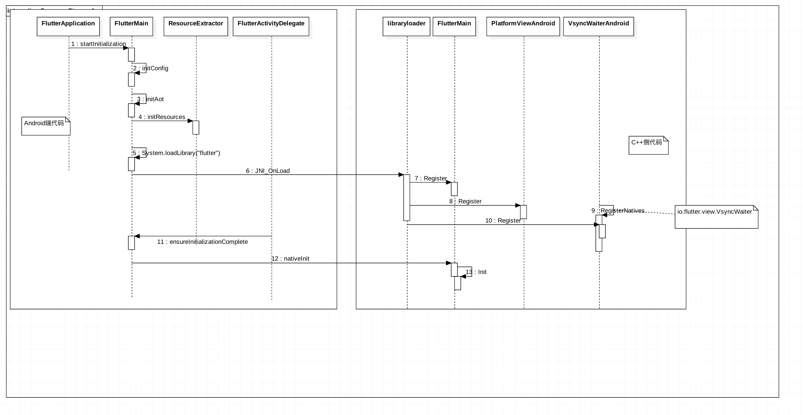

# Fluttr在Android代码启动是初始化Flutter，libflutter.so流程

## Android初始化

Flutter代码在Android端代码启动时，是如何加载相关的Dart代码，进行执行，最终在手机端是如何显示出来的

!!! info "Android初始化过程"

    * 1.Android Application启动
    * 2.FlutterMain类初始化Flutter相关的文件，请查看flutter的Apk包中的文件结构
    * 3.抽取Apk包中的Flutter相关的资源
    * 4.System.loadLibrary(“flutter”)加载`libflutter.so` 引擎文件
    * 5.JNI第一次加载so库时，会自动调用JNI_OnLoad方法,关联Flutter java平台代码到JNI中
    * 6.在FlutterMain.cc中调用`Init()`初始化在java端抽取的flutter代码，把相关的文件路径传递到JNI中，进行初始化，JNI层可以读取的文件路径



### Application中进行初始化：

!!! info "STEP"

    * 1.Application中调用FlutterMain.startInitialization(this);
    * 2.初始化配置文件的路径和文件名配置，方便读取不同位置的flutter文件
    * 3.抽取Aot优化过的代码
    * 4.加载资源文件到资源查找路径中
    * 5.加载so库:System.loadLibrary("flutter");
    * 6.FlutterActivity:对View、事件一系列动作的初始化

android应用启动Application初始化Dart相关的代码

```java
public class FlutterApplication extends Application {
    private Activity mCurrentActivity = null;

    public FlutterApplication() {
    }

    @CallSuper
    public void onCreate() {
        super.onCreate();
        FlutterMain.startInitialization(this);
    }

    public Activity getCurrentActivity() {
        return this.mCurrentActivity;
    }

    public void setCurrentActivity(Activity mCurrentActivity) {
        this.mCurrentActivity = mCurrentActivity;
    }
}
```

## FlutterMain

调用Flutter for android 库初始化Flutter相关的文件

1.`FlutterMain.startInitialization(this);`

2.`System.loadLibrary('flutter')`加载so

在engine中调用engine/src/flutter/shell/platform/android/library_loader.cc，JNI中的代码初始化:

!!! info "主要完成三件事"

    * 1.初始化FlutterMain作为JNI层回调的类

    * 2.初始化平台事件的处理类

    * 3.初始化UI绘制Sync信号的传递


## JNI_OnLoad

JNI中对应相关的类进行初始化

  * 第一次加载so库时，调用当前的方法，完成一下三件事:

  * 注册Java层代码到JNI层，方便后续的回调Java层代码

  * engine/src/flutter/shell/platform/android/flutter_main.cc

  * /src/flutter/shell/platform/android/io/flutter/view/FlutterView.java

初始化相关的平台View的事件处理逻辑

```c++

JNIEXPORT jint JNI_OnLoad(JavaVM* vm, void* reserved) {
  // Initialize the Java VM.
  fml::jni::InitJavaVM(vm);

  JNIEnv* env = fml::jni::AttachCurrentThread();
  bool result = false;

  // Register FlutterMain.
  result = shell::FlutterMain::Register(env);
  FML_CHECK(result);

  // Register PlatformView
  // 处理平台的UI/事件相关的内容，生命周期的管理，后台执行
  result = shell::PlatformViewAndroid::Register(env);
  FML_CHECK(result);

  // Register VSyncWaiter.
  // 真正处理相关的UI绘制事件
  result = shell::VsyncWaiterAndroid::Register(env);
  FML_CHECK(result);

  return JNI_VERSION_1_4;
}
```

## FlutterMain::Register(env)

在library_loader库中进行组成,编译engine回调java成代码

      bool FlutterMain::Register(JNIEnv* env) {
      static const JNINativeMethod methods[] = {
          {
              .name = "nativeInit",
              .signature = "(Landroid/content/Context;[Ljava/lang/String;Ljava/"
                           "lang/String;Ljava/lang/String;Ljava/lang/String;)V",
              .fnPtr = reinterpret_cast<void*>(&Init),
          },
          {
              .name = "nativeRecordStartTimestamp",
              .signature = "(J)V",
              .fnPtr = reinterpret_cast<void*>(&RecordStartTimestamp),
          },
      };

      jclass clazz = env->FindClass("io/flutter/view/FlutterMain");

      if (clazz == nullptr) {
        return false;
      }

      return env->RegisterNatives(clazz, methods, arraysize(methods)) == 0;
      }
## Shell

result = shell::PlatformViewAndroid::Register(env);对应java层事件的处理 `/engine/src/flutter/shell/platform/android/platform_view_android.h`

```C++
class PlatformViewAndroid final : public PlatformView {

    <!-- 没有对Register进行初始化 -->
    public:
    static bool Register(JNIEnv* env);
```

## VsyncWaiterAndroid

VsyncWaiterAndroid::Register(env);处理相关的frame rate问题，同步平台层的事件和dart UI的事件更新,JNI回调Java层的代码`io/flutter/view/VsyncWaiter`,Android平台层对帧率的控制使用的类：`android.view.Choreographer`

```C++
// 对应flutter for android 库中的：io.flutter.view.VsyncWaiter
//
bool VsyncWaiterAndroid::Register(JNIEnv* env) {
  static const JNINativeMethod methods[] = {{
      .name = "nativeOnVsync",
      .signature = "(JJJ)V",
      .fnPtr = reinterpret_cast<void*>(&OnNativeVsync),
  }};

  jclass clazz = env->FindClass("io/flutter/view/VsyncWaiter");

  if (clazz == nullptr) {
    return false;
  }

  g_vsync_waiter_class = new fml::jni::ScopedJavaGlobalRef<jclass>(env, clazz);

  FML_CHECK(!g_vsync_waiter_class->is_null());

  g_async_wait_for_vsync_method_ = env->GetStaticMethodID(
      g_vsync_waiter_class->obj(), "asyncWaitForVsync", "(J)V");

  FML_CHECK(g_async_wait_for_vsync_method_ != nullptr);

  return env->RegisterNatives(clazz, methods, arraysize(methods)) == 0;
}
```


## Java层对应的代码

```Java
public static void startInitialization(Context applicationContext, FlutterMain.Settings settings) {
<!-- 确保在主线程调用初始化 -->
if (Looper.myLooper() != Looper.getMainLooper()) {
    throw new IllegalStateException("startInitialization must be called on the main thread");
} else if (sSettings == null) {
    sSettings = settings;
    long initStartTimestampMillis = SystemClock.uptimeMillis();
    <!-- 1.初始化配置文件 -->
    initConfig(applicationContext);
    <!-- 2.获取Dart优化的代码文件 -->
    initAot(applicationContext);
    <!-- 3.初始化资源文件 -->
    initResources(applicationContext);
    <!-- 4.加载so库文件 -->
    System.loadLibrary("flutter");
    long initTimeMillis = SystemClock.uptimeMillis() - initStartTimestampMillis;
    nativeRecordStartTimestamp(initTimeMillis);
}
}
```

### 1.初始化配置文件

```Java
private static void initConfig(Context applicationContext) {
    try {
        Bundle metadata = applicationContext.getPackageManager().getApplicationInfo(applicationContext.getPackageName(), 128).metaData;
        if (metadata != null) {
            sAotSharedLibraryPath = metadata.getString(PUBLIC_AOT_AOT_SHARED_LIBRARY_PATH, "app.so");
            sAotVmSnapshotData = metadata.getString(PUBLIC_AOT_VM_SNAPSHOT_DATA_KEY, "vm_snapshot_data");
            sAotVmSnapshotInstr = metadata.getString(PUBLIC_AOT_VM_SNAPSHOT_INSTR_KEY, "vm_snapshot_instr");
            sAotIsolateSnapshotData = metadata.getString(PUBLIC_AOT_ISOLATE_SNAPSHOT_DATA_KEY, "isolate_snapshot_data");
            sAotIsolateSnapshotInstr = metadata.getString(PUBLIC_AOT_ISOLATE_SNAPSHOT_INSTR_KEY, "isolate_snapshot_instr");
            sFlx = metadata.getString(PUBLIC_FLX_KEY, "app.flx");
            sFlutterAssetsDir = metadata.getString(PUBLIC_FLUTTER_ASSETS_DIR_KEY, "flutter_assets");
        }

    } catch (NameNotFoundException var2) {
        throw new RuntimeException(var2);
    }
}
```

### 2.获取包中的Dart优化后的代码资源文件

```Java
private static void initAot(Context applicationContext) {
  Set<String> assets = listAssets(applicationContext, "");
  sIsPrecompiledAsBlobs = assets.containsAll(Arrays.asList(sAotVmSnapshotData, sAotVmSnapshotInstr, sAotIsolateSnapshotData, sAotIsolateSnapshotInstr));
  sIsPrecompiledAsSharedLibrary = assets.contains(sAotSharedLibraryPath);
  if (sIsPrecompiledAsBlobs && sIsPrecompiledAsSharedLibrary) {
      throw new RuntimeException("Found precompiled app as shared library and as Dart VM snapshots.");
  }
}
```

### 3.获取资源文件

```Java
private static void initResources(Context applicationContext) {
    Context context = applicationContext;
    (new ResourceCleaner(applicationContext)).start();
    Bundle metaData = null;

    try {
        metaData = context.getPackageManager().getApplicationInfo(context.getPackageName(), 128).metaData;
    } catch (NameNotFoundException var4) {
        Log.e("FlutterMain", "Unable to read application info", var4);
    }

    if (metaData != null && metaData.getBoolean("DynamicPatching")) {
        sResourceUpdater = new ResourceUpdater(applicationContext);
        if (sResourceUpdater.getDownloadMode() == DownloadMode.ON_RESTART || sResourceUpdater.getDownloadMode() == DownloadMode.ON_RESUME) {
            sResourceUpdater.startUpdateDownloadOnce();
            if (sResourceUpdater.getInstallMode() == InstallMode.IMMEDIATE) {
                sResourceUpdater.waitForDownloadCompletion();
            }
        }
    }

    sResourceExtractor = new ResourceExtractor(applicationContext);
    sResourceExtractor.addResource(fromFlutterAssets(sFlx)).addResource(fromFlutterAssets(sAotVmSnapshotData)).addResource(fromFlutterAssets(sAotVmSnapshotInstr)).addResource(fromFlutterAssets(sAotIsolateSnapshotData)).addResource(fromFlutterAssets(sAotIsolateSnapshotInstr)).addResource(fromFlutterAssets("kernel_blob.bin"));
    if (sIsPrecompiledAsSharedLibrary) {
        sResourceExtractor.addResource(sAotSharedLibraryPath);
    } else {
        sResourceExtractor.addResource(sAotVmSnapshotData).addResource(sAotVmSnapshotInstr).addResource(sAotIsolateSnapshotData).addResource(sAotIsolateSnapshotInstr);
    }

    sResourceExtractor.start();
}


```


### 4.nativeInit

抽取Apk包中相关的文件到指定的目录，抽取完成后调用本地方法`nativeInit` 调用engine/src/flutter/shell/platform/android/flutter_main.cc
相关的文件拷贝之后的文件路径
调用Flutter_main中init方法初始化JNI中读取数据的路径

!!! warning "源代码分析到这个地方，就开始加重Dart代码，是否在这个地方替换掉Isolate镜像，DartVM镜像进行动态加载不同的文件????"


```Java
public static void ensureInitializationComplete(Context applicationContext, String[] args) {
    if (Looper.myLooper() != Looper.getMainLooper()) {
        throw new IllegalStateException("ensureInitializationComplete must be called on the main thread");
    } else if (sSettings == null) {
        throw new IllegalStateException("ensureInitializationComplete must be called after startInitialization");
    } else if (!sInitialized) {
        try {
            sResourceExtractor.waitForCompletion();
            List<String> shellArgs = new ArrayList();
            shellArgs.add("--icu-symbol-prefix=_binary_icudtl_dat");
            if (args != null) {
                Collections.addAll(shellArgs, args);
            }

            if (sIsPrecompiledAsSharedLibrary) {
                shellArgs.add("--aot-shared-library-path=" + new File(PathUtils.getDataDirectory(applicationContext), sAotSharedLibraryPath));
            } else {
                if (sIsPrecompiledAsBlobs) {
                    shellArgs.add("--aot-snapshot-path=" + PathUtils.getDataDirectory(applicationContext));
                } else {
                    shellArgs.add("--cache-dir-path=" + PathUtils.getCacheDirectory(applicationContext));
                    shellArgs.add("--aot-snapshot-path=" + PathUtils.getDataDirectory(applicationContext) + "/" + sFlutterAssetsDir);
                }

                shellArgs.add("--vm-snapshot-data=" + sAotVmSnapshotData);
                shellArgs.add("--vm-snapshot-instr=" + sAotVmSnapshotInstr);
                shellArgs.add("--isolate-snapshot-data=" + sAotIsolateSnapshotData);
                shellArgs.add("--isolate-snapshot-instr=" + sAotIsolateSnapshotInstr);
            }

            if (sSettings.getLogTag() != null) {
                shellArgs.add("--log-tag=" + sSettings.getLogTag());
            }

            String appBundlePath = findAppBundlePath(applicationContext);
            String appStoragePath = PathUtils.getFilesDir(applicationContext);
            String engineCachesPath = PathUtils.getCacheDirectory(applicationContext);
            <!-- 调用JNI中的方法进行初始化，dart虚拟机加载的文件信息 -->
            nativeInit(applicationContext, (String[])shellArgs.toArray(new String[0]), appBundlePath, appStoragePath, engineCachesPath);
            sInitialized = true;
        } catch (Exception var6) {
            Log.e("FlutterMain", "Flutter initialization failed.", var6);
            throw new RuntimeException(var6);
        }
    }
}

```

## flutter_main::nativeInit

apk中文件抽取完成之后处理初始化JNI中的代码，加载flutter相关的文件代码，io/flutter/view/FlutterMain.class ,`nativeInit(applicationContext, (String[])shellArgs.toArray(new String[0]), appBundlePath, appStoragePath, engineCachesPath);`,初始化完成之后十里河

nativeInit()
在Java层可以使用相关的命令传递相关的参数
Java层中apk文件抽取完成后初始化参数信息，
主要是传递相关的初始化参数到JNI层，方便加载相关的文件 初始化Flutter路径信息
```Java
void FlutterMain::Init(JNIEnv* env,
                       jclass clazz,
                       jobject context,
                       jobjectArray jargs,
                       jstring bundlePath,
                       jstring appStoragePath,
                       jstring engineCachesPath) {
  std::vector<std::string> args;
  args.push_back("flutter");
  for (auto& arg : fml::jni::StringArrayToVector(env, jargs)) {
    args.push_back(std::move(arg));
  }
  // 初始化命令行参数
  auto command_line = fml::CommandLineFromIterators(args.begin(), args.end());

  auto settings = SettingsFromCommandLine(command_line);

  // 初始化资源目录结构
  settings.assets_path = fml::jni::JavaStringToString(env, bundlePath);

  // Restore the callback cache.
  // TODO(chinmaygarde): Route all cache file access through FML and remove this
  // setter.
  // 设置缓存目录
  blink::DartCallbackCache::SetCachePath(
      fml::jni::JavaStringToString(env, appStoragePath));
  // 初始化Android缓存目录
  fml::paths::InitializeAndroidCachesPath(
      fml::jni::JavaStringToString(env, engineCachesPath));
  // 从磁盘加载缓存数据
  blink::DartCallbackCache::LoadCacheFromDisk();

  // 如何运行时配置文件路径
  if (!blink::DartVM::IsRunningPrecompiledCode()) {
    // Check to see if the appropriate kernel files are present and configure
    // settings accordingly.
    auto application_kernel_path =
        fml::paths::JoinPaths({settings.assets_path, "kernel_blob.bin"});

    if (fml::IsFile(application_kernel_path)) {
      settings.application_kernel_asset = application_kernel_path;
    }
  }
  // 添加回调进入消息队列
  settings.task_observer_add = [](intptr_t key, fml::closure callback) {
    fml::MessageLoop::GetCurrent().AddTaskObserver(key, std::move(callback));
  };
  // 移除消息队列
  settings.task_observer_remove = [](intptr_t key) {
    fml::MessageLoop::GetCurrent().RemoveTaskObserver(key);
  };

#if FLUTTER_RUNTIME_MODE == FLUTTER_RUNTIME_MODE_DEBUG
  // There are no ownership concerns here as all mappings are owned by the
  // embedder and not the engine.
  auto make_mapping_callback = [](const uint8_t* mapping, size_t size) {
    return [mapping, size]() {
      return std::make_unique<fml::NonOwnedMapping>(mapping, size);
    };
  };

  settings.dart_library_sources_kernel =
      make_mapping_callback(kPlatformStrongDill, kPlatformStrongDillSize);
#endif  // FLUTTER_RUNTIME_MODE == FLUTTER_RUNTIME_MODE_DEBUG

  // Not thread safe. Will be removed when FlutterMain is refactored to no
  // longer be a singleton.
  g_flutter_main.reset(new FlutterMain(std::move(settings)));
}
```

执行到这个地方，Apk中的文件已经抽取完成，回调方法，回调事件已经完成,路径的初始化信息已经初始化
