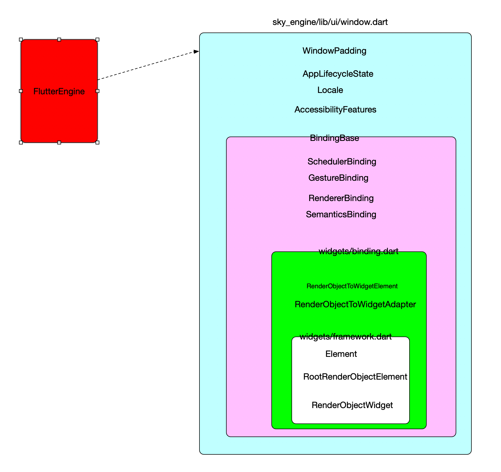
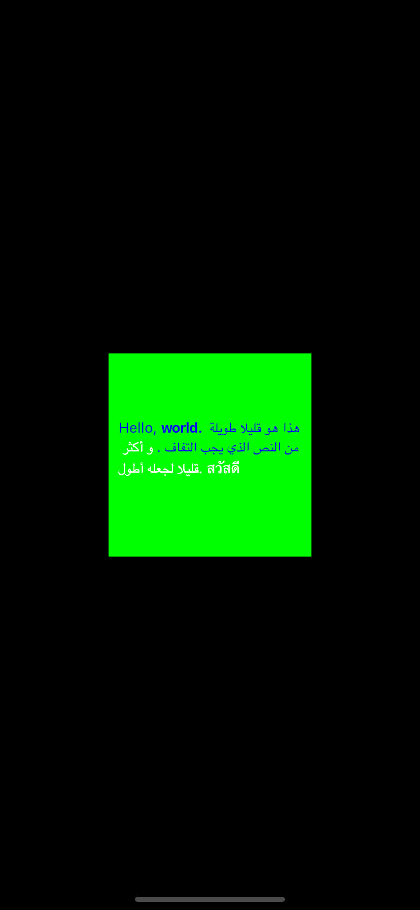

# Flutter UI 架构

## 概述


在Engine源代码分析中，我们知道，Flutter是通过widow层和Flutter 框架层通信，Widow是上下层通信的枢纽，启动承上启下的作用，那么Widow最小的可执行单元是什么？？

flutter 引擎初始化完成之后，会调用Window中的`onBeginFrame` 方法来构建一帧，构建完成一帧之后调用`ui.window.render(sceneBuilder.build());`传递给Flutter的Engine中，第二帧是通过`scheduleFrame`不断的调动来改变整个Widget的构建过程，不断的改变Widget生成的渲染对象，传递给Flutter引擎，就可以实现相关的代码界面的变动，页面跳转等。

记着下面三个方法，Widget的所用调用过程都是在为构建一帧在做准备

    ui.window.onBeginFrame = beginFrame;
    ui.window.render(sceneBuilder.build());
    ui.window.scheduleFrame();

ui.Window类是Flutter引擎和FlutterUI框架的接口，FlutterUI是怎么启动起来的？？？

`1.主要完成的是FlutterUI层和FlutterEngine层的绑定操作ui.Window`

`2.分解系统成的事件`

    GestureBinding
    ServicesBinding
    SchedulerBinding
    PaintingBinding,
    SemanticsBinding
    RendererBinding
    WidgetsBinding
  `3.提供一个渲染对象个给ui.window.render(sceneBuilder.build()); 调用Engine中的渲染引擎`

  `4.初始化平台Plugin接口`

  `4.初始化多语言，多区域`


## window 事件是怎么分解给不同的Binding进行处理的？？

1.FlutterEngine通过Widow类和FlutterUI进行通信，包括Widget的绘制和生命周期管理

2.Window类把相关的事件回调和调用方法返回给不同的Bindings类进行解耦，每个部分完成相关的操作

3.FlutterUI层通过runApp包Flutter相关的部分提交给系统框架和系统框架层进行通信

4.通过直接使用window类进行Frame的绘制，就能够对Flutter层进行理解，FlutterUI层其实是Window构造的一个扩展和细化，



### 核心步骤:

Widgets层和window层解耦是通过继承`BindingBase`的`mixin`类来继续的，不同的Bindings类继承`BindingBase`,

```Dart

/// A concrete binding for applications based on the Widgets framework.
///
/// This is the glue that binds the framework to the Flutter engine.
class WidgetsFlutterBinding extends BindingBase with GestureBinding, ServicesBinding, SchedulerBinding, PaintingBinding, SemanticsBinding, RendererBinding, WidgetsBinding {

  /// Returns an instance of the [WidgetsBinding], creating and
  /// initializing it if necessary. If one is created, it will be a
  /// [WidgetsFlutterBinding]. If one was previously initialized, then
  /// it will at least implement [WidgetsBinding].
  ///
  /// You only need to call this method if you need the binding to be
  /// initialized before calling [runApp].
  ///
  /// In the `flutter_test` framework, [testWidgets] initializes the
  /// binding instance to a [TestWidgetsFlutterBinding], not a
  /// [WidgetsFlutterBinding].
  static WidgetsBinding ensureInitialized() {
    if (WidgetsBinding.instance == null)
      WidgetsFlutterBinding();
    return WidgetsBinding.instance;
  }
}
```

WidgetsFlutterBinding 实现了`BindingBase`,在`BindingBase`的构造方法中调用 `initInstances`方法， runApp调用`ensureInitialized`方法来全部每一个Binding对象都进行初始化，初始化顺序是从后往前调用`initInstances`进行初始化，同时也对Window分解的内容进行`BindingBase`完成过程

    1.构造方法中默认调用initInstances
    2.构造方法中默认调用initServiceExtensions
    3.同时BindingBase, SchedulerBinding, GestureBinding, RendererBinding, SemanticsBinding 也和调用自己的上述两个构造方法
    4.完成FlutterUI层和FlutterEngine之间的交互过程

### flutterUI框架中提供的实现BindingBase的类

每个类的具体功能查看一下对应类的：`构造方法中默认调用initInstances`,`initServiceExtensions`

    Object (dart.core)
    BindingBase (binding.dart) 所有Binding类的父类，之后初始化一次
    SemanticsBinding (binding.dart)
    PaintingBinding (binding.dart)
    ServicesBinding (binding.dart)
    SchedulerBinding (binding.dart)
    GestureBinding (binding.dart)
    RendererBinding (binding.dart)
    RenderingFlutterBinding (binding.dart)
    WidgetsBinding (binding.dart)  FlutterUI的统一注册入口
    WidgetsFlutterBinding (binding.dart)
    TestWidgetsFlutterBinding (binding.dart)

#### PaintingBinding

绑定画笔库，处理图像缓存，和ServicesBinding 配套使用

```Dart
mixin PaintingBinding on BindingBase, ServicesBinding {
  @override
  void initInstances() {
    super.initInstances();
    _instance = this;
    _imageCache = createImageCache();
    if (shaderWarmUp != null) {
      shaderWarmUp.execute();
    }
  }
```
#### ServicesBinding
监听平台消息并将它们定向到[BinaryMessages]。[ServicesBinding]还注册了一个公开的[LicenseEntryCollector]在存储在资产根目录的`LICENSE`文件中找到的许可证捆绑，并实现`ext.flutter.evict`服务扩展
```Dart
mixin ServicesBinding on BindingBase {
  @override
  void initInstances() {
    super.initInstances();
    _instance = this;
    window
      ..onPlatformMessage = BinaryMessages.handlePlatformMessage;
    initLicenses();
  }
```
####  SchedulerBinding

用于运行以下内容的调度程序：

 * _Transient回调_，由系统的[Window.onBeginFrame]触发

回调，用于将应用程序的行为同步到系统显示例如，[Ticker]和[AnimationController]的触发器来自这些。

 * _Persistent callbacks_，由系统的[Window.onDrawFrame]触发回调，用于在瞬态回调后更新系统的显示执行例如，渲染层使用它来驱动它渲染管道。

 *  * _Post-frame callbacks_，仅在持久回调之后运行

从[Window.onDrawFrame]回调返回之前。
 *非渲染任务，在帧之间运行。给出了这些
优先级，根据a按优先级顺序执行

```Dart
mixin SchedulerBinding on BindingBase, ServicesBinding {
  @override
  void initInstances() {
    super.initInstances();
    _instance = this;
    window.onBeginFrame = _handleBeginFrame;
    window.onDrawFrame = _handleDrawFrame;
    SystemChannels.lifecycle.setMessageHandler(_handleLifecycleMessage);
    readInitialLifecycleStateFromNativeWindow();
  }
```

监听平台消息并将它们定向到[BinaryMessages]。[ServicesBinding]还注册了一个公开的[LicenseEntryCollector]在存储在资产根目录的`LICENSE`文件中找到的许可证捆绑，并实现`ext.flutter.evict`服务扩展。

```Dart
mixin ServicesBinding on BindingBase {
  @override
  void initInstances() {
    super.initInstances();
    _instance = this;
    window
      ..onPlatformMessage = BinaryMessages.handlePlatformMessage;
    initLicenses();
  }
```


#### GestureBinding

当[GestureBinding]收到[PointerDownEvent]时（来自[Window.onPointerDataPacket]，由。解释[PointerEventConverter]），执行[hitTest]以确定哪个[HitTestTarget]节点受到影响。 （预计其他约束力实现[hitTest]以推迟[HitTestable]对象。例如，渲染层延伸到[RenderView]和渲染对象的其余部分层次结构。）

```Dart
mixin GestureBinding on BindingBase implements HitTestable, HitTestDispatcher, HitTestTarget {
  @override
  void initInstances() {
    super.initInstances();
    _instance = this;
    window.onPointerDataPacket = _handlePointerDataPacket;
  }
```

#### RendererBinding

```Dart
/// The glue between the render tree and the Flutter engine.
mixin RendererBinding on BindingBase, ServicesBinding, SchedulerBinding, GestureBinding, SemanticsBinding, HitTestable {
  @override
  void initInstances() {
    super.initInstances();
    _instance = this;
    _pipelineOwner = PipelineOwner(
      onNeedVisualUpdate: ensureVisualUpdate,
      onSemanticsOwnerCreated: _handleSemanticsOwnerCreated,
      onSemanticsOwnerDisposed: _handleSemanticsOwnerDisposed,
    );
    window
      ..onMetricsChanged = handleMetricsChanged
      ..onTextScaleFactorChanged = handleTextScaleFactorChanged
      ..onPlatformBrightnessChanged = handlePlatformBrightnessChanged
      ..onSemanticsEnabledChanged = _handleSemanticsEnabledChanged
      ..onSemanticsAction = _handleSemanticsAction;
    initRenderView();
    _handleSemanticsEnabledChanged();
    assert(renderView != null);
    addPersistentFrameCallback(_handlePersistentFrameCallback);
    _mouseTracker = _createMouseTracker();
  }
```

#### WidgetsBinding

```Dart
/// The glue between the widgets layer and the Flutter engine.
mixin WidgetsBinding on BindingBase, SchedulerBinding, GestureBinding, RendererBinding, SemanticsBinding {
  @override
  void initInstances() {
    super.initInstances();
    _instance = this;
    buildOwner.onBuildScheduled = _handleBuildScheduled;
    window.onLocaleChanged = handleLocaleChanged;
    window.onAccessibilityFeaturesChanged = handleAccessibilityFeaturesChanged;
    SystemChannels.navigation.setMethodCallHandler(_handleNavigationInvocation);
    SystemChannels.system.setMessageHandler(_handleSystemMessage);
  }

```


### 源码实现

使给定的小部件填充并将其附加到屏幕上。小部件在布局期间被赋予约束，迫使它填充整个屏幕。如果您希望将窗口小部件对齐到屏幕的一侧（例如，顶部），考虑使用[Align]小部件。如果你想中心您的小部件，您也可以使用[中心]小部件再次调用[runApp]将从屏幕上分离上一个根小部件并将给定的小部件附加到其位置。比较新的小部件树针对上一个窗口小部件树，任何差异都应用于底层渲染树，类似于[StatefulWidget]时发生的情况调用[State.setState]后重建。如有必要，使用[WidgetsFlutterBinding]初始化绑定。 也可以看看：[WidgetsBinding.attachRootWidget]，它为。创建根小部件小部件层次结构。 [RenderObjectToWidgetAdapter.attachToRenderTree]，它创建了根元素层次结构的元素。 [WidgetsBinding.handleBeginFrame]，它将窗口小部件管道泵送到确保构建小部件，元素和渲染树。

```Dart
void runApp(Widget app) {
  WidgetsFlutterBinding.ensureInitialized()
    ..attachRootWidget(app)
    ..scheduleWarmUpFrame();
}
```

WidgetsBinding集成Bindingbase:

1.构造方法中默认调用initInstances

2.构造方法中默认调用initServiceExtensions

3.同时BindingBase, SchedulerBinding, GestureBinding, RendererBinding, SemanticsBinding 也和调用自己的上述两个构造方法

4.完成FlutterUI层和FlutterEngine之间的交互过程


```Dart
/// The glue between the widgets layer and the Flutter engine.
mixin WidgetsBinding on BindingBase, SchedulerBinding, GestureBinding, RendererBinding, SemanticsBinding {
  @override
  void initInstances() {
    super.initInstances();
    _instance = this;
    buildOwner.onBuildScheduled = _handleBuildScheduled;
    window.onLocaleChanged = handleLocaleChanged;
    window.onAccessibilityFeaturesChanged = handleAccessibilityFeaturesChanged;
    SystemChannels.navigation.setMethodCallHandler(_handleNavigationInvocation);
    SystemChannels.system.setMessageHandler(_handleSystemMessage);
  }

  static WidgetsBinding get instance => _instance;
  static WidgetsBinding _instance;

  @override
  void initServiceExtensions() {
    super.initServiceExtensions();

      registerBoolServiceExtension(
        name: 'showPerformanceOverlay',
        getter: () =>
        Future<bool>.value(WidgetsApp.showPerformanceOverlayOverride),
        setter: (bool value) {
          if (WidgetsApp.showPerformanceOverlayOverride == value)
            return Future<void>.value();
          WidgetsApp.showPerformanceOverlayOverride = value;
          return _forceRebuild();
        },
      );
      WidgetInspectorService.instance.initServiceExtensions(registerServiceExtension);
      return true;
    }());
  }

```


## FlutterUI和FlutterEngine之间的粘合剂`BindingBase`

1.BindingBase初始化

  用于提供单例服务的mixins的基类（也称为“Binding”）。在mixin的`on`子句中使用这个类，继承它并实现[initInstances（）]。 mixin保证只能构建一次应用程序的生命周期（更确切地说，如果构造两次，它将断言
在检查模式下）。用于编写应用程序的最顶层将具有一个具体的类继承自[BindingBase]并使用所有各种[BindingBase]mixins（例如[ServicesBinding]）。例如，Widgets库中Flutter引入了一个名为[WidgetsFlutterBinding]的绑定。相关的library定义了如何创建绑定。可以暗示（例如，[WidgetsFlutterBinding]自动从[runApp]开始，或者应用程序可能需要显式调用构造函数。小部件层和Flutter引擎之间的粘合剂。
初始化绑定时调用，注册服务扩展。想要公开服务扩展的绑定应该重载这个方法使用调用来注册它们 [registerSignalServiceExtension]，[registerBoolServiceExtension]， [registerNumericServiceExtension]，和
[registerServiceExtension]（按复杂程度递增）。此方法的实现必须调用它们的超类实施{@macro flutter.foundation.bindingBase.registerServiceExtension} 也可以看看：

* <https://github.com/dart-lang/sdk/blob/master/runtime/vm/service/service.md#rpcs-requests-and-responses>

2.和Window类的关联

绑定此绑定的窗口。许多其他绑定被定义为[BindingBase]的扩展，，例如，[ServicesBinding]，[RendererBinding]和[WidgetsBinding]。每个这些绑定定义了与[ui.Window]交互的行为，例如，[ServicesBinding]注册一个[ui.Window.onPlatformMessage]处理程序，和[RendererBinding]注册[ui.Window.onMetricsChanged]，[ui.Window.onTextScaleFactorChanged]，[ui.Window.onSemanticsEnabledChanged]，和[ui.Window.onSemanticsAction]处理程序。这些其他绑定中的每一个都可以静态地单独访问[Window]，但这会妨碍用假冒测试这些行为的能力窗口用于验证目的。因此，[BindingBase]暴露了这一点[Window]供其他绑定使用。 [BindingBase]的子类，如 [TestWidgetsFlutterBinding]，可以覆盖此访问器以返回a不同的[Window]实现，例如[TestWindow]。


```Dart
abstract class BindingBase {
  BindingBase() {
    1.初始化实例本身
    2.注册扩展服务
    .......
    initInstances();
    initServiceExtensions();
    .......
  }
  获取window类
  ui.Window get window => ui.window;

  void initInstances() {
  }
  注册扩展服务
  @protected
  @mustCallSuper
  void initServiceExtensions() {

    assert(() {
      const String platformOverrideExtensionName = 'platformOverride';
      registerServiceExtension(
        name: platformOverrideExtensionName,
        callback: (Map<String, String> parameters) async {
          if (parameters.containsKey('value')) {
            switch (parameters['value']) {
              case 'android':
                debugDefaultTargetPlatformOverride = TargetPlatform.android;
                break;
              case 'iOS':
                debugDefaultTargetPlatformOverride = TargetPlatform.iOS;
                break;
              case 'fuchsia':
                debugDefaultTargetPlatformOverride = TargetPlatform.fuchsia;
                break;
              case 'default':
              default:
                debugDefaultTargetPlatformOverride = null;
            }
            _postExtensionStateChangedEvent(
              platformOverrideExtensionName,
              defaultTargetPlatform.toString().substring('$TargetPlatform.'.length),
            );
            await reassembleApplication();
          }
          return <String, dynamic>{
            'value': defaultTargetPlatform
                     .toString()
                     .substring('$TargetPlatform.'.length),
          };
        },
      );
      return true;
    }());
  }
。。。。。。。。。。。。
}

```
## window

### Flutter用户UI层是怎么和Window管理起来
上一节中，已经把系统为我们创建好的Binding类，定义了多个，主要目的就是分别对FlutterEngine和FlutterUI直接的回调和交互做区分处理，达到代码解耦的目的

主机操作系统用户界面的最基本界面。系统中有一个Window实例，您可以这样做从[window]属性获取
FlutterUI用户是怎么访问Window接口的？先使用一个极简的案例来展示一个FlutterUI项目调用FlutterEngine中的接口

### Window是如何最简单的一帧绘制在屏幕上的

使用新提供的更新应用程序在GPU上的渲染[Scene]必须在范围内调用此函数[onBeginFrame]或[onDrawFrame]回调被调用。如果这个功能在单个[onBeginFrame] / [onDrawFrame]中第二次被调用回调序列或调用那些回调范围之外的调用将被忽略。要记录图形操作，首先要创建一个[PictureRecorder]构造一个[Canvas]，将[PictureRecorder]传递给它的构造函数。发出所有图形操作后，调用[PictureRecorder.endRecording]函数在[PictureRecorder]上获取表示已发布图形操作的最终[Picture]。接下来，创建一个[SceneBuilder]，然后使用添加[Picture][SceneBuilder.addPicture]。使用[SceneBuilder.build]方法即可然后获取[Scene]对象，您可以通过此对象显示该对象[渲染]功能。也可以看看：[SchedulerBinding]，用于管理的Flutter框架类帧的调度。[RendererBinding]，Flutter框架类，用于管理布局和画。




核心实现:

    color = const ui.Color(0xFF00FF00);
    提供一个Frame数据给Window
    ui.window.onBeginFrame = beginFrame;
    处理点击事件
    ui.window.onPointerDataPacket = handlePointerDataPacket;
    调用scheduleFrame方法调用native方法访问Flutterengine
    ui.window.scheduleFrame();

需要汇总的对象添加到window.render中
    final ui.SceneBuilder sceneBuilder = ui.SceneBuilder()
      // TODO(abarth): We should be able to add a picture without pushing a
      // container layer first.
      ..pushClipRect(physicalBounds)
      ..addPicture(ui.Offset.zero, picture)
      ..pop();

    ui.window.render(sceneBuilder.build());

```Dart
import 'dart:ui' as ui;

void beginFrame(Duration timeStamp) {
  final double devicePixelRatio = ui.window.devicePixelRatio;
  final ui.Size logicalSize = ui.window.physicalSize / devicePixelRatio;

  final ui.ParagraphBuilder paragraphBuilder = ui.ParagraphBuilder(
    ui.ParagraphStyle(textDirection: ui.TextDirection.ltr),
  )
    ..addText('Hello, world.');
  final ui.Paragraph paragraph = paragraphBuilder.build()
    ..layout(ui.ParagraphConstraints(width: logicalSize.width));

  final ui.Rect physicalBounds = ui.Offset.zero & (logicalSize * devicePixelRatio);
  final ui.PictureRecorder recorder = ui.PictureRecorder();
  final ui.Canvas canvas = ui.Canvas(recorder, physicalBounds);
  canvas.scale(devicePixelRatio, devicePixelRatio);
  canvas.drawParagraph(paragraph, ui.Offset(
    (logicalSize.width - paragraph.maxIntrinsicWidth) / 2.0,
    (logicalSize.height - paragraph.height) / 2.0,
  ));
  final ui.Picture picture = recorder.endRecording();

  final ui.SceneBuilder sceneBuilder = ui.SceneBuilder()
    ..pushClipRect(physicalBounds)
    ..addPicture(ui.Offset.zero, picture)
    ..pop();

  ui.window.render(sceneBuilder.build());
}

void main() {
  ui.window.onBeginFrame = beginFrame;
  ui.window.scheduleFrame();
}

```

## 总结
通过上面的分析，已经对Window相关的接口继续解耦到不同的binding对象，所有的初始化操作都是在`initInstances()`方法中进行初始化的

1.调用runApp开始启动一个AppWidget层的入口

2.调用`WidgetsFlutterBinding`的`ensureInitialized`方法来对`BindingBase`的所有子类进行初始化

3.mixin类的初始化是从继承顺序从后往前进行初始化

通过上面的分析和demo的演示，我们可以很方便的了解Widow事件的拆分，不同`BindingBase`的初始化、以及Window的渲染对象回调到Flutterengin层提供渲染对象，后续的文章将介绍，FlutterWidget层是如何返回Flutter渲染对象的
