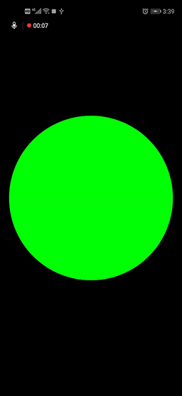

# Flutter Widget初始化

在上一篇FlutterEngine引擎启动的时候，我们已经分析了，从andorid端架子dart相关的代码和资源开发，分析FlutterEngine中的初始化过程，最终调用FlutterUI层的入口main()方法，在main()方法调用之前，我们就已经在FlutterEngine初始化时，架子了Window.Dart文件，在运行main(),函数之后，就是把FlutterUI层产生的每一帧添加到FlutterEngine上，接下来我们会进一步分析FlutterEngine架子FlutterUI层代码，已经FlutterUI层的初始化逻辑

## 概要

核心类:

RenderObject:RenderBox实现类

Element:管理widget在树中的逻辑关系

Wideget:配置每一个节点在的数据

BuildContext:提供的Element树中进行查找的用户接口

Window:FlutterEngine提供给FlutterUI通信的接口

RenderView:FlutterUI框架的第一个RenderObject，同时和window的Scene进行关联

Layer:每一个渲染对象对应的一个逻辑表示

Scene：最终FlutterUI层经过一系列布局、合成、汇总最终生成Scene提供给SkyEngine

RenderObjectToWidgetAdapter:FlutterUI的第一个Widget对象

BuildOwner:记录Element树中添加和删除的节点、并且记录那些Element需要重新计算

PipelineOwner:记录RenderObject的在整棵树中的关系和变化请求，最终通过调用PipelineOwner来遍历整个渲染对象树进行每一帧的逻辑处理

## 引擎绘制原理

在分析FlutterUI框架之前，先来分析一下Flutter引擎是怎么用最少步骤把一帧绘制在屏幕上的

###  大象装进冰箱里

1.Flutter启动时调用scheduleFrame()会触发ui.window.onBeginFrame()回调方法调用

2.sceneBuilder 生成场景

3.数据回传到渲染引擎:ui.window.render(scene);

4.手势回调事件:ui.window.onPointerDataPacket = handlePointerDataPacket;，通过手势事件来触发不间断的调用第三步骤中的方法

5.刷新一帧:ui.window.scheduleFrame();

通过上面的三个步骤，就可以实现一帧一帧的绘制的屏幕上，主要的一个内容是如何管理`Scene`对象的数据变化处理逻辑，不断的更新数据回传到渲染引擎进行计算

### 官方Demo



###  官方Demo 源码
```Dart
ui.Picture paint(ui.Rect paintBounds) {
  final ui.PictureRecorder recorder = ui.PictureRecorder();
  final ui.Canvas canvas = ui.Canvas(recorder, paintBounds);
  final ui.Size size = paintBounds.size;
  canvas.drawCircle(
    size.center(ui.Offset.zero),
    size.shortestSide * 0.45,
    ui.Paint()..color = color,
  );
  return recorder.endRecording();
}

ui.Scene composite(ui.Picture picture, ui.Rect paintBounds) {
  final double devicePixelRatio = ui.window.devicePixelRatio;
  final Float64List deviceTransform = Float64List(16)
    ..[0] = devicePixelRatio
    ..[5] = devicePixelRatio
    ..[10] = 1.0
    ..[15] = 1.0;
  final ui.SceneBuilder sceneBuilder = ui.SceneBuilder()
    ..pushTransform(deviceTransform)
    ..addPicture(ui.Offset.zero, picture)
    ..pop();
  return sceneBuilder.build();
}

void beginFrame(Duration timeStamp) {
  final ui.Rect paintBounds = ui.Offset.zero & (ui.window.physicalSize / ui.window.devicePixelRatio);
  final ui.Picture picture = paint(paintBounds);
  final ui.Scene scene = composite(picture, paintBounds);
  ui.window.render(scene);
}

void handlePointerDataPacket(ui.PointerDataPacket packet) {
  for (ui.PointerData datum in packet.data) {
    if (datum.change == ui.PointerChange.down) {
      color = const ui.Color(0xFF0000FF);
      ui.window.scheduleFrame();
    } else if (datum.change == ui.PointerChange.up) {
      color = const ui.Color(0xFF00FF00);
      ui.window.scheduleFrame();
    }
  }
}

void main() {
  color = const ui.Color(0xFF00FF00);
  // The engine calls onBeginFrame whenever it wants us to produce a frame.
  ui.window.onBeginFrame = beginFrame;
  // The engine calls onPointerDataPacket whenever it had updated information
  // about the pointers directed at our app.
  ui.window.onPointerDataPacket = handlePointerDataPacket;
  // Here we kick off the whole process by asking the engine to schedule a new
  // frame. The engine will eventually call onBeginFrame when it is time for us
  // to actually produce the frame.
  ui.window.scheduleFrame();
}

```
上面的逻辑来看，FlutterUI层最终的目的就是提供一帧内容传递个图像渲染引擎，不断驱动，来修改Widget相关的属性，从而改动FlutterRenderObject相关的数据，提供给FlutterEngine进行处理，最终渲染到平台提供的View上


## Flutter架构

### 核心问题点

通过上面的分析，我们知道Flutter引擎对UI层的绘制，最关心的是:

1.输出的渲染对象

2.渲染对象如何改变

3.如何管理渲染对象的生成

4.如何管理树中对象的变化


## 系统层初始化过程

### Widget初始化过程

Flutter 层UI初始化过程，是在入口文件中调用`runApp`把应用Widget和系统的渲染引擎进行关联

```Dart
void runApp(Widget app) {
  WidgetsFlutterBinding.ensureInitialized()
    ..attachRootWidget(app)
    ..scheduleWarmUpFrame();
}
```
上一篇文章中，我们已经介绍了Window事件是如何分解到不同的"BaseBind"对象的子类上，并进行初始化的，继续分析用户层的widget如何和系统成的Window框架进行关联的。

`attachRootWidget`完成了RenderObject和Element进行绑定，也就是和Window对象关联的第一个渲染对象，同时调用`BuilderOwer`来对屏幕上显示的区域和那些需要进行重新绘制的`Widget`计算。`BuilderOwer`管理树根到树叶的Element对象，记录那些是需要改变的(如果一棵树有10个节点，那么在第一次绘制完成只用，如果树中的有几个节点有改变，第二次构建渲染对象的过程中，从Root节点开始构建，那边需要遍历整棵树才能找到其中那个是已经改变的节点，在Root渲染对象中使用`BuilderOwer`保存每一个节点是否有变动，在进行下一次构建渲染对象的时候:1.管理Widget框架，2.管理没有inactive的Element,3.管理整棵Widget树的reassemble命令，build/layout/paint pipeline)，分配`BuilderOwer`给整棵树，通过`RootRenderObjectElement.assignOwner`

`scheduleWarmUpFrame`所有的数据准备好了之后，需要把一帧的数据传递到系统FlutterEngine中继续渲染出来发展屏幕上。`pipeline`是对已经计算好的数据进行处理提交到FluuterEngine上进行渲染一个管理逻辑

以上逻辑主要做了两个操作:

#### 1.生成静态数据的关联对象:(只是保存一下逻辑数据)

    1:RenderView:对应系统层渲染框架的Surface对象的数据抽象，FlutterUI层的第一个渲染对象

    2.Element: Widget的实例对象，Widget保存了控制自身的数据结构类型，Element对象是对是Widget的一个抽象表示，用在告诉BuilderOwer如何配置Widget，Element的生命周期_ElementLifecycle {initial,active,inactive,defunct,},调用`attachRenderObject`把渲染对象挂载到渲染树中

    3.RenderObject:通过子类`RenderBox`对Element进行笛卡尔或者极坐标进行逻辑布局的坐标系，提供绘图层的Layer

    4.BuildContext:提供了一个用户在Widget访问`RenderObject`的接口类

    5.RenderObjectToWidgetAdapter：`RootRenderObjectElement`和`RenderView`管理在一起，根`RootRenderObjectElement`持有`RenderView`对象，那么在Element和RenderObject对象就构成了一个整体，可以同步更新数据

    6.ParentData：用来在`RenderObject`中对保存数据，Widget是不可以被修改的，在Widget改变的时候，指定UI进行更新，把数据保存在`RenderObject`中，rebuild之后`RenderObject`对象还存在，除非保存数据的父节点不移除构建树中。

    7.RenderObject->Constraints描述子wiget能够读取的数据，不描述笛卡尔坐标系和极坐标


#### 2.动态数据:

    1.buildOwner:从`RenderView`开始计算整个UI树中显示的是那一部分已经是哪一部分是需要更新，保存相关的`List<Element>`对象

    2.[PipelineOwner](../flutterdev/FlutterWidgetinit/#pipeline):每一个`Element`中都会有一个`RenderObject`，主要使用来处理渲染引擎在FlutterUI层的逻辑数据,上一步已经把需要更新的数据添加到`List<RenderObject>`

    3.调用`RenderView`的`compositeFrame`方法把场景数据传递到系统渲染引擎


#### RenderObject和Element关系

通过调用runApp中`attachRootWidget`把`Element`和`RenderObject`进行关联
`RenderObjectToWidgetAdapter`是`Widget`的一个子类，主要实现两个方法:

    1.`createElement`
    2.`createRenderObject`

`createElement`主要的功能是对`Widget`进行管理，`Element`是Widget的一个实例对象,Elment有不同的子类型，Element作为树中单一节点，管理RenderObject和Widget，Widget提供第一节点的数据配置Element，Element同时还管理过个节点在树中的逻辑关系，多个Widget通过Element来串联，构成一棵树，Element作为一个图纸的作用，相当于地图功能，而真正可以提供个汽车同行的路，就是RenderObject的主要功能

`createRenderObject`主要功能是产生`RenderObject`的对象，主要功能是完成坐标系统的构建，对`Element`提供配置参数，实现类是`RenderBox`，多个渲染对象的变化情况通过`Pipeline`进行记录管理，在查找RenderObject需要变化是就可以从`Pipeline`中进行查找而不用遍历整棵树


每一个`Element`对应一个`RenderObject`对象，`RenderObject`作为`Element`的成员变量进行使用，多个Element进行关联形成一棵树，每一个Element节点上的RenderObject对象通过合成就可以提供到FlutterEngine上的每一帧
Element主要是实现逻辑功能，RenderObject实现真正的数据渲染功能


#### `RenderObjectToWidgetAdapter`的构造函数中的参数冲那里来的？

`renderView`: WidgetsBinding 继承 RendererBinding，在`RendererBinding`的`initInstances`方法中初始化`renderView`,系统`surface`,成员变量`RenderBox`是整个绘图的`Root`
顶层`RootRenderObjectElement`,只用顶层对象使用`BuildOwner`


`RenderObjectToWidgetAdapter` 类作为Flutter系统顶层的UI，作为用户UI和Flutter框架层的联合点
在`WidgetsBinding`中调用`attachRootWidget`进行渲染对象和Element对象进行关联,`RenderView`成为`RootRenderObjectElement`的成员变量,渲染对象和Element对象进行关联，可以同步更新UI

#### attachRootWidget 完成三件事:

  RenderObjectToWidgetAdapter: 关联renderView和rootWidget

  关联PipelineOwner

  关联BuildOwner

```Dart
void attachRootWidget(Widget rootWidget) {
  _renderViewElement = RenderObjectToWidgetAdapter<RenderBox>(
    container: renderView,
    debugShortDescription: '[root]',
    child: rootWidget,
  ).attachToRenderTree(buildOwner, renderViewElement);
}
```

#### renderView对象

renderView对象是在`RendererBinding`中调用`initRenderView`对象进行初始化的，`RenderView`集成`RenderObject`实现`RenderObjectWithChildMixin`

RenderBox:是真正的渲染对象
RenderObject:
  1.主要是保存RenderBox的数据实际数据和child的Constraints关系，同时保存对RenderBox操作的接口

  2.保存和Child相关关联的数据ParentData


```Dart
/// Creates a [RenderView] object to be the root of the
/// [RenderObject] rendering tree, and initializes it so that it
/// will be rendered when the engine is next ready to display a
/// frame.
///
/// Called automatically when the binding is created.
void initRenderView() {
  assert(renderView == null);
  renderView = RenderView(configuration: createViewConfiguration(), window: window);
  renderView.scheduleInitialFrame();
}
```
#### ViewConfiguration

配置FlutterUI框架第一个渲染对象显示在屏幕上的大小

1.设备像素缩放比例

2.设备的时间物理像素

```Dart
ViewConfiguration createViewConfiguration() {
  final double devicePixelRatio = window.devicePixelRatio;
  return ViewConfiguration(
    size: window.physicalSize / devicePixelRatio,
    devicePixelRatio: devicePixelRatio,
  );
}
```

#### Window
BindingBase 对象初始化时，获取ui.window对象最为和Flutter通信的对象

  ui.Window get window => ui.window;

#### scheduleInitialFrame

RenderView初始化完成之后，初始化标记当前的渲染对象的状态

1.添加当前对象到Pipline中，标记为需要布局`_nodesNeedingLayout`

2.初始化Layer对象，所有的RenderObject对象最终会合并到当前对象，并且传递个Window.render上

3.通知Pipline进行可视化更新

```Dart
void scheduleInitialFrame() {
  assert(owner != null);
  assert(_rootTransform == null);
  scheduleInitialLayout();
  scheduleInitialPaint(_updateMatricesAndCreateNewRootLayer());
  assert(_rootTransform != null);
  owner.requestVisualUpdate();
}
```
#### Layer

Layer 是所有RenderObject对象合成在一起最终传递到Window.render中

1.初始化一个Layer对象

2.绑定RootLayer和当前的渲染对象`rootLayer.attach(this);`,每一个renderObject对象持有RootLayer对象的引用

```Dart
Layer _updateMatricesAndCreateNewRootLayer() {
  _rootTransform = configuration.toMatrix();
  final ContainerLayer rootLayer = TransformLayer(transform: _rootTransform);
  rootLayer.attach(this);
  assert(_rootTransform != null);
  return rootLayer;
}
```
通过上面的初始化过程已经把渲染对象初始化完成，并且关联自己到PipelineOwner对象中，详细的信息在后续介绍(owner._nodesNeedingLayout.add(this);)，RenderView初始化话过去设置当前FlutterUI显示在屏幕上的大小，和FlutterEngine层的对象进行关联，可以把一帧的数据传递到Window对象的本地方法中

#### 小结

RenderView对象进行初始化过程:

1.在RendererBinding对象初始化时调用`initRenderView()`初始化RootRenderView

2.获取设备的ViewConfiguration对象来配置FlutterUI在窗口上显示的大小

3.获取ui.window对象引用，FlutterUI层的帧可以合成到window.render方法上

4.创建一个Layer对象作为RootLayer，并且调用attch方法传递到每一个节点上的RenderObject对象上


## 用户层的Widget初始化过程

### 初始化`Widget`

上面介绍了初始化系统框架成的渲染对象`renderView`,和记录Widget变化信息的`PipelineOwner`,真正执行测量、布局、绘制、的整个过程，并且已经初始化不同的BaseBind对象的子类，分解了Window对象的事件


`RenderObjectToWidgetAdapter.attachToRenderTree`对Element进行创建
将这个Widget进行填充，并实际将结果[renderobject]设置为[容器]的子级。如果element为空，则此函数将创建一个新元素。否则，给定元素将有一个计划好的更新以切换到此小部件。由[runapp]用于引导应用程序。
 Only one [buildScope] can be active at a time.

调用attach对象是renderViewElement对象为null(可以自己打断点调试查看)，递归从树的根节点进行遍历，所有的树中的Widget进行填充，父子、兄弟节点的依赖关系通过Element对象来保存，每一个节点的配置信息是通过Widget接口给提供操作整棵树的接口，渲染RenderObject到RenderObjectToWidgetElement

#### 初始化Element

在绑定渲染对象和跟Element之后进行，开始初始化Element对象
```Dart
RenderObjectToWidgetElement<T> attachToRenderTree(BuildOwner owner, [ RenderObjectToWidgetElement<T> element ]) {
  if (element == null) {///顶级原生出手动调用createment(); RenderObjectToWidgetElement
    owner.lockState(() {
      element = createElement();
      assert(element != null);
      ///只用根节点会调用该方法，其他节点的Element不会为空
      element.assignOwner(owner);
    });
    owner.buildScope(element, () {
      element.mount(null, null);  ///开始遍历树处理每一个Widget
    });
  } else {
    element._newWidget = this;
    element.markNeedsBuild();
  }
  return element;
}

```
createElement 方法创建rootElement对象，RenderObjectToWidgetElement，Element对象中有四个成员变量:

1.renderObject:当前Widget对象的RenderObject对象

2._newWidget:提供给开发者控制RenderObject的接口

3._child:如果当前Element对象有子节点，那么使用当前变量保存当前子节点引用


#### Element.mount，创建RenderObject

调用createElement()创建一个Element对象的时候，Element对象是孤立存在的，父Element对象是不负责处理挂载，通过子节点的Element对象mount方法执行两个操作:

1.调用super.mount()，通知父Element把自己添加在整棵树中，并且创建渲染对象

2.更新子节点的Element对象，不断重复上述过程


#### RenderObjectElement.mount()

在创建`RenderObjectToWidgetElement`对象的时候，构造方法中调用  RenderObjectToWidgetElement(RenderObjectToWidgetAdapter<T> widget) : super(widget);,传递当前节点的widget对象，在调用mount方法时进行初始化操作，调用`createRenderObject`方法创建渲染对象，并且`attachRenderObject(newSlot);`对象到渲染树中，Element已经创建完成，明确通过mount挂载自己到整个Element树中，同时创建RenderObject对象，并且添加到渲染树中，完成了当前节点的初始化，如果当前节点都有子节点，那么就会初始化当前的节点的子节点。

```Dart
@override
void mount(Element parent, dynamic newSlot) {
  super.mount(parent, newSlot);
  _renderObject = widget.createRenderObject(this);
  assert(() { _debugUpdateRenderObjectOwner(); return true; }());
  assert(_slot == newSlot);
  attachRenderObject(newSlot);
  _dirty = false;
}

```
#### updateChild

从根节点开始，不断的创建子Element对象,不断的通过mount方法添加到Element树中,通过updateChild初始化自己的子节点，在更新子节点是有一条件就是，当前的子节点是否要更新，是创建一个新的还是使用当前的节点复用

#### 是否创建节点的核心算法:
    /// The following table summarizes the above:
    ///
    /// |                     | **newWidget == null**  | **newWidget != null**   |
    /// | :-----------------: | :--------------------- | :---------------------- |
    /// |  **child == null**  |  Returns null.         |  Returns new [Element]. |
    /// |  **child != null**  |  Old child is removed, returns null. | Old child updated if possible, returns child or new [Element]. |

```Dart
Element updateChild(Element child, Widget newWidget, dynamic newSlot) {
  assert(() {
    if (newWidget != null && newWidget.key is GlobalKey) {
      final GlobalKey key = newWidget.key;
      key._debugReserveFor(this);
    }
    return true;
  }());
  if (newWidget == null) {
    if (child != null)
      deactivateChild(child);
    return null;
  }
  if (child != null) {
    if (child.widget == newWidget) {
      if (child.slot != newSlot)
        updateSlotForChild(child, newSlot);
      return child;
    }
    if (Widget.canUpdate(child.widget, newWidget)) {
      if (child.slot != newSlot)
        updateSlotForChild(child, newSlot);
      child.update(newWidget);
      assert(child.widget == newWidget);
      assert(() {
        child.owner._debugElementWasRebuilt(child);
        return true;
      }());
      return child;
    }
    deactivateChild(child);
    assert(child._parent == null);
  }
  return inflateWidget(newWidget, newSlot);
}
```

#### inflateWidget 真正创建Element的地方

  为给定的小部件创建一个元素，并将其添加为给定槽中的元素。此方法通常由[updatechild]调用，但可以调用直接通过需要对创建进行更细粒度控制的子类元素。
如果给定的小部件有一个全局键并且已经存在一个元素具有具有该全局键的小部件，此函数将重用该元素可能从树上的另一个位置嫁接或重新激活(it from the list of inactive elements）而不是创建一个新元素。
此函数返回的元素已经被装入将处于活动生命周期状态。注:以上是对UI架构中使用到的逻辑继续分析，主要是把整个UI框架的数据表示和关联进行拆分和组合，能够提供UI变化是数据的跟踪和记录(静态数据保存逻辑)

`final Element newChild = newWidget.createElement();`遍历树，为每一个Widget生成实例对象`Element`,调用`mount`方法把`Elment`添加到树中

```Dart
@protected
Element inflateWidget(Widget newWidget, dynamic newSlot) {
  assert(newWidget != null);
  final Key key = newWidget.key;
  if (key is GlobalKey) {
    final Element newChild = _retakeInactiveElement(key, newWidget);
    if (newChild != null) {
      assert(newChild._parent == null);
      assert(() { _debugCheckForCycles(newChild); return true; }());
      newChild._activateWithParent(this, newSlot);
      final Element updatedChild = updateChild(newChild, newWidget, newSlot);
      assert(newChild == updatedChild);
      return updatedChild;
    }
  }
  final Element newChild = newWidget.createElement();
  assert(() { _debugCheckForCycles(newChild); return true; }());
  newChild.mount(this, newSlot);
  assert(newChild._debugLifecycleState == _ElementLifecycle.active);
  return newChild;
}

```

### BuildOwner：

widgets框架的manager类。此类跟踪需要重建的小部件，并处理其他任务作为一个整体应用于小部件树，例如管理非活动元素列出树并在必要时触发“重新组合”命令调试时热重新加载。

1. 通常由[widgetsbinding]拥有，并且是与build/layout/paint管道。可以生成其他生成所有者来管理屏幕外小部件树。若要将生成所有者分配给树

2. 请使用的根元素上的[rootrenderobjectelement.assignowner]方法。

BuildOwner: 主要是记录Element树中的那些需要改变的渲染对象进行渲染，`查找有哪些`Element`是污染了，需要进行从新布局和绘制的`，通过查看BuildOwner对象的成员变量:

1.记录整棵树中添加或移除的信息记录

final _InactiveElements _inactiveElements = _InactiveElements();

2.记录以及添加到树中的Element对象那些Widget对象以及有改变了

final List<Element> _dirtyElements = <Element>[];


#### reassemble：自有在hotreload上调用

使根在给定[element]的整个子树完全重建。当应用程序代码已更改并正在热重新加载，以使小部件树获取任何更改了实现。这很昂贵，除非在开发期间，否则不应该调用它。
RendererBinding的initInstances方法中调用`drawFrame`


#### buildScope：

查找在屏幕上显示的区域的Element,确定哪些元素是要进行处理，画布是一个没有边界的区域，所以在在绘制之前是需要进行确认哪些区域是需要进行处理的
```Dart
void drawFrame() {
  .....

  try {
    if (renderViewElement != null)
    ///开始计算在屏幕上显示一帧的范围
      buildOwner.buildScope(renderViewElement);
    super.drawFrame();
    buildOwner.finalizeTree();
  } finally {
    。。。。。。
  }
  .......
}
```


### 小结Widget初始化过程

通过上面的我们知道整个Widget初始化过程:

1.调用Widget对象的createElement方法创建一个当前节点的Element对象

2.调用Element对象的mount方法，

    1.调用父类的mount方法，把自己添加到整棵Element对象中

    2.在父类的mount方法中调用widget.createRenderObject创建当前节点的RenderOb对象

    3.调用updateChild方法，遍历所有的子节点的Widget对象，添加到Element树中和RenderObject树中

3.WidgetsBinding的成员变量BuildOwner来记录整个Element对象树添加和移除，记录已添加的Element有改变的信息(提高遍历效率，主要处理以及改变的对象)

到目前为止整个widget树已经初始化完成，整个树的配置信息已经初始化完成，这一部分属于`静态数据`，在屏幕上看到的每一帧的数据是从这些静态数据中收集计算出来的。


## 绘制第一帧

在调用main()时，初始化runApp()，加载整个FlutterUI框架，渲染当前的RenderObject到FlutterEngine中

1. attachRootWidget:创建Element树和RenderObject树，同时创建了`BuildOwner`来跟踪整个Element对象的变化情况,`Pipline`记录RenderObject变化情况

2.RenderObject对象初始化完成，需要主动汇总在屏幕上`scheduleWarmUpFrame`,接下来分析一下第一帧是怎么显示在屏幕上的

```Dart
void runApp(Widget app) {
  WidgetsFlutterBinding.ensureInitialized()
    ..attachRootWidget(app)
    ..scheduleWarmUpFrame();
}

```

触发第一帧尽快执行，而不是等待引擎请求帧以响应系统“vsync”信号。这在应用程序启动期间使用，以便第一个帧（即可能很贵）得到一些额外的毫秒来运行。锁定事件调度，直到调度的帧完成。
如果已经用[scheduleFrame]计划了一个帧，或者[scheduleForcedFrame]，此调用可能会延迟该帧。
如果任何计划的帧已经开始，或者如果另一个已经调用了[schedulewarmupframe]，此调用将被忽略。prefer[scheduleframe]在正常操作中更新显示。
调用`scheduleFrame`触发window对象处理第一帧数据`window.scheduleFrame();`,将会触发`window.onBeginFrame`,开始执行，`SchedulerBinding`负责处理window对象的frame回调事件


```Dart
void scheduleWarmUpFrame() {
  if (_warmUpFrame || schedulerPhase != SchedulerPhase.idle)
    return;
  _warmUpFrame = true;
  Timeline.startSync('Warm-up frame');
  final bool hadScheduledFrame = _hasScheduledFrame;
  Timer.run(() {
    assert(_warmUpFrame);
    handleBeginFrame(null);
  });
  Timer.run(() {
    assert(_warmUpFrame);
    handleDrawFrame();
    resetEpoch();
    _warmUpFrame = false;
    if (hadScheduledFrame)
      scheduleFrame();
  });
  lockEvents(() async {
    await endOfFrame;
    Timeline.finishSync();
  });
}
```
### handleBeginFrame

在`RendererBinding`初始化`initInstances`时，`addPersistentFrameCallback`添加处理一帧的回调函数`_handlePersistentFrameCallback`,上一步中调用`scheduleFrame()`触发`window.onDrawFrame`回调函数执行

`handleBeginFrame`方法预处理一帧到FlutterEngine中，

```Dart
void handleBeginFrame(Duration rawTimeStamp) {
  Timeline.startSync('Frame', arguments: timelineWhitelistArguments);
  _firstRawTimeStampInEpoch ??= rawTimeStamp;
  _currentFrameTimeStamp = _adjustForEpoch(rawTimeStamp ?? _lastRawTimeStamp);
  if (rawTimeStamp != null)
    _lastRawTimeStamp = rawTimeStamp;

。。。。。。。。

  assert(schedulerPhase == SchedulerPhase.idle);
  _hasScheduledFrame = false;
  try {
    // TRANSIENT FRAME CALLBACKS
    Timeline.startSync('Animate', arguments: timelineWhitelistArguments);
    _schedulerPhase = SchedulerPhase.transientCallbacks;
    final Map<int, _FrameCallbackEntry> callbacks = _transientCallbacks;
    _transientCallbacks = <int, _FrameCallbackEntry>{};
    callbacks.forEach((int id, _FrameCallbackEntry callbackEntry) {
      if (!_removedIds.contains(id))
        _invokeFrameCallback(callbackEntry.callback, _currentFrameTimeStamp, callbackEntry.debugStack);
    });
    _removedIds.clear();
  } finally {
    _schedulerPhase = SchedulerPhase.midFrameMicrotasks;
  }
}
```
`handleDrawFrame`先调用一下FlutterUI层的变化信息，在`RendererBinding`初始化是添加回调方法到持久化回调集合中
```Dart
void _handlePersistentFrameCallback(Duration timeStamp) {
  drawFrame();
}

```
### drawFrame()

在下面的方法中调用回调帧的方法，就是调用了`drawFrame()`方法绘制第一帧，上面分析的过程中，分析过PipLine是保存了RenderObject对象的变化信息，接下来就是调用PipLine进行RenderObject的查找，布局、合成、绘制等一系列操作，最终这边好一帧，然后通知FlutterEngine已经准备好数据帧可以渲染了。。。。。

```Dart
/// Called by the engine to produce a new frame.
///
/// This method is called immediately after [handleBeginFrame]. It calls all
/// the callbacks registered by [addPersistentFrameCallback], which typically
/// drive the rendering pipeline, and then calls the callbacks registered by
/// [addPostFrameCallback].
///
/// See [handleBeginFrame] for a discussion about debugging hooks that may be
/// useful when working with frame callbacks.
void handleDrawFrame() {
  assert(_schedulerPhase == SchedulerPhase.midFrameMicrotasks);
  Timeline.finishSync(); // end the "Animate" phase
  try {
    // PERSISTENT FRAME CALLBACKS
    _schedulerPhase = SchedulerPhase.persistentCallbacks;
    for (FrameCallback callback in _persistentCallbacks)
      _invokeFrameCallback(callback, _currentFrameTimeStamp);

    // POST-FRAME CALLBACKS
    _schedulerPhase = SchedulerPhase.postFrameCallbacks;
    final List<FrameCallback> localPostFrameCallbacks =
        List<FrameCallback>.from(_postFrameCallbacks);
    _postFrameCallbacks.clear();
    for (FrameCallback callback in localPostFrameCallbacks)
      _invokeFrameCallback(callback, _currentFrameTimeStamp);
  } finally {
    _schedulerPhase = SchedulerPhase.idle;
    Timeline.finishSync(); // end the Frame
    assert(() {
      if (debugPrintEndFrameBanner)
        debugPrint('▀' * _debugBanner.length);
      _debugBanner = null;
      return true;
    }());
    _currentFrameTimeStamp = null;
  }
}
```


## Pipeline

PipelineOwner提供了一个接口，用于驱动PipelineOwner并存储已请求访问的渲染对象的状态在管道的每个阶段。要刷新PipelineOwner，请调用以下命令函数顺序：

1.[flushlayout]更新任何需要计算其布局。在此阶段中，每个渲染的大小和位置计算对象。渲染对象可能会弄脏其绘画或此阶段的合成状态。

2.[flushcompositingbits]更新任何已脏的渲染对象合成位。在此阶段中，每个渲染对象都将学习它的任何子级都需要合成。此信息用于选择如何实现视觉效果时的绘制阶段，例如剪辑。如果渲染对象有合成子对象，则需要使用[层]创建剪辑以便剪辑应用于composited child（将被绘制到它自己的[layer]）。

3.[flushpaint]访问任何需要绘制的渲染对象。在此期间阶段，渲染对象有机会将绘制命令记录到[PictureLayer]和构造其他合成的[Layer]s。

4。最后，如果启用了语义，[flushssemantics]将编译呈现对象的语义。此语义信息由提高渲染树可访问性的辅助技术。[renderBinding]保存渲染对象的管道所有者在屏幕上可见。您可以创建其他管道所有者来管理off-screen对象，它可以独立于屏幕上的渲染对象。

pipeline是在什么时候开始调用的？？
```Dart
void runApp(Widget app) {
  WidgetsFlutterBinding.ensureInitialized()
    ..attachRootWidget(app)
    ..scheduleWarmUpFrame();
}
```

此方法由handleDrawFrame调用，它本身被调用在布局和绘制框架时由引擎自动执行。每个帧由以下阶段组成：

1.动画阶段：注册的handlebeginframe方法window.onbeginframe，调用所有临时帧回调按注册顺序向scheduleFrameCallback注册。这个包含正在驱动的所有实例objects，这意味着所有活动的animation对象点。

2.Microtasks：在handlebeginframe返回后，任何由临时帧回调安排的运行。这通常包括ticker和animationcontroller的期货回调完成此帧。在handlebeginframe之后，handledrawframe，注册于调用了window.onDrawFrame，它调用所有的持久帧callbacks，其中最值得注意的是这个方法，drawFrame，它

3.布局阶段：系统中所有脏的renderobject都被放置out（参见renderObject.performlayout）。参见renderobject.markneedslayout有关将对象标记为脏的布局的详细信息。

4.合成位阶段：任何脏文件上的合成位renderObject对象已更新。renderObject.markneedscompositingbitsupdate。

5.绘制阶段：系统中所有脏的renderobject都是重新绘制（参见renderobject.paint）。这将生成Layer树。renderbject.markneedspaint了解有关标记对象的详细信息油漆脏了。

6.合成阶段：图层树变成一个场景发送到GPU。7。语义阶段：系统中所有脏的renderobject都有它们的语义已更新（请参见renderobject.semanticsannotator）。这个生成semanticsnode树。湖renderbject.markneedssemanticsupdate了解有关标记语义的脏对象。有关步骤3-7的更多详细信息，请参见PipelineOwner。

8.定稿阶段：在DrawFrame返回后，HandleDrawFrame然后调用后帧回调（使用addPostFrameCallback注册）。一些绑定（例如widgetsbinding）为此添加了额外的步骤list（例如，请参见widgetsbinding.drawframe）。

```Dart
@protected
void drawFrame() {
  assert(renderView != null);
  pipelineOwner.flushLayout();
  pipelineOwner.flushCompositingBits();
  pipelineOwner.flushPaint();
  renderView.compositeFrame(); // this sends the bits to the GPU
  pipelineOwner.flushSemantics(); // this also sends the semantics to the OS.
}
```
### flushLayout

 PipelineOwner在执行的过程中把需要会在的`RenderObject`对象查找出来保存在`_nodesNeedingLayout`列表中，通过树的深度来进行排序遍历，调用`_layoutWithoutResize`方法进行布局大小的改变，同时把需要绘制的`RenderObject`添加到`_nodesNeedingPaint`集合中便于下一个阶段进行绘制，改变`_needsPaint`为true

```Dart
void flushLayout() {
....
  try {
    // TODO(ianh): assert that we're not allowing previously dirty nodes to redirty themselves
    第一次创建RenderObject对象是，都是需要Layout的
    while (_nodesNeedingLayout.isNotEmpty) {
      final List<RenderObject> dirtyNodes = _nodesNeedingLayout;
      _nodesNeedingLayout = <RenderObject>[];
      for (RenderObject node in dirtyNodes..sort((RenderObject a, RenderObject b) => a.depth - b.depth)) {
        if (node._needsLayout && node.owner == this)
          node._layoutWithoutResize();
      }
    }
  } finally {
  ...
  }
}

```

在上面的分析过程中，我们已经知道，FlutterUI的第一个渲染对象是`RenderView`,那么当布局开始时当然是第一个调用的渲染对象(可以自己断点调试一下),`RenderView`对象继承RenderView对象，执行RenderObject对象的`_layoutWithoutResize`调用RenderView的`performLayout`方法，开始从RootRenderObject开始绘制整个屏幕的渲染对象。

```Dart
void _layoutWithoutResize() {
  assert(_relayoutBoundary == this);
  RenderObject debugPreviousActiveLayout;
  assert(!_debugMutationsLocked);
  assert(!_doingThisLayoutWithCallback);
  assert(_debugCanParentUseSize != null);
  assert(() {
    _debugMutationsLocked = true;
    _debugDoingThisLayout = true;
    debugPreviousActiveLayout = _debugActiveLayout;
    _debugActiveLayout = this;
    if (debugPrintLayouts)
      debugPrint('Laying out (without resize) $this');
    return true;
  }());
  try {
    performLayout();
    markNeedsSemanticsUpdate();
  } catch (e, stack) {
    _debugReportException('performLayout', e, stack);
  }
  assert(() {
    _debugActiveLayout = debugPreviousActiveLayout;
    _debugDoingThisLayout = false;
    _debugMutationsLocked = false;
    return true;
  }());
  _needsLayout = false;
  markNeedsPaint();
}

```
### 如何计算渲染对象的摆放位置和自定义控件RenderView

计算此渲染对象的布局。此方法是父控件要求子控件执行的主要入口点更新他们的布局信息。父对象传递约束对象它通知子级哪些布局是允许的。这子控件是必须遵守给定的约束。如果父级读取子级布局期间计算的信息，则“parentUseSSize”的父级必须传递true。在这种情况下，父母将：只要子项被标记为需要布局，就被标记为需要布局因为父级的布局信息依赖于子级的布局信息。如果父项使用默认值（false）“parentUseSSize”，子项可以更改其布局信息（根据给定的约束）而不通知父级。子类不应直接重写[Layout]。相反，他们应该重写[PerformResize]和/或[performLayout]。delegates将实际工作委托给[performResize]和[performLayout]。父级的[Performance Layout]方法应调用其所有无条件的子项。这是[布局]方法的责任在此处实现）如果子项不需要执行任何操作，则提前返回更新其布局信息。

`flushLayout`调用`node._layoutWithoutResize();`进行渲染对象的位置计算`RenderView`中的`performLayout`进行layout进行处理
```Dart
@override
  void performLayout() {
    assert(_rootTransform != null);
    _size = configuration.size;
    assert(_size.isFinite);

    if (child != null)
      child.layout(BoxConstraints.tight(_size));
  }
```
### `flushCompositingBits`

上一步中把相关的位置大小确认好之后，如果有多个控件有重叠的部分，需要进行合并,如何调用`markNeedsPaint`准备后续需要汇总的内容
```Dart

void flushCompositingBits() {
  if (!kReleaseMode) {
    Timeline.startSync('Compositing bits');
  }
  _nodesNeedingCompositingBitsUpdate.sort((RenderObject a, RenderObject b) => a.depth - b.depth);
  for (RenderObject node in _nodesNeedingCompositingBitsUpdate) {
    if (node._needsCompositingBitsUpdate && node.owner == this)
      node._updateCompositingBits();
  }
  _nodesNeedingCompositingBitsUpdate.clear();
  if (!kReleaseMode) {
    Timeline.finishSync();
  }
}
```
遍历Layout的时候标记需要合成的渲染对象。调用渲染自身的参数来判断是否呀合成，在下面的处理逻辑是有一个优化过程，在屏幕上摆放的Widget，有的是会有重叠和覆盖，在覆盖的情况下，如果被完全覆盖掉，就没有必要合成这些RenderObject对象,标记当前的渲染对象是需要绘制的。

```Dart
void _updateCompositingBits() {
  if (!_needsCompositingBitsUpdate)
    return;
  final bool oldNeedsCompositing = _needsCompositing;
  _needsCompositing = false;
  visitChildren((RenderObject child) {
    child._updateCompositingBits();
    if (child.needsCompositing)
      _needsCompositing = true;
  });
  if (isRepaintBoundary || alwaysNeedsCompositing)
    _needsCompositing = true;
  if (oldNeedsCompositing != _needsCompositing)
    markNeedsPaint();
  _needsCompositingBitsUpdate = false;
}
```

### `flushPaint`

更新所有渲染对象的显示列表。此函数是渲染管道的核心阶段之一。在布局之后和重新放置场景之前进行绘制，以便场景与每个渲染对象的最新显示列表合成。有关如何使用此函数的示例，请参见[RenderBinding]。
通过布局和合成两步的计算操作，已经把需要汇总的数据计算出来，提供给画笔对象把`RenderObject`对象绘制在`layer`上，Window对象中`render(Scene scene)`就是在为此函数准备数据
```Dart

void flushPaint() {
  .....
  try {
    final List<RenderObject> dirtyNodes = _nodesNeedingPaint;
    _nodesNeedingPaint = <RenderObject>[];
    // Sort the dirty nodes in reverse order (deepest first).
    ///从树叶开始计算
    for (RenderObject node in dirtyNodes..sort((RenderObject a, RenderObject b) => b.depth - a.depth)) {
      assert(node._layer != null);
      if (node._needsPaint && node.owner == this) {
        if (node._layer.attached) {
          ///此步骤是汇总的详细过程，放在后面在进行解析
          PaintingContext.repaintCompositedChild(node);
        } else {
          node._skippedPaintingOnLayer();
        }
      }
    }
    assert(_nodesNeedingPaint.isEmpty);
  } finally {
......
  }
}
```
### Layer

每一个RenderObject对象在Layer对应，需要

```Dart
static void _repaintCompositedChild(
  RenderObject child, {
  bool debugAlsoPaintedParent = false,
  PaintingContext childContext,
}) {
  OffsetLayer childLayer = child._layer;
  if (childLayer == null) {
    child._layer = childLayer = OffsetLayer();
  } else {
    childLayer.removeAllChildren();
  }
  childContext ??= PaintingContext(child._layer, child.paintBounds);
  child._paintWithContext(childContext, Offset.zero);
  childContext.stopRecordingIfNeeded();
}
```
下图是每一个渲染对象的一个抽象显示，真正显示的是需要从当前的的层合并为一帧，解析来就可以开始开始合并，每一个RenderObject对象的数据，把一个立体的链表拼接成为一个平面。

layer:三维展示

frame：二维数据


### `renderView.compositeFrame()`

上一步中已经把需要的`RenderObject`进行了绘制，每一个`RenderObject`中都有一个`ContainerLayer`对象，作为每一个渲染对象的`Layer`,现在需要处理的是在Flutter已经做好了逻辑操作，需要把Dart对象转换为渲染引擎能够识别的对象:

Window对象中`render(Scene scene)`就是在为此函数准备数据，通过Navtive调用把数据传递到底层绘制

1.使用SceneBuilder对象来创建场景

2.把`RenderObject`对象中数据取出来构建Scene的原始数据

3.调用`_window.render(scene);`实现真正的数据传递到渲染引擎，调用sky引擎进行渲染

```Dart
/// Uploads the composited layer tree to the engine.
///
/// Actually causes the output of the rendering pipeline to appear on screen.
void compositeFrame() {
  try {
    final ui.SceneBuilder builder = ui.SceneBuilder();
    final ui.Scene scene = layer.buildScene(builder);
    if (automaticSystemUiAdjustment)
      _updateSystemChrome();
    _window.render(scene);
    scene.dispose();
    assert(() {
      if (debugRepaintRainbowEnabled || debugRepaintTextRainbowEnabled)
        debugCurrentRepaintColor = debugCurrentRepaintColor.withHue((debugCurrentRepaintColor.hue + 2.0) % 360.0);
      return true;
    }());
  } finally {
  }
}
```
### scheduleFrame

上面分析了整个`Scene`数据的准备过程，在接下来的就是开始执行FlutterEngine进行渲染到平台的UI上

```Dart
void scheduleFrame() {
  if (_hasScheduledFrame || !_framesEnabled)
    return;
  assert(() {
    if (debugPrintScheduleFrameStacks)
      debugPrintStack(label: 'scheduleFrame() called. Current phase is $schedulerPhase.');
    return true;
  }());
  window.scheduleFrame();
  _hasScheduledFrame = true;
}
```

## 总结

1.通过上面的分析我们知道，Widget出现在屏幕上执行执行四个步骤就可以显示。FlutterUI框架中对Widow类进行拆分，对不同的回调事件进行不同的mixin类来进行处理

2.通过runApp把开发的Widget和系统框架层关联：

  1.Element和RenderObject对象进行绑定。

  2.触发系统绘制一帧

3.分别处理不同的实际功能[BindingBase](../flutter/flutterUIframework.md)GestureBinding, ServicesBinding, SchedulerBinding, PaintingBinding, SemanticsBinding, RendererBinding, WidgetsBinding

4.通过`RenderObjectToWidgetAdapter`对象来进行Element、RenderObject对象进行关联，主要是处理Widget的数据和RenderView中的数据

5.Element管理Widget数据

6.RenderObject面向Flutter引擎接口，提供绘制UI数据的Layters

7.BuildContext提供了Widget中访问RenderObject对象的接口

8.BuildOwer主要是Element查找出那些Element是需要重新进行绘制的

9.Pipeline查找RenderObject对象，处理那些事渲染对象是需要在Layer进行Layout、填充、绘制的

10.调用RenderView中的方法，把生成的数据调用window.render(scene)传递到渲染引擎

11.RenderObject是如何摆放在正确的位置上的

上面的分析过程是接着上一篇进行分析的，上一篇分析的是FlutterEngine：Run调用的过程，调用main()从而进入FlutterUI层开始初始化，接着是把UI层汇总好的一帧回传到FlutterEngine中进行处理，下一篇我们接接着分析一下FlutterUI层是怎么把一个UI界面传递到Android的SurfaceView进行显示的。


···
