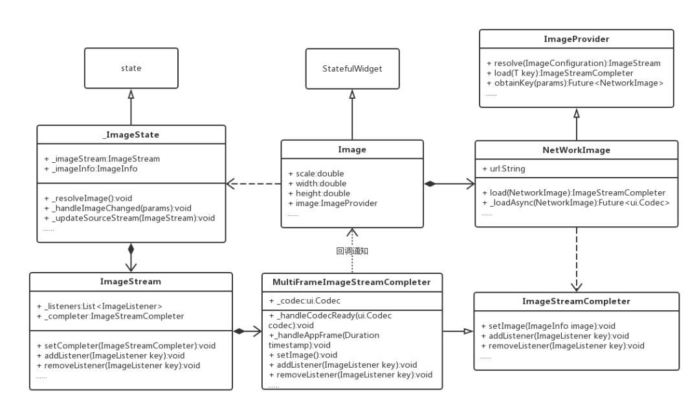

# Flutter 加载图片


## ImageCache

用于缓存图像的类。实现最近最少使用的缓存，最多1000个图像，最多100个图像MB。最大尺寸可以使用[_kDefaultSize]调整[_kDefaultSizeBytes]。正在使用的图像（即application通过[imagestream]对象保存引用，[imagestreamcompleter]对象，[imageinfo]对象，或原始[dart:ui.image]objects）可能从缓存中收回（因此需要从如果在[putifabsent]方法中引用了网络，但是只要应用程序在使用位，位就一直保存在内存中。[putifabsent]方法是缓存API的主要入口点。它返回给定键以前缓存的[ImageStreamCompleter]，如果available；如果不可用，则首先调用给定的回调来获取它。在任一case，键移到“最近使用的”位置。
通常这个类不是直接使用的。[ImageProvider]类及其子类自动处理图像的缓存。此缓存的共享实例由[PrimutBut绑定]保留，并且可以通过[painting]库中的[imagecache]顶级属性获取。

### 默认大小

const int _kDefaultSize = 1000;

const int _kDefaultSizeBytes = 100 << 20; // 100 MiB
### Flutter 继承关系



可以看到Image的框架结构还是有点儿复杂的，在你只调用一行代码的情况下，其实Flutter为你做了很多工作。

初步梳理下每个类概念：

StatefulWidget就是有状态的Widget，是展示在页面上的元素。
Image继承于StatefulWidget，是来显示和加载图片。
State控制着StatefulWidget状态改变的生命周期，当Widget被创建、Widget配置信息改变或者Widget被销毁等等，State的一系列方法会被调用。
_ImageState继承于State，处理State生命周期变化以及生成Widget。
ImageProvider提供加载图片的入口，不同的图片资源加载方式不一样，只要重写其load方法即可。同样，缓存图片的key值也有其生成。
NetWorkImage负责下载网络图片的，将下载完成的图片转化成ui.Codec对象交给ImageStreamCompleter去处理解析。
ImageStreamCompleter就是逐帧解析图片的。
ImageStream是处理Image Resource的，ImageState通过ImageStream与ImageStreamCompleter建立联系。ImageStream里也存储着图片加载完毕的监听回调。
MultiFrameImageStreamCompleter就是多帧图片解析器。

### 源码分析

源码分析

我们看下Image.network都做了什么：

```Dart
class Image extends StatefulWidget {
    Image.network(String src, {
    Key key,
    double scale = 1.0,
    this.width,
    this.height,
    this.color,
    this.colorBlendMode,
    this.fit,
    this.alignment = Alignment.center,
    this.repeat = ImageRepeat.noRepeat,
    this.centerSlice,
    this.matchTextDirection = false,
    this.gaplessPlayback = false,
    Map<String, String> headers,
      }) : image = new NetworkImage(src, scale: scale, headers: headers),
       assert(alignment != null),
       assert(repeat != null),
       assert(matchTextDirection != null),
       super(key: key);
   ......
```

Image是一个StatefulWidget对象，所以我们看它的State对象：

```Dart
class _ImageState extends State<Image> {
  ImageStream _imageStream;
  ImageInfo _imageInfo;
  bool _isListeningToStream = false;
}

class ImageStream extends Diagnosticable {
  ImageStreamCompleter get completer => _completer;
  ImageStreamCompleter _completer;

  List<ImageListener> _listeners;

  /// Assigns a particular [ImageStreamCompleter] to this [ImageStream].
   void setCompleter(ImageStreamCompleter value) {
    assert(_completer == null);
    _completer = value;
    print("setCompleter:::"+(_listeners==null).toString());
    if (_listeners != null) {
      final List<ImageListener> initialListeners = _listeners;
      _listeners = null;
      initialListeners.forEach(_completer.addListener);
    }
  }

  /// Adds a listener callback that is called whenever a new concrete [ImageInfo]
  void addListener(ImageListener listener) {
    if (_completer != null)
      return _completer.addListener(listener);
    _listeners ??= <ImageListener>[];
    _listeners.add(listener);
  }

  /// Stop listening for new concrete [ImageInfo] objects.
  void removeListener(ImageListener listener) {
    if (_completer != null)
      return _completer.removeListener(listener);
    assert(_listeners != null);
    _listeners.remove(listener);
  }
 }
```

我们对_ImageState的两个属性对象解释一下：

### ImageStream

ImageStream是处理Image Resource的，ImageStream里存储着图片加载完毕的监听回调，ImageStreamCompleter也是其成员，这样ImageStream将图片的解析流程交给了ImageStreamCompleter去处理。
ImageInfo包含了Image的数据源信息：width和height以及ui.Image。 将ImageInfo里的ui.Image设置给RawImage就可以展示了。RawImage就是我们真正渲染的对象，是显示ui.Image的一个控件，接下来我们会看到。
我们知道State的生命周期，首先State的initState执行，然后didChangeDependencies会执行，我们看到ImageState里没有重写父类的initState，那我们看其didChangeDependencies()：

```Dart
@override
void didChangeDependencies() {
    _resolveImage();

    if (TickerMode.of(context))
      _listenToStream();
    else
      _stopListeningToStream();

    super.didChangeDependencies();
}

```

### _resolveImage方法解析


我们看到首先调用了resolveImage()，我们看下resolveImage方法：

```Dart
void _resolveImage() {
    final ImageStream newStream =
      widget.image.resolve(createLocalImageConfiguration(
          context,
          size: widget.width != null && widget.height != null ? new Size(widget.width, widget.height) : null
      ));
    assert(newStream != null);
    _updateSourceStream(newStream);
  }
```
这个方法是处理图片的入口。widget.image这个就是上面的创建的NetworkImage对象，是个ImageProvider对象，调用它的resolve并且传进去默认的ImageConfiguration。 我们看下resolve方法，发现NetworkImage没有，果不其然，我们在其父类ImageProvider找到了：

```Dart
ImageStream resolve(ImageConfiguration configuration) {
    assert(configuration != null);
    final ImageStream stream = new ImageStream();
    T obtainedKey;
    obtainKey(configuration).then<void>((T key) {
      obtainedKey = key;
      stream.setCompleter(PaintingBinding.instance.imageCache.putIfAbsent(key, () => load(key)));
    }).catchError(
      (dynamic exception, StackTrace stack) async {
        FlutterError.reportError(new FlutterErrorDetails(
          exception: exception,
          stack: stack,
          library: 'services library',
          context: 'while resolving an image',
          silent: true, // could be a network error or whatnot
          informationCollector: (StringBuffer information) {
            information.writeln('Image provider: $this');
            information.writeln('Image configuration: $configuration');
            if (obtainedKey != null)
              information.writeln('Image key: $obtainedKey');
          }
        ));
        return null;
      }
    );
    return stream;
  }

```
我们看到这个方法创建了ImageStream并返回，调用obtainKey返回一个携带NetworkImage的future，以后会作为缓存的key使用，并且调用ImageStream的setCompleter的方法：

```Dart
void setCompleter(ImageStreamCompleter value) {
    assert(_completer == null);
    _completer = value;
    if (_listeners != null) {
      final List<ImageListener> initialListeners = _listeners;
      _listeners = null;
      initialListeners.forEach(_completer.addListener);
    }
  }
```
这个方法就是给ImageStream设置一个ImageStreamCompleter对象，每一个ImageStream对象只能设置一次，ImageStreamCompleter是为了辅助ImageStream解析和管理Image图片帧的，并且判断是否有初始化监听器，可以做一些初始化回调工作。 我们继续看下PaintingBinding.instance.imageCache.putIfAbsent方法：

```Dart
ImageStreamCompleter putIfAbsent(Object key, ImageStreamCompleter loader()) {
    assert(key != null);
    assert(loader != null);
    ImageStreamCompleter result = _pendingImages[key];
    // Nothing needs to be done because the image hasn't loaded yet.
    if (result != null)
      return result;
    // Remove the provider from the list so that we can move it to the
    // recently used position below.
    final _CachedImage image = _cache.remove(key);
    if (image != null) {
      _cache[key] = image;
      return image.completer;
    }
    result = loader();
    void listener(ImageInfo info, bool syncCall) {
      // Images that fail to load don't contribute to cache size.
      final int imageSize = info.image == null ? 0 : info.image.height * info.image.width * 4;
      final _CachedImage image = new _CachedImage(result, imageSize);
      _currentSizeBytes += imageSize;
      _pendingImages.remove(key);
      _cache[key] = image;
      result.removeListener(listener);
      _checkCacheSize();
    }
    if (maximumSize > 0 && maximumSizeBytes > 0) {
      _pendingImages[key] = result;
      result.addListener(listener);
    }
    return result;
  }
```
这个是Flutter默认提供的内存缓存api的入口方法，这个方法会先通过key获取之前的ImageStreamCompleter对象，这个key就是NetworkImage对象，当然我们也可以重写obtainKey方法自定义key，如果存在则直接返回，如果不存在则执行load方法加载ImageStreamCompleter对象，并将其放到首位（最少最近使用算法）。

也就是说ImageProvider已经实现了内存缓存：默认缓存图片的最大个数是1000，默认缓存图片的最大空间是10MiB。 第一次加载图片肯定是没有缓存的，所以我们看下loader方法，我们看到ImageProvider是空方法，我们去看NetWorkImage，按照我们的预期确实在这里：

```Dart
@override
  ImageStreamCompleter load(NetworkImage key) {
    return new MultiFrameImageStreamCompleter(
      codec: _loadAsync(key),
      scale: key.scale,
      informationCollector: (StringBuffer information) {
        information.writeln('Image provider: $this');
        information.write('Image key: $key');
      }
    );
  }
  //网络请求加载图片的方法
  Future<ui.Codec> _loadAsync(NetworkImage key) async {
    assert(key == this);

    final Uri resolved = Uri.base.resolve(key.url);
    final HttpClientRequest request = await _httpClient.getUrl(resolved);
    headers?.forEach((String name, String value) {
      request.headers.add(name, value);
    });
    final HttpClientResponse response = await request.close();
    if (response.statusCode != HttpStatus.ok)
      throw new Exception('HTTP request failed, statusCode: ${response?.statusCode}, $resolved');

    final Uint8List bytes = await consolidateHttpClientResponseBytes(response);
    if (bytes.lengthInBytes == 0)
      throw new Exception('NetworkImage is an empty file: $resolved');

    return await ui.instantiateImageCodec(bytes);
  }
```
这个方法为我们创建了一个MultiFrameImageStreamCompleter对象，根据名字我们也能知道它继承于ImageStreamCompleter。还记得ImageStreamCompleter是做什么的吗，就是辅助ImageStream管理解析Image的。

参数解析：

### _loadAsync()是请求网络加载图片的方法
scale是缩放系数
informationCollector是信息收集对象的，提供错误或者其他日志用
MultiFrameImageStreamCompleter是多帧的图片处理加载器，我们知道Flutter的Image支持加载gif，通过MultiFrameImageStreamCompleter可以对gif文件进行解析：

```Dart
MultiFrameImageStreamCompleter({
    @required Future<ui.Codec> codec,
    @required double scale,
    InformationCollector informationCollector
  }) : assert(codec != null),
       _informationCollector = informationCollector,
       _scale = scale,
       _framesEmitted = 0,
       _timer = null {
    codec.then<void>(_handleCodecReady, onError: (dynamic error, StackTrace stack) {
      FlutterError.reportError(new FlutterErrorDetails(
        exception: error,
        stack: stack,
        library: 'services',
        context: 'resolving an image codec',
        informationCollector: informationCollector,
        silent: true,
      ));
    });
  }
```

  ui.Codec _codec;
  final double _scale;
  final InformationCollector _informationCollector;
  ui.FrameInfo _nextFrame;
我们看到MultiFrameImageStreamCompleter拿到loadAsync返回的codec数据对象,通过handleCodecReady来处理数据，然后会调用_decodeNextFrameAndSchedule方法：

```Dart
Future<Null> _decodeNextFrameAndSchedule() async {
    try {
      _nextFrame = await _codec.getNextFrame();
    } catch (exception, stack) {
      FlutterError.reportError(new FlutterErrorDetails(
          exception: exception,
          stack: stack,
          library: 'services',
          context: 'resolving an image frame',
          informationCollector: _informationCollector,
          silent: true,
      ));
      return;
    }
    if (_codec.frameCount == 1) {
      // This is not an animated image, just return it and don't schedule more
      // frames.
      _emitFrame(new ImageInfo(image: _nextFrame.image, scale: _scale));
      return;
    }
    SchedulerBinding.instance.scheduleFrameCallback(_handleAppFrame);
  }
```
通过codec.getNextFrame()去拿下一帧，对于静态的图片frameCount是1，直接用ImageInfo组装image，交给emitFrame方法，这个方法里会调用setImage，如下：

```Dart
@protected
  void setImage(ImageInfo image) {
    _current = image;
    if (_listeners.isEmpty)
      return;
    final List<ImageListener> localListeners = new List<ImageListener>.from(_listeners);
    for (ImageListener listener in localListeners) {
      try {
        listener(image, false);
      } catch (exception, stack) {
        _handleImageError('by an image listener', exception, stack);
      }
    }
  }
```
setImage方法就是设置当前的ImageInfo并检查监听器列表，通知监听器图片已经加载完毕可以刷新UI了。

对于动图来说就是就是交给SchedulerBinding逐帧的去调用setImage，通知UI刷新，代码就不贴了，有兴趣的可以自行查看下。 至此resolveImage调用流程我们算是讲完了，接下来我们看listenToStream。

### _listenToStream方法解析


我们继续分析didChangeDependencies方法，这个方法里会判断TickerMode.of(context)的值，这个值默认是true，和AnimationConrol有关，后续可以深入研究。然后调用_listenToStream()。 我们看下这个方法：

```Dart
void _listenToStream() {
    if (_isListeningToStream)
      return;
    _imageStream.addListener(_handleImageChanged);
    _isListeningToStream = true;
  }
```
这个就是添加图片加载完毕的回调器。还记得吗，当图片加载并解析完毕的时候，MultiFrameImageStreamCompleter的setImage方法会调用这里传过去的回调方法。我们看下这里回调方法里做了什么：

```Dart
void _handleImageChanged(ImageInfo imageInfo, bool synchronousCall) {
    setState(() {
      _imageInfo = imageInfo;
    });
  }
```
很显然就是拿到上层传过来ImageInfo，调用setState更新UI 我们看下build方法：

```Dart
Widget build(BuildContext context) {
    return new RawImage(
      image: _imageInfo?.image,
      width: widget.width,
      height: widget.height,
      scale: _imageInfo?.scale ?? 1.0,
      color: widget.color,
      colorBlendMode: widget.colorBlendMode,
      fit: widget.fit,
      alignment: widget.alignment,
      repeat: widget.repeat,
      centerSlice: widget.centerSlice,
      matchTextDirection: widget.matchTextDirection,
    );
  }
```
就是用imageInfo和widget的信息来封装RawImage，RawImage是RenderObjectWidget对象，是应用程序真正渲染的对象，将咱们的图片显示到界面上。


### 总结

梳理下流程：

从入口开始，Image是继承于StatefulWidget，它为咱们实现好了State：_ImageState,并且提供了一个已经实例化的NetWorkImage对象，它是继承于ImageProvider对象的。
ImageState创建完之后，ImageState通过调用resolveImage()，resolveImage()又会调用ImageProvider的resolve()方法返回一个ImageStream对象。_ImageState也注册了监听器给ImageStream，当图片下载完毕后会执行回调方法。
然后在ImageProvider的resolve()方法里不仅创建了ImageStream还设置了ImageStream的setComplete方法去设置ImageStreamCompleter，在这里去判断是否有缓存，没有缓存就调用load方法去创建ImageStreamCompleter并且添加监听器为了执行加载完图片之后的缓存工作。ImageStreamCompleter是为了解析已经加载完成的Image的。
NetWorkImage实现了ImageProvider的load方法，是真正下载图片的地方，创建了MultiFrameImageStreamCompleter对象，并且调用_loadAsync去下载图片。当图片下载完成后就调用UI的回调方法，通知UI刷新。

### 最后

至此，对Image.network的源码分析到这里也结束了，你也可以返回去看下Image的结构图了。怎么样，分析完之后是不是对Flutter加载网络图片的流程已经很了解了，也找到了Flutter缓存的突破口，Flutter自身已经提供了内存缓存（虽然不太完美），接下来你就可以添加你的硬盘缓存或者定制你的图片框架了。
