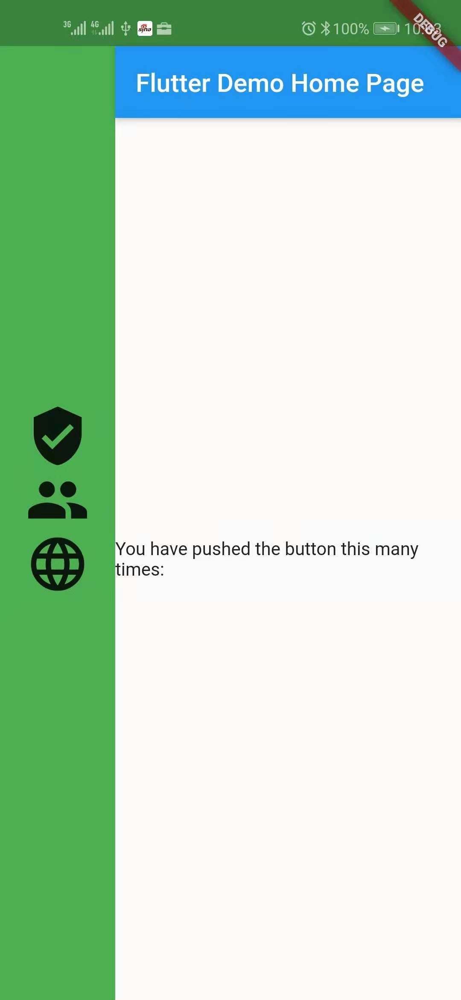

# Flutter用户侧接口

## MaterialApp

在前面我们已经分析了FlutterUI框架的加载过程，分析的系统启动部分，最原始的资源加载过程，所有的系统资源加载完成之后，就开始加载提供给开发者使用的接口数据，FlutterUI使用的是Bloc架构模式，所有的用户界面的入口是在`runApp`的时候提供给FlutterUI的框架层进行关联使用，`WidgetsApp`是FlutterUI层提供的一个接口，主要定义了标准、基础的FlutterUI层和用户UI之间的一个统一接口，我们可以自己自定义，`MaterialApp`作为系统框架层和开发者定义的数据来进行配置初始化`WidgetsApp`,DefaultTextStyle、MediaQuery、Localizations、Navigator、Overlay、SemanticsDebugger

`MaterialApp`同时需要完成两件事情:

1.保存全局性的数据和FlutterUI界面的Application配置

2.接收开发者的配置参数，进行初始化

3.配置全局导航

4.绘制性能图标

5.调试模式辅助工具

### WidgetsApp

通过包裹多个不同类型的widget，保存整个App使用到的数据,把整个系统事件和全局信息通过`WidgetsApp`APP的进行统一的管理处理，使用`Stack`控件保存整个用户UI接口的Widget层级，

`WidgetsApp`本身就是一个`StatefulWidget`,我们直接看一下build的执行过程

1.初始化`Navigator`(后续再分析导航控制器的使用过程)

2.提供builder接口给开发者替换掉系统默认的导航控制器，可以实现自己的导航FlutterUI绘制逻辑

3.DefaultTextStyle也是Widget的子类，InheritedWidget保存了主题数据，所用的用户界面获取全局的字体数据

5.PerformanceOverlay，现在UI的绘制图表，LeafRenderObjectWidget的子类，进行绘制

6.WidgetInspector查看视图的轮廓

7.处理键盘快捷键，一般在开发网页版本的时候经常用到`Shortcuts`

8.焦点事件的传递过程`DefaultFocusTraversal`,使用`ReadingOrderTraversalPolicy`事件进行传递

9.`_MediaQueryFromWindow`控制整个FlutterUI在手机屏幕上的显示区域，刘海屏和普通屏幕的边界，圆角都不一样，所以在所有的Widget外出做一层包裹，避免有溢出或者有遮挡的部分

10.本地化`Localizations`

```dart
@override
Widget build(BuildContext context) {
  Widget navigator;
  if (_navigator != null) {
    navigator = Navigator(
      key: _navigator,
      // If window.defaultRouteName isn't '/', we should assume it was set
      // intentionally via `setInitialRoute`, and should override whatever
      // is in [widget.initialRoute].
      initialRoute: WidgetsBinding.instance.window.defaultRouteName != Navigator.defaultRouteName
          ? WidgetsBinding.instance.window.defaultRouteName
          : widget.initialRoute ?? WidgetsBinding.instance.window.defaultRouteName,
      onGenerateRoute: _onGenerateRoute,
      onUnknownRoute: _onUnknownRoute,
      observers: widget.navigatorObservers,
    );
  }
  提供builder接口给开发者替换掉系统默认的导航控制器，可以实现自己的导航FlutterUI绘制逻辑，可以做一下定制的内容
  Widget result;
  if (widget.builder != null) {
    result = Builder(
      builder: (BuildContext context) {
        return widget.builder(context, navigator);
      },
    );
  } else {
    assert(navigator != null);
    result = navigator;
  }

  if (widget.textStyle != null) {
    result = DefaultTextStyle(
      style: widget.textStyle,
      child: result,
    );
  }

  PerformanceOverlay performanceOverlay;
  // We need to push a performance overlay if any of the display or checkerboarding
  // options are set.
  if (widget.showPerformanceOverlay || WidgetsApp.showPerformanceOverlayOverride) {
    performanceOverlay = PerformanceOverlay.allEnabled(
      checkerboardRasterCacheImages: widget.checkerboardRasterCacheImages,
      checkerboardOffscreenLayers: widget.checkerboardOffscreenLayers,
    );
  } else if (widget.checkerboardRasterCacheImages || widget.checkerboardOffscreenLayers) {
    performanceOverlay = PerformanceOverlay(
      checkerboardRasterCacheImages: widget.checkerboardRasterCacheImages,
      checkerboardOffscreenLayers: widget.checkerboardOffscreenLayers,
    );
  }
  if (performanceOverlay != null) {
    result = Stack(
      children: <Widget>[
        result,
        Positioned(top: 0.0, left: 0.0, right: 0.0, child: performanceOverlay),
      ],
    );
  }

  if (widget.showSemanticsDebugger) {
    result = SemanticsDebugger(
      child: result,
    );
  }

  assert(() {
    if (widget.debugShowWidgetInspector || WidgetsApp.debugShowWidgetInspectorOverride) {
      result = WidgetInspector(
        child: result,
        selectButtonBuilder: widget.inspectorSelectButtonBuilder,
      );
    }
    if (widget.debugShowCheckedModeBanner && WidgetsApp.debugAllowBannerOverride) {
      result = CheckedModeBanner(
        child: result,
      );
    }
    return true;
  }());

  Widget title;
  if (widget.onGenerateTitle != null) {
    title = Builder(
      // This Builder exists to provide a context below the Localizations widget.
      // The onGenerateTitle callback can refer to Localizations via its context
      // parameter.
      builder: (BuildContext context) {
        final String title = widget.onGenerateTitle(context);
        assert(title != null, 'onGenerateTitle must return a non-null String');
        return Title(
          title: title,
          color: widget.color,
          child: result,
        );
      },
    );
  } else {
    title = Title(
      title: widget.title,
      color: widget.color,
      child: result,
    );
  }

  final Locale appLocale = widget.locale != null
    ? _resolveLocales(<Locale>[widget.locale], widget.supportedLocales)
    : _locale;

  assert(_debugCheckLocalizations(appLocale));

  return Shortcuts(
    shortcuts: _keyMap,
    child: Actions(
      actions: _actionMap,
      child: DefaultFocusTraversal(
        policy: ReadingOrderTraversalPolicy(),
        child: _MediaQueryFromWindow(
          child: Localizations(
            locale: appLocale,
            delegates: _localizationsDelegates.toList(),
            child: title,
          ),
        ),
      ),
    ),
  );
}
```

### MaterialApp:builder

在MaterialApp中提供了一个参数`builder`可以通过控制整个App的显示区域，可以指定主要的显示区域和屏幕边界的的间隔，可以在外围添加一些控件类型

```dart
return MaterialApp(
  title: 'Flutter Demo',
  color: Colors.red,
  builder: (BuildContext context, Widget navigator) {
    return Container(
      color: Colors.green,
      child: Row(
        children: <Widget>[
          Column(
            mainAxisAlignment: MainAxisAlignment.center,
            children: <Widget>[
              Container(
                margin: EdgeInsets.only(left: 20, right: 20),
                child: Icon(
                  Icons.verified_user,
                  size: 50,
                ),
              ),
              Container(
                margin: EdgeInsets.only(left: 20, right: 20),
                child: Icon(
                  Icons.group,
                  size: 50,
                ),
              ),
              Container(
                margin: EdgeInsets.only(left: 20, right: 20),
                child: Icon(
                  Icons.language,
                  size: 50,
                ),
              )
            ],
          ),
          Expanded(
              flex: 1,
              child: Container(
                child: navigator,
              ))
        ],
      ),
    );
  },
  theme: ThemeData(
    primarySwatch: Colors.blue,
  ),
//      debugShowMaterialGrid: true,
//      debugShowCheckedModeBanner: true,
//      showSemanticsDebugger: true,
//      showPerformanceOverlay: true,
  home: MyHomePage(title: 'Flutter Demo Home Page'),
);
```


