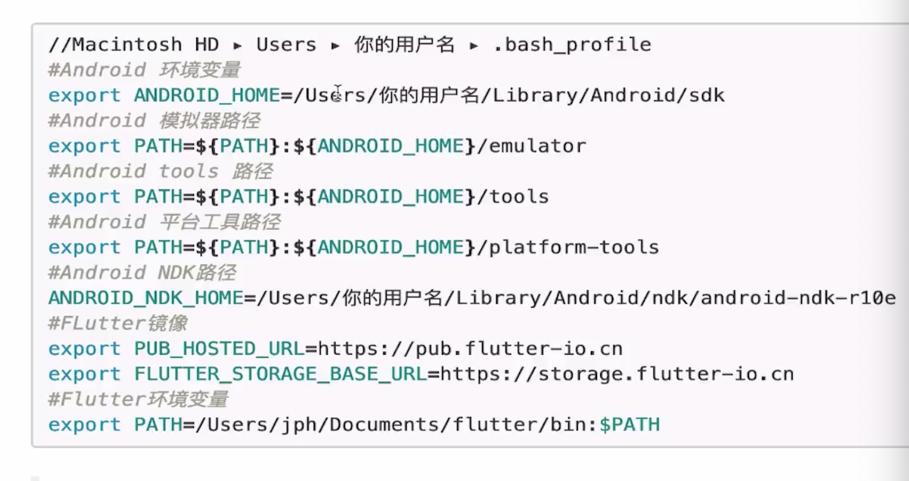
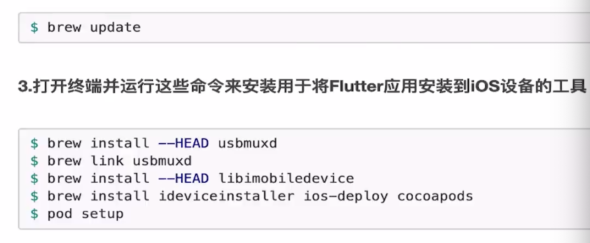

# Dart 开发 Android&IOS&Web
## 环境搭建问题？
1.系统要求
2.设置Flutter镜像
3.获取FlutterSDK
4.IOS开发环境设置
5.Android开发环境设置
6.如何查看Mac操作系统版本
7.Flutter依赖库：bash、curl git 2.x mkdir rm unzip which
8.设置Flutter镜像：bash_profile

    export PUB_HOSTED_URL=https://pub.flutter-io.cn
    export FLUTTER_STORAGE_BASE_URL=https://storage.flutter-io.cn
    git clone -b dev https://github.com/flutter/flutter.git
    export PATH="$PWD/flutter/bin:$PATH"
    cd ./flutter
    flutter doctor

上海资料获取:

    FLUTTER_STORAGE_BASE_URL: https://mirrors.sjtug.sjtu.edu.cn/
    PUB_HOSTED_URL: https://dart-pub.mirrors.sjtug.sjtu.edu.cn/


[Flutter in China](https://flutter.dev/community/china)
[flutter.cn](https://flutter.cn/)

9.环境变量配置

10.打开IOS模拟器

    open -a Simulator

11.使用命令行创建和运行项目
12.如何安装Flutter App到苹果真机上

    1.要通过 flutter run 运行到IOS真机上，需要安装一下额外的开发工具和一个Apple账号，还需要的Xcode中设置
    2.使用Xcode运行Flutter App更简单，这几运行就可以了
    安装IOS安装工具:
    
    任何一个命令失败都可以运行`brew doctor`来排查错误


13.Homebrew 安装使用
14.Flutter开发工具使用
15.androidStudio版本控制
16.Flutter环境变量、工具问题、版本问题

  Flutter环境变量、stable、beta、dev、master
  Flutter doctor
  AndroidStudio
  Xcode  新建一个项目查看是是否可以运行
  VPN和镜像

17.Flutter需要掌握的内容
  1.学习Flutter需要掌握的基础知识：Dart、Android&IOS基础[Dart](https://www.dartlang.org),[Dart中文](https://dart.goodev.org)
  2.如何使用Flutter包和插件
  3.如何继续Flutter布局
  4.如何使用Flutter路由和导航
  5.如何检测用户手势和以及点击事件处理
  6.如何导入和使用Flutter资源文件
  7.如何打开第三方应用

18.材料设计

  [材料设计](https;//material.io)
  [字体库](https://fonts.google.com)

19.布局相关组件

  RenderObjectWidget
    SingleChildRenderObjectWidget
      Opactiy
      ClipOval
      ClipRect
      PhysicalModel
      Align
      Padding
      SizeBox
      FractionallySizeBox

    MultiChildRenderObjectWidget
      Flex
      Stack
      Wrap
      Flow
  ParentDataWidget
     Positioned
     Flexible->Expande

20.Flutter 生命周期(应用程序生命周期、Widget生命周期)

Flutter生命周期按照使其划分为三个不同的生命周期:
1.创建期
createState、initState
2.更新期
didchangeDependences、build、didUpdateWidget
3.销毁期
deativate、dispose

21.AndroidX兼容
22.如何添加图片占位符
23.如何加载不同分辨率的图片
24.如何加载手机上的图片
25.实现动画有哪些方式
26.说明Hero有哪些应用场景
27.Flutter开发的技巧有哪些？？
28.如何调试flutter的android代码
29.如何调试Flutter的IOS代码

## Flutter混合开发
1.Flutter混合开发有哪些步骤
2.创建一个Fluttermodul有哪些步骤
3.Android已有项目中集成Flutter步骤
4.现有IOS中集成Flutter的步骤
5.请对比纯Flutter开发和混合Flutter开发调试有哪些步骤
6.Flutter代码的运行模式
7.如何打包一个已经集成Flutter的项目如何设置？
8.Flutter和Native通信的方式？有哪些步骤？
9.描述Channels是如何工作的?
10.Flutter如何调用Native代码？
11.Native如何调用Flutter代码？
12.如何将Flutter的页面作为一个页面集成到现有页面中?
13.热加载和热重启的区别？？
14.Android证书版本号的区别？？？
15.
# Flutter学习路线

1.Flutter开发相关工具

2.Dart基础

### 常见的数据传输结构:XML,JSON,protobuf
[protobuf使用](https://www.jianshu.com/p/419efe983cb2)

### Widget生命周期

[Flutter应用程序生命周期](https://stackoverflow.com/questions/49869873/flutter-update-widgets-on-resume#comment86757209_49870276)
```Dart
mport 'package:flutter/foundation.dart';
import 'package:flutter/widgets.dart';

class LifecycleEventHandler extends WidgetsBindingObserver {
  LifecycleEventHandler({this.resumeCallBack, this.suspendingCallBack});

  final AsyncCallback resumeCallBack;
  final AsyncCallback suspendingCallBack;

  @override
  Future<Null> didChangeAppLifecycleState(AppLifecycleState state) async {
    switch (state) {
      case AppLifecycleState.inactive:
      case AppLifecycleState.paused:
      case AppLifecycleState.suspending:
        await suspendingCallBack();
        break;
      case AppLifecycleState.resumed:
        await resumeCallBack();
        break;
    }
  }
}


class AppWidgetState extends State<AppWidget> {
  void initState() {
    super.initState();

    WidgetsBinding.instance.addObserver(
        new LifecycleEventHandler(resumeCallback(() => setState((){}))
    );
  }
  ...
}
```

```Dart
import 'package:flutter/services.dart';

SystemChannels.lifecycle.setMessageHandler((msg){
  debugPrint('SystemChannels> $msg');
  if(msg==AppLifecycleState.resumed.toString())setState((){});
});
```

```Dart

0

For deeply testing, I think the results are worth for read. If you are curious about which method you should use, just read the below: (Tested on Android)

There are three methods for LifeCycle solution.

WidgetsBindingObserver
SystemChannels.lifecycle
flutter-android-lifecycle-plugin
The main difference between WidgetsBindingObserver and SystemChannels.lifecycle is that WidgetsBindingObserver have more capables If you have a bunch of widgets that need to listen LifeCycle. SystemChannels is more low layer, and used by WidgetsBindingObserver.

After several testing, If you use SystemChannels after runApp, and home widget mixin with WidgetsBindingObserver, home widget would be failed, because SystemChannels.lifecycle.setMessageHandler override the home's method.

So If you want to use a global, single method, go for SystemChannels.lifecycle, others for WidgetsBindingObserver.

And what about the third method? This is only for Android, and If you must bind your method before runApp, this is the only way to go.
```
3.Flutter基础

    ///  * [DefaultAssetBundle]
    ///  * [NetworkAssetBundle]
    ///  * [rootBundle]
    ///  *[SystemChannels]
    ///  *[WidgetsBindingObserver]

    ///  * [ListView], which handles multiple children in a scrolling list.
    ///  * [GridView], which handles multiple children in a scrolling grid.
    ///  * [PageView], for a scrollable that works page by page.
    ///  * [Scrollable], which handles arbitrary scrolling effects.

4.Flutter第三方架构库
[简单的路由导航fluro](https://pub.dev/packages/fluro)
[获取设备信息](https://pub.dev/documentation/device_info/latest/)

5.Flutter架构

6.Flutter优化

7.Flutter相关高级开发工具

2.FluuterUI 库

3.FlutterEngine 库


# MVP Flutter:

[MVP](https://medium.com/flutter-community/improve-your-flutter-app-performance-split-your-widgets-935f97e93f7d)

Flutter 学习：

    Dart虚拟机
    Flutter框架层
    flutter应用层

Flutter布局的计算和生命周期
PreferredSizeWidget
常用工具类:https://www.jianshu.com/p/425a7ff9d66e


# 使用到的技术和遇到的坑

    使用到的工具:
    flutter_statusbar
    connectivity
    eventbus
          同步和异步的差异
          static final EventBus eventBus = new EventBus();
        //  static final EventBus eventBus = new EventBus(sync: true);//使用异步操作

    rxdart
    sqlite
    Redux


    ## 后台DjangoUI

    [simpleUI](https://gitee.com/tompeppa/simpleui/)
    [QUICK](https://gitee.com/tompeppa/simpleui/blob/master/QUICK.md)


    # Android学习资料

    ## Android原生学习资料

        [open-android](https://github.com/open-android/Android)
        [MVPArms官方快速组件化方案开源](https://blog.csdn.net/xJ032w2j4cCjhOW8s8/article/details/80730205)
        [Android原生权限](https://blog.csdn.net/u013553529/article/details/53167072)
        [系统权限](https://blog.csdn.net/u013553529/article/details/53167072)
        [Rx官方文档](https://github.com/tbruyelle/RxPermissions)

    ## 架构

        [MVC](https://en.wikipedia.org/wiki/Model%E2%80%93view%E2%80%93controller)
        [MVP](https://en.wikipedia.org/wiki/Model%E2%80%93view%E2%80%93presenter)

    ## json_to_dart
    https://javiercbk.github.io/json_to_dart/


    [自定义一个方便的点击控件](https://blog.csdn.net/qq_28478281/article/details/84064947):

    # 两个文件的异同
    import 'package:flutter/material.dart';
    import 'package:flutter/cupertino.dart';

    Dio:
    https://segmentfault.com/a/1190000015853959

    坑:
    https://blog.csdn.net/perfectnihil/article/details/92664198

    FlatButton,MaterialButton,CupertinoButton,IconButton,ImageButton 使用

    获取屏幕控件大小:
    https://segmentfault.com/a/1190000015182891
    https://juejin.im/post/5c827600f265da2da67c5f06
    https://blog.csdn.net/suyie007/article/details/84106543


    TextField控件使用:
    https://www.cnblogs.com/ChengYing-Freedom/p/10304959.html
    https://www.jianshu.com/p/54419a143d70
    https://juejin.im/post/5c12250af265da61590b8b20


    WillPopScope
    https://juejin.im/post/5cb46c87e51d456e6479b459

    #meta类的使用
    /Users/cuco/flutter/.pub-cache/hosted/pub.dartlang.org/meta-1.1.6/lib/meta.dart

    # 网络处理:

    https://flutter.dev/docs/cookbook/networking/fetch-data

    #Flutter路劲操作库
    /Users/cuco/flutter/.pub-cache/hosted/pub.dartlang.org/path-1.6.2/lib/path.dart

    # 数据库

            sqflite: ^1.1.6+3

            更新数据库:
            https://github.com/tekartik/sqflite/blob/master/sqflite/doc/migration_example.md
            数据库操作:
            https://github.com/tekartik/sqflite/blob/master/sqflite/doc/opening_db.md#prevent-database-locked-issue

    动态生成文件:
    flutter packages pub run build_runner build
    flutter packages pub run build_runner build --delete-conflicting-outputs

    # 测试
    单元测试、mockito
    https://pub.dev/packages/mockito


    # Mac 连接手机失败
    rm -rf /var/db/lockdown

            ➜  iotproject_client git:(master) ✗ flutter doctor
            Doctor summary (to see all details, run flutter doctor -v):
            [✓] Flutter (Channel stable, v1.5.4-hotfix.2, on Mac OS X 10.14.3 18D109, locale zh-Hans-CN)
            ⣻Unhandled exception:
            Exception: ideviceinfo returned an error:
            ERROR: Could not connect to lockdownd, error code -21

    # IOS真机安装


    ➜  iotproject_client git:(master) ✗ flutter run -d a86c6137ffe625bd1ce35ae0405ed863ae270b2f
    Launching lib/main.dart on iPhone 6s Plus in debug mode...
    ════════════════════════════════════════════════════════════════════════════════
    No valid code signing certificates were found
    You can connect to your Apple Developer account by signing in with your Apple ID
    in Xcode and create an iOS Development Certificate as well as a Provisioning
    Profile for your project by:
      1- Open the Flutter project's Xcode target with
           open ios/Runner.xcworkspace
      2- Select the 'Runner' project in the navigator then the 'Runner' target
         in the project settings
      3- In the 'General' tab, make sure a 'Development Team' is selected.
         You may need to:
             - Log in with your Apple ID in Xcode first
             - Ensure you have a valid unique Bundle ID
             - Register your device with your Apple Developer Account
             - Let Xcode automatically provision a profile for your app
      4- Build or run your project again
      5- Trust your newly created Development Certificate on your iOS device
         via Settings > General > Device Management > [your new certificate] > Trust

    For more information, please visit:
      https://developer.apple.com/library/content/documentation/IDEs/Conceptual/
      AppDistributionGuide/MaintainingCertificates/MaintainingCertificates.html

    Or run on an iOS simulator without code signing
    ════════════════════════════════════════════════════════════════════════════════
    No development certificates available to code sign app for device deployment
    ➜  iotproject_client git:(master) ✗
