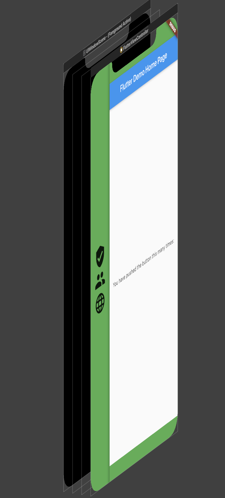
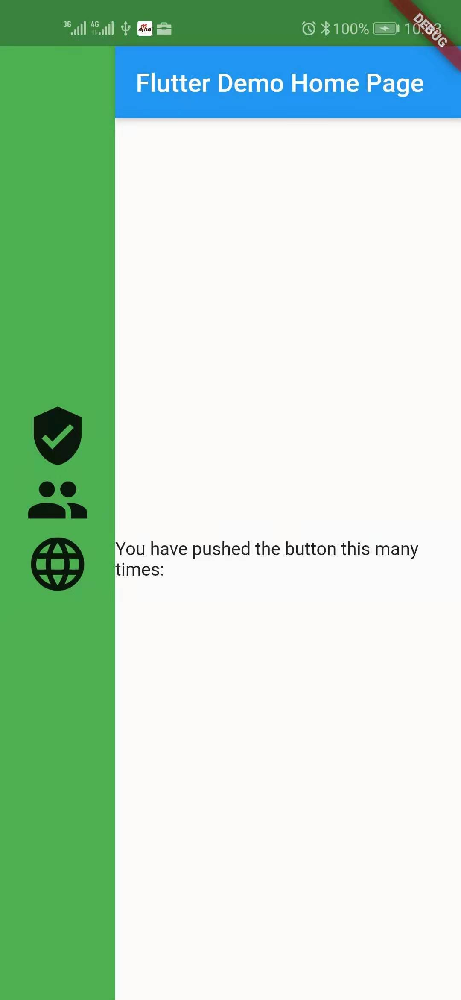

# Navigator

在开发的时候常常会员多个界面的调整问题，从Welcome界面，Login，主界面的一个流程，这三个界面是怎进行调整的，FlutterUI是怎么组织，我们先看一下下图

可以看出，每一个页面是一个完整的屏幕界面(在前面一篇文章中，我们介绍过可以改变窗口的大小),每一个页面都是Widget的一个子类，有一个RenderObje对象，只是这个RenderObject对象默认是占据一个完整的屏幕大小,多个界面直接入口切换，使用Navigator来管理多个页面之间的关系，看一下FlutterUI的布局是如何组织的

在FlutterUI中主要的就是Widget这个控件来做布局管理，在前面文章分析FlutterUI启动的时候，在runApp方法中把布局文件添加到了FlutterUI框架中加载起来，和提供给开发者的接口就是runApp传入的界面，在上一篇文字中，已经看过了WidgetsApp,在app中使用的在启动时指定的路由接口来启动第一个界面，`WidgetsApp`本身就提供了多个界面现在的区域，边界、主题和一些公共信息，提供了一个现实子页面的框架，WidgetsApp自己也是一个Widget，其他的界面，Navigator是`WidgetsApp`的子控件，多个页面保存在`Navigator`中，我们随着调用push和pop等相关的方法，不断的切换界面作为`WidgetsApp`的子控件，就实现了页面自己的切换。

## Navigator 实现

## navigator路由分类
PopupRoute
ModalRoute
PageRoute

## 使用多个导航控制器
