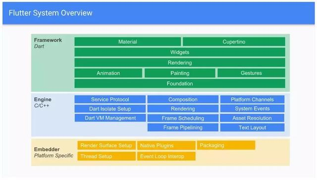

#Flutter引擎目录
AUTHORS
BUILD.gn
LICENSE
README.md
build
buildtools
flutter
ios_tools
out
third_party
tools

Flutter 目录二级目录:
total 96
-rw-r--r--   1 cuco  staff   525B Feb 28 11:00 AUTHORS
-rw-r--r--   1 cuco  staff   3.8K Feb 28 11:00 BUILD.gn
-rw-r--r--   1 cuco  staff   756B Feb 28 11:00 CONTRIBUTING.md
-rw-r--r--   1 cuco  staff    20K Feb 28 13:17 DEPS
-rw-r--r--   1 cuco  staff   1.5K Feb 28 11:00 LICENSE
-rw-r--r--   1 cuco  staff   1.4K Feb 28 11:00 README.md
-rw-r--r--   1 cuco  staff   6.4K Feb 28 11:00 analysis_options.yaml
drwxr-xr-x  10 cuco  staff   320B Feb 28 11:00 assets
drwxr-xr-x   5 cuco  staff   160B Feb 28 11:00 benchmarking
drwxr-xr-x   5 cuco  staff   160B Feb 28 11:00 build
drwxr-xr-x  11 cuco  staff   352B Feb 28 11:00 ci
drwxr-xr-x  10 cuco  staff   320B Feb 28 11:00 common
drwxr-xr-x   3 cuco  staff    96B Feb 28 11:00 docs
drwxr-xr-x  31 cuco  staff   992B Feb 28 11:00 flow
drwxr-xr-x   6 cuco  staff   192B Feb 28 11:45 flutter_kernel_transformers
drwxr-xr-x  61 cuco  staff   1.9K Feb 28 11:00 fml
drwxr-xr-x  10 cuco  staff   320B Feb 28 11:45 frontend_server
drwxr-xr-x   6 cuco  staff   192B Feb 28 11:00 lib
drwxr-xr-x  29 cuco  staff   928B Feb 28 11:00 runtime
drwxr-xr-x   8 cuco  staff   256B Feb 28 11:00 shell：客户端调用Flutter的文件目录，支持Android，Mac，IOS，嵌入式系统，在客户端开始会导入该目录下的包，在AndroidStudio中显示为FlutterForAndroid
drwxr-xr-x   6 cuco  staff   192B Feb 28 11:00 sky
drwxr-xr-x   8 cuco  staff   256B Feb 28 13:17 synchronization
drwxr-xr-x  15 cuco  staff   480B Feb 28 11:00 testing
drwxr-xr-x   4 cuco  staff   128B Feb 28 11:00 third_party
drwxr-xr-x  11 cuco  staff   352B Mar  4 19:32 tools
drwxr-xr-x  37 cuco  staff   1.2K Feb 28 11:00 vulkan


FlutterNativeView平台通道数据传输需要进一步分析

make_unique  函数：/Users/cuco/engine/src/flutter/shell/platform/android/android_shell_holder.cc

RefPtr<fml::TaskRunner>：/Users/cuco/engine/src/flutter/common/task_runners.cc

MessageLoop:engine/src/flutter/shell/platform/android/android_shell_holder.cc
MakeRefCounted:/Users/cuco/engine/src/flutter/shell/platform/android/platform_view_android_jni.cc

# Flutter 初始化调用JNI方法完成初始化

# Android初始化默认编译好的Flutter代码的文件

Android代码在初始化完成flutter的文件之后，提供SurfaceView到底层进行Flutter engine 中的Skia 2d图像
同为跨平台技术，Flutter有何优势呢？

Flutter在Rlease模式下直接将Dart编译成本地机器码，避免了代码解释运行的性能消耗。
Dart本身针对高频率循环刷新（如屏幕每秒60帧）在内存层面进行了优化，使得Dart运行时在屏幕绘制实现如鱼得水。
Flutter实现了自己的图形绘制避免了Native桥接。
Flutter在应用层使用Dart进行开发，而支撑它的是用C++开发的引擎。



# 在Android端初始化Flutter 相关的环境通过两个步骤来完成：

在下图中:
  * 1.初始化Flutter Engine 运行FlutterUI库的环境，初始化AndroidShellHolder：来管理Flutter相关的引环境
  * 2.注册SurfaceView给Flutter Eingine，提供给引擎进行绘制的画布，调用ANative_window类来连接FlutterUI和AndroidUI的桥梁



接下来进行分析在JNI层的调用过程:AttachJNI中调用`std::make_unique<AndroidShellHolder>`方法创建`AndroidShellHolder`实例`engine/src/flutter/shell/platform/android/platform_view_android_jni.cc`
```c++
    // Called By Java
    // 方法注册进入JNI
    static jlong AttachJNI(JNIEnv* env,
                           jclass clazz,
                           jobject flutterJNI,
                           jboolean is_background_view) {
      fml::jni::JavaObjectWeakGlobalRef java_object(env, flutterJNI);
      auto shell_holder = std::make_unique<AndroidShellHolder>(
          FlutterMain::Get().GetSettings(), java_object, is_background_view);
      if (shell_holder->IsValid()) {
        return reinterpret_cast<jlong>(shell_holder.release());
      } else {
        return 0;
      }
    }
```

`AndroidShellHolder`类是对Platfrom层调用JNI的接口作为一个代理对象来进行统一的代理入口，使用C++11的智能指针对象来统一管理一个对象

[C++智能指针](https://www.cnblogs.com/TenosDoIt/p/3456704.html)

介绍c++里面的四个智能指针: auto_ptr, shared_ptr, weak_ptr, unique_ptr 其中后三个是c++11支持，并且第一个已经被c++11弃用。

为什么要使用智能指针：我们知道c++的内存管理是让很多人头疼的事，当我们写一个new语句时，一般就会立即把delete语句直接也写了，但是我们不能避免程序还未执行到delete时就跳转了或者在函数中没有执行到最后的delete语句就返回了，如果我们不在每一个可能跳转或者返回的语句前释放资源，就会造成内存泄露。使用智能指针可以很大程度上的避免这个问题，因为智能指针就是一个类，当超出了类的作用域是，类会自动调用析构函数，析构函数会自动释放资源。下面我们逐个介绍。

[unique_ptr](https://www.cnblogs.com/DswCnblog/p/5628195.html),是用于取代c++98的auto_ptr的产物,在c++98的时候还没有移动语义(move semantics)的支持,因此对于auto_ptr的控制权转移的实现没有核心元素的支持,但是还是实现了auto_ptr的移动语义,这样带来的一些问题是拷贝构造函数和复制操作重载函数不够完美,具体体现就是把auto_ptr作为函数参数,传进去的时候控制权转移,转移到函数参数,当函数返回的时候并没有一个控制权移交的过程,所以过了函数调用则原先的auto_ptr已经失效了.在c++11当中有了移动语义,使用move()把unique_ptr传入函数,这样你就知道原先的unique_ptr已经失效了.移动语义本身就说明了这样的问题,比较坑爹的是标准描述是说对于move之后使用原来的内容是未定义行为,并非抛出异常,所以还是要靠人肉遵守游戏规则.再一个,auto_ptr不支持传入deleter,所以只能支持单对象(delete object),而unique_ptr对数组类型有偏特化重载,并且还做了相应的优化,比如用[]访问相应元素等.

unique_ptr 是一个独享所有权的智能指针，它提供了严格意义上的所有权，包括：

1、拥有它指向的对象

2、无法进行复制构造，无法进行复制赋值操作。即无法使两个unique_ptr指向同一个对象。但是可以进行移动构造和移动赋值操作

3、保存指向某个对象的指针，当它本身被删除释放的时候，会使用给定的删除器释放它指向的对象

unique_ptr 可以实现如下功能：

1、为动态申请的内存提供异常安全

2、讲动态申请的内存所有权传递给某函数

3、从某个函数返回动态申请内存的所有权

4、在容器中保存指针

5、auto_ptr 应该具有的功能

[share_ptr](https://www.cnblogs.com/DswCnblog/p/5628087.html)

从名字share就可以看出了资源可以被多个指针共享，它使用计数机制来表明资源被几个指针共享。可以通过成员函数use_count()来查看资源的所有者个数。出了可以通过new来构造，还可以通过传入auto_ptr, unique_ptr,weak_ptr来构造。当我们调用release()时，当前指针会释放资源所有权，计数减一。当计数等于0时，资源会被释放.

[weak_ptr](https://www.cnblogs.com/DswCnblog/p/5628314.html)

weak_ptr是用来解决shared_ptr相互引用时的死锁问题,如果说两个shared_ptr相互引用,那么这两个指针的引用计数永远不可能下降为0,资源永远不会释放。它是对对象的一种弱引用，不会增加对象的引用计数，和shared_ptr之间可以相互转化，shared_ptr可以直接赋值给它，它可以通过调用lock函数来获得shared_ptr。


`usr/include/c++/v1/memory`

```c++
auto shell_holder = std::make_unique<AndroidShellHolder>(
    FlutterMain::Get().GetSettings(), java_object, is_background_view);
```

使用模板方法来创建一个unique_ptr
```c++
template<class _Tp>
inline _LIBCPP_INLINE_VISIBILITY
typename __unique_if<_Tp>::__unique_array_unknown_bound
make_unique(size_t __n)
{
    typedef typename remove_extent<_Tp>::type _Up;
    return unique_ptr<_Tp>(new _Up[__n]());
}
```
# 在Flutter Android侧初始化时调用
AndroidShellHolder：主要是管理flutter engine 在Platform端的入口:

  * 1.Platfrom,UI,IO,GUP线程的管理，配置参数的的加载
  * 2.创建一个线程清理虚拟机退出的清理工作
  * 3.thread_host_负责管理相关的线程,托管四个相处
  * 4.PlatformViewAndroid的创建，负责管理平台侧是事件处理在UI线程执行
  * 5.Rasterizer的初始化栅格化在GPU线程执行
  * 6.MessageLoop的创建，在platfrom中运行
  * 7.TaskRunners管理添加到不同平台中的线程执行，负责管理四个任务运行器
  * 8.Shell加载第三方库，Java虚拟机的创建


```c++
//  参数说明:
//
//   blink::Settings settings,//配置数据
//   fml::jni::JavaObjectWeakGlobalRef java_object,//FlutterJNI 对象
//   bool is_background_view
//   static size_t shell_count = 1;  Shell:对象的个数为一个
//   完成：
//     1.加载Settings配置文件，绑定全局对象java_object
//     2.创建一个线程清理虚拟机退出的清理工作
//     3.ThreadHost类来管理Flutter engine的Platform，io，GPU，UI线程
//     4.初始化消息队列：fml::MessageLoop::EnsureInitializedForCurrentThread();
    //FlutterEngine的初始化入口
    AndroidShellHolder::AndroidShellHolder(
        blink::Settings settings,
        fml::jni::JavaObjectWeakGlobalRef java_object,
        bool is_background_view)
        : settings_(std::move(settings)), java_object_(java_object) {
      static size_t shell_count = 1;
      auto thread_label = std::to_string(shell_count++);
      // 创建一个线程清理虚拟机退出的清理工作
      FML_CHECK(pthread_key_create(&thread_destruct_key_, ThreadDestructCallback) ==
                0);

      if (is_background_view) {
        thread_host_ = {thread_label, ThreadHost::Type::UI};
      } else {
        thread_host_ = {thread_label, ThreadHost::Type::UI | ThreadHost::Type::GPU |
                                          ThreadHost::Type::IO};
      }

      // Detach from JNI when the UI and GPU threads exit.
      auto jni_exit_task([key = thread_destruct_key_]() {
        FML_CHECK(pthread_setspecific(key, reinterpret_cast<void*>(1)) == 0);
      });
      thread_host_.ui_thread->GetTaskRunner()->PostTask(jni_exit_task);
      if (!is_background_view) {
        thread_host_.gpu_thread->GetTaskRunner()->PostTask(jni_exit_task);
      }

      fml::WeakPtr<PlatformViewAndroid> weak_platform_view;
      Shell::CreateCallback<PlatformView> on_create_platform_view =
          [is_background_view, java_object, &weak_platform_view](Shell& shell) {
            std::unique_ptr<PlatformViewAndroid> platform_view_android;
            if (is_background_view) {
              platform_view_android = std::make_unique<PlatformViewAndroid>(
                  shell,                   // delegate
                  shell.GetTaskRunners(),  // task runners
                  java_object              // java object handle for JNI interop
              );

            } else {
              platform_view_android = std::make_unique<PlatformViewAndroid>(
                  shell,                   // delegate
                  shell.GetTaskRunners(),  // task runners
                  java_object,             // java object handle for JNI interop
                  shell.GetSettings()
                      .enable_software_rendering  // use software rendering
              );
            }
            weak_platform_view = platform_view_android->GetWeakPtr();
            return platform_view_android;
          };

      Shell::CreateCallback<Rasterizer> on_create_rasterizer = [](Shell& shell) {
        return std::make_unique<Rasterizer>(shell.GetTaskRunners());
      };

      // The current thread will be used as the platform thread. Ensure that the
      // message loop is initialized.
      fml::MessageLoop::EnsureInitializedForCurrentThread();
      fml::RefPtr<fml::TaskRunner> gpu_runner;
      fml::RefPtr<fml::TaskRunner> ui_runner;
      fml::RefPtr<fml::TaskRunner> io_runner;
      fml::RefPtr<fml::TaskRunner> platform_runner =
          fml::MessageLoop::GetCurrent().GetTaskRunner();
      if (is_background_view) {
        auto single_task_runner = thread_host_.ui_thread->GetTaskRunner();
        gpu_runner = single_task_runner;
        ui_runner = single_task_runner;
        io_runner = single_task_runner;
      } else {
        gpu_runner = thread_host_.gpu_thread->GetTaskRunner();
        ui_runner = thread_host_.ui_thread->GetTaskRunner();
        io_runner = thread_host_.io_thread->GetTaskRunner();
      }
      blink::TaskRunners task_runners(thread_label,     // label
                                      platform_runner,  // platform
                                      gpu_runner,       // gpu
                                      ui_runner,        // ui
                                      io_runner         // io
      );

      shell_ =
          Shell::Create(task_runners,             // task runners
                        settings_,                // settings
                        on_create_platform_view,  // platform view create callback
                        on_create_rasterizer      // rasterizer create callback
          );

      platform_view_ = weak_platform_view;
      FML_DCHECK(platform_view_);

      is_valid_ = shell_ != nullptr;

      if (is_valid_) {
        task_runners.GetGPUTaskRunner()->PostTask([]() {
          // Android describes -8 as "most important display threads, for
          // compositing the screen and retrieving input events". Conservatively
          // set the GPU thread to slightly lower priority than it.
          if (::setpriority(PRIO_PROCESS, gettid(), -5) != 0) {
            // Defensive fallback. Depending on the OEM, it may not be possible
            // to set priority to -5.
            if (::setpriority(PRIO_PROCESS, gettid(), -2) != 0) {
              FML_LOG(ERROR) << "Failed to set GPU task runner priority";
            }
          }
        });
        task_runners.GetUITaskRunner()->PostTask([]() {
          if (::setpriority(PRIO_PROCESS, gettid(), -1) != 0) {
            FML_LOG(ERROR) << "Failed to set UI task runner priority";
          }
        });
      }
    }
```
### 创建一个线程来对Dart vm虚拟机退出后做一起扫尾工作,并且添加到ui_thread,如果is_background_view是在后台工作，也添加到GPU_Thread里面

```c++
// 创建一个线程清理虚拟机退出的清理工作
  FML_CHECK(pthread_key_create(&thread_destruct_key_, ThreadDestructCallback) == 0);
```

```c++
  // Detach from JNI when the UI and GPU threads exit.
    auto jni_exit_task([key = thread_destruct_key_]() {
      FML_CHECK(pthread_setspecific(key, reinterpret_cast<void*>(1)) == 0);
    });
    thread_host_.ui_thread->GetTaskRunner()->PostTask(jni_exit_task);
    if (!is_background_view) {
      thread_host_.gpu_thread->GetTaskRunner()->PostTask(jni_exit_task);
    }
```

### Flutter Engine要求Embeder提供四个Task Runner，Embeder指的是将引擎移植到平台的中间层代码。这四个主要的Task Runner包括：


根据在java层调用native层的调用是传入的参数判断创建线程的类型:
  * 1.创建一个ThreadHost来管理4个线程对象
  * 2.定义一个线程类的代理类`/engine/src/flutter/fml/thread.cc`
  * 3.在线程代理类中创建MessageLoop、绑定TaskRunner,同时启动MessageLoop
  * 4.创建一个TaskRunners类来管理四个任务运行器

```c++
if (is_background_view) {
  thread_host_ = {thread_label, ThreadHost::Type::UI};
} else {
  thread_host_ = {thread_label, ThreadHost::Type::UI | ThreadHost::Type::GPU |
                                    ThreadHost::Type::IO};
}
```
`ThreadHost` 类主要是创建唯一的Platform，UI，IO，GPU线程，主要用来对四个线程的宿主对象,定义一个枚举类型来标记四种线程的类型:

```c++

enum Type {
  Platform = 1 << 0,
  UI = 1 << 1,
  GPU = 1 << 2,
  IO = 1 << 3,
};
```
构造方法创建四个线:
```c++
ThreadHost::ThreadHost(std::string name_prefix, uint64_t mask) {
  if (mask & ThreadHost::Type::Platform) {
    platform_thread = std::make_unique<fml::Thread>(name_prefix + ".platform");
  }

  if (mask & ThreadHost::Type::UI) {
    ui_thread = std::make_unique<fml::Thread>(name_prefix + ".ui");
  }

  if (mask & ThreadHost::Type::GPU) {
    gpu_thread = std::make_unique<fml::Thread>(name_prefix + ".gpu");
  }

  if (mask & ThreadHost::Type::IO) {
    io_thread = std::make_unique<fml::Thread>(name_prefix + ".io");
  }
}
```
在`engine/src/flutter/fml/thread.cc`构造方法中创建线程类，同时初始化`MessageLoop`,关联任务运行器到消息队列，同时启动消息队列`loop.Run()`
```c++
Thread::Thread(const std::string& name) : joined_(false) {
  fml::AutoResetWaitableEvent latch;
  fml::RefPtr<fml::TaskRunner> runner;
  thread_ = std::make_unique<std::thread>([&latch, &runner, name]() -> void {
    SetCurrentThreadName(name);
    fml::MessageLoop::EnsureInitializedForCurrentThread();//初始化消息队列
    auto& loop = MessageLoop::GetCurrent();
    runner = loop.GetTaskRunner();
    latch.Signal();
    loop.Run();//启动消息队列
  });
  // 当前线程等待状态
  latch.Wait();
  task_runner_ = runner;
}
```


`Platform Task Runner:`

    Flutter Engine的主Task Runner，类似于Android Main Thread或者iOS的Main Thread。但是需要注意他们还是有区别的。

    一般来说，一个Flutter应用启动的时候会创建一个Engine实例，Engine创建的时候会创建一个线程供Platform Runner使用。

    跟Flutter Engine的所有交互（接口调用）必须在Platform Thread进行，否则可能导致无法预期的异常。这跟iOS UI相关的操作都必须在主线程进行相类似。需要注意的是在Flutter Engine中有很多模块都是非线程安全的。

    规则很简单，对于Flutter Engine的接口调用都需保证在Platform Thread进行。

    阻塞Platform Thread不会直接导致Flutter应用的卡顿（跟iOS android主线程不同）。尽管如此，也不建议在这个Runner执行繁重的操作，长时间卡住Platform Thread应用有可能会被系统Watchdog强杀。

`UI Task Runner Thread（Dart Runner）`

    UI Task Runner用于执行Dart root isolate代码（isolate我们后面会讲到，姑且先简单理解为Dart VM里面的线程）。Root isolate比较特殊，它绑定了不少Flutter需要的函数方法，以便进行渲染相关操作。对于每一帧，引擎要做的事情有：

    Root isolate通知Flutter Engine有帧需要渲染。
    Flutter Engine通知平台，需要在下一个vsync的时候得到通知。
    平台等待下一个vsync
    对创建的对象和Widgets进行Layout并生成一个Layer Tree，这个Tree马上被提交给Flutter Engine。当前阶段没有进行任何光栅化，这个步骤仅是生成了对需要绘制内容的描述。
    创建或者更新Tree，这个Tree包含了用于屏幕上显示Widgets的语义信息。这个东西主要用于平台相关的辅助Accessibility元素的配置和渲染。
    除了渲染相关逻辑之外Root Isolate还是处理来自Native Plugins的消息，Timers，Microtasks和异步IO等操作。Root Isolate负责创建管理的Layer Tree最终决定绘制到屏幕上的内容。因此这个线程的过载会直接导致卡顿掉帧。

`GPU Task Runner`

    GPU Task Runner主要用于执行设备GPU的指令。UI Task Runner创建的Layer Tree是跨平台的，它不关心到底由谁来完成绘制。GPU Task Runner负责将Layer Tree提供的信息转化为平台可执行的GPU指令。GPU Task Runner同时负责绘制所需要的GPU资源的管理。资源主要包括平台Framebuffer，Surface，Texture和Buffers等。

    一般来说UI Runner和GPU Runner跑在不同的线程。GPU Runner会根据目前帧执行的进度去向UI Runner要求下一帧的数据，在任务繁重的时候可能会告诉UI Runner延迟任务。这种调度机制确保GPU Runner不至于过载，同时也避免了UI Runner不必要的消耗。

    建议为每一个Engine实例都新建一个专用的GPU Runner线程。

`IO Task Runner`

    前面讨论的几个Runner对于执行流畅度有比较高的要求。Platform Runner过载可能导致系统WatchDog强杀，UI和GPU Runner过载则可能导致Flutter应用的卡顿。但是GPU线程的一些必要操作，例如IO，放到哪里执行呢？答案正是IO Runner。

    IO Runner的主要功能是从图片存储（比如磁盘）中读取压缩的图片格式，将图片数据进行处理为GPU Runner的渲染做好准备。IO Runner首先要读取压缩的图片二进制数据（比如PNG，JPEG），将其解压转换成GPU能够处理的格式然后将数据上传到GPU。

    获取诸如ui.Image这样的资源只有通过async call去调用，当调用发生的时候Flutter Framework告诉IO Runner进行加载的异步操作。

    IO Runner直接决定了图片和其它一些资源加载的延迟间接影响性能。所以建议为IO Runner创建一个专用的线程。


Shell类的实现:


## 初始化消息队列在AndroidShellHolder
```c++
    // Copyright 2013 The Flutter Authors. All rights reserved.
    // Use of this source code is governed by a BSD-style license that can be
    // found in the LICENSE file.

    #include "flutter/fml/message_loop.h"

    #include <utility>

    #include "flutter/fml/memory/ref_counted.h"
    #include "flutter/fml/memory/ref_ptr.h"
    #include "flutter/fml/message_loop_impl.h"
    #include "flutter/fml/task_runner.h"
    #include "flutter/fml/thread_local.h"

    namespace fml {
    // 使用本地线程对象保存不同ioslate的消息队列信息
    FML_THREAD_LOCAL ThreadLocal tls_message_loop([](intptr_t value) {
      delete reinterpret_cast<MessageLoop*>(value);
    });
    // 获取当前的线程信息
    MessageLoop& MessageLoop::GetCurrent() {
      auto* loop = reinterpret_cast<MessageLoop*>(tls_message_loop.Get());
      FML_CHECK(loop != nullptr)
          << "MessageLoop::EnsureInitializedForCurrentThread was not called on "
             "this thread prior to message loop use.";
      return *loop;
    }

    void MessageLoop::EnsureInitializedForCurrentThread() {
      if (tls_message_loop.Get() != 0) {
        // Already initialized.
        return;
      }
      tls_message_loop.Set(reinterpret_cast<intptr_t>(new MessageLoop()));
    }

    bool MessageLoop::IsInitializedForCurrentThread() {
      return tls_message_loop.Get() != 0;
    }
    // 创建消息队列
    MessageLoop::MessageLoop()
        : loop_(MessageLoopImpl::Create()),
          task_runner_(fml::MakeRefCounted<fml::TaskRunner>(loop_)) {
      FML_CHECK(loop_);
      FML_CHECK(task_runner_);
    }

    MessageLoop::~MessageLoop() = default;

    void MessageLoop::Run() {
      loop_->DoRun();
    }

    void MessageLoop::Terminate() {
      loop_->DoTerminate();
    }

    fml::RefPtr<fml::TaskRunner> MessageLoop::GetTaskRunner() const {
      return task_runner_;
    }

    fml::RefPtr<MessageLoopImpl> MessageLoop::GetLoopImpl() const {
      return loop_;
    }

    void MessageLoop::AddTaskObserver(intptr_t key, fml::closure callback) {
      loop_->AddTaskObserver(key, callback);
    }

    void MessageLoop::RemoveTaskObserver(intptr_t key) {
      loop_->RemoveTaskObserver(key);
    }

    void MessageLoop::RunExpiredTasksNow() {
      loop_->RunExpiredTasksNow();
    }

    }  // namespace fml


```

使用本地线程对象保存不同ioslate的消息队列信息,使用`ThreadLocal`进行消息循环的保存
```c++
  FML_THREAD_LOCAL ThreadLocal tls_message_loop([](intptr_t value) {
    delete reinterpret_cast<MessageLoop*>(value);
  });
```
初始化MessageLoop:
```c++
// 创建消息队列
MessageLoop::MessageLoop()
    : loop_(MessageLoopImpl::Create()),
      task_runner_(fml::MakeRefCounted<fml::TaskRunner>(loop_)) {
  FML_CHECK(loop_);
  FML_CHECK(task_runner_);
}
```

message_loop_impl是MessageLoop的实现类，真正管理消息的类`engine/src/flutter/fml/message_loop_impl.cc`,对不同的平台的具体实现

```c++
// Copyright 2013 The Flutter Authors. All rights reserved.
// Use of this source code is governed by a BSD-style license that can be
// found in the LICENSE file.

#define FML_USED_ON_EMBEDDER

#include "flutter/fml/message_loop_impl.h"

#include <algorithm>
#include <vector>

#include "flutter/fml/build_config.h"
#include "flutter/fml/logging.h"
#include "flutter/fml/trace_event.h"

#if OS_MACOSX
#include "flutter/fml/platform/darwin/message_loop_darwin.h"
#elif OS_ANDROID
#include "flutter/fml/platform/android/message_loop_android.h"
#elif OS_LINUX
#include "flutter/fml/platform/linux/message_loop_linux.h"
#elif OS_WIN
#include "flutter/fml/platform/win/message_loop_win.h"
#endif

namespace fml {
// 使用编译命令来标记加载不同平台的消息队列
fml::RefPtr<MessageLoopImpl> MessageLoopImpl::Create() {
#if OS_MACOSX
  return fml::MakeRefCounted<MessageLoopDarwin>();
#elif OS_ANDROID
  return fml::MakeRefCounted<MessageLoopAndroid>();
#elif OS_LINUX
  return fml::MakeRefCounted<MessageLoopLinux>();
#elif OS_WIN
  return fml::MakeRefCounted<MessageLoopWin>();
#else
  return nullptr;
#endif
}

```


## Shell 类的初始化，主要负责管理客户端相关的资源`/engine/src/flutter/shell/platform/android/android_shell_holder.cc`,创建的地方


Shell主要的功能初始化一下四个对象:

  * platform_view_ = std::move(platform_view);
  * engine_ = std::move(engine);
  * rasterizer_ = std::move(rasterizer);
  * io_manager_ = std::move(io_manager);
  * 创建DartVM虚拟机

主要这些的动作:

  * 1.记录开始时间
  * 2.初始化日志设置
  * 3.初始化Skia：InitSkiaEventTracer
  * 4.初始化：SkGraphics
  * 5.初始化本地化库:InitializeICU
  * 6.创建虚拟机:blink::DartVM::ForProcess(settings);
  * 7.开启平台任务任务
    - 7.1:new Shell
    - 7.2:在new Shell时候有从新创建了一个DartVM：
    ```c++
        Shell::Shell(blink::TaskRunners task_runners, blink::Settings settings)
      : task_runners_(std::move(task_runners)),//任务运行器
        settings_(std::move(settings)),
        vm_(blink::DartVM::ForProcess(settings_)) {//创建一个新的DartVM
        FML_DCHECK(task_runners_.IsValid());
        FML_DCHECK(task_runners_.GetPlatformTaskRunner()->RunsTasksOnCurrentThread());
    ```
    - 7.3 Install service protocol handlers.
  * 真正创建平台操作的对象`/engine/src/flutter/shell/platform/android/platform_view_android.cc`
  * 创建一个CreateVSyncWaiter对象
  * 创建`IOManager`管理器，在IO线程执行
  * 创建Rasterizer执行在GPU线程
  * 创建engine在UI线程执行


```c++

shell_ =
    Shell::Create(task_runners,             // task runners
                  settings_,                // settings
                  on_create_platform_view,  // platform view create callback
                  on_create_rasterizer      // rasterizer create callback
    );

在Shell创建时:

  std::unique_ptr<Shell> Shell::Create(
      blink::TaskRunners task_runners,
      blink::Settings settings,
      Shell::CreateCallback<PlatformView> on_create_platform_view,
      Shell::CreateCallback<Rasterizer> on_create_rasterizer) {
    //初始化第三方库
    PerformInitializationTasks(settings);

    //初始化DartVM虚拟机
    auto vm = blink::DartVM::ForProcess(settings);
    FML_CHECK(vm) << "Must be able to initialize the VM.";
    return Shell::Create(std::move(task_runners),             //
                         std::move(settings),                 //
                         vm->GetIsolateSnapshot(),            //
                         blink::DartSnapshot::Empty(),        //
                         std::move(on_create_platform_view),  //
                         std::move(on_create_rasterizer)      //
    );
  }

```

Shell创建时第三方库初始化位置`PerformInitializationTasks`,`/engine/src/flutter/shell/common/shell.cc`

    `RecordStartupTimestamp();` 记录时间戳
    `fml::SetLogSettings(log_settings);`  设置日志信息
    `InitSkiaEventTracer(settings.trace_skia);` 初始化Skia2d图像引擎库跟踪器
    `SkGraphics::Init();`   初始化2d图形引擎库
    `fml::icu::InitializeICU(settings.icu_data_path);` 初始化国际化处理ICU


```c++
// Though there can be multiple shells, some settings apply to all components in
// the process. These have to be setup before the shell or any of its
// sub-components can be initialized. In a perfect world, this would be empty.
// TODO(chinmaygarde): The unfortunate side effect of this call is that settings
// that cause shell initialization failures will still lead to some of their
// settings being applied.
static void PerformInitializationTasks(const blink::Settings& settings) {
  static std::once_flag gShellSettingsInitialization = {};
  std::call_once(gShellSettingsInitialization, [&settings] {
    RecordStartupTimestamp();

    {
      fml::LogSettings log_settings;
      log_settings.min_log_level =
          settings.verbose_logging ? fml::LOG_INFO : fml::LOG_ERROR;
      fml::SetLogSettings(log_settings);
    }

    tonic::SetLogHandler(
        [](const char* message) { FML_LOG(ERROR) << message; });

    if (settings.trace_skia) {
      InitSkiaEventTracer(settings.trace_skia);
    }

    if (!settings.skia_deterministic_rendering_on_cpu) {
      SkGraphics::Init();
    } else {
      FML_DLOG(INFO) << "Skia deterministic rendering is enabled.";
    }

    if (settings.icu_initialization_required) {
      if (settings.icu_data_path.size() != 0) {
        fml::icu::InitializeICU(settings.icu_data_path);
      } else if (settings.icu_mapper) {
        fml::icu::InitializeICUFromMapping(settings.icu_mapper());
      } else {
        FML_DLOG(WARNING) << "Skipping ICU initialization in the shell.";
      }
    }
  });
}
```

Dart VM 虚拟机在Shell创建的时候初始化：`auto vm = blink::DartVM::ForProcess(settings);`,`/engine/src/flutter/shell/common/shell.cc`,Shell::Create，Dart虚拟机的分析，在后续在进行扩展

  * 1.加载dart虚拟机快照
  * 2.加载Isolate快照
  * 3.调用DartVM构造方法初始化虚拟机
  *

```c++
  fml::RefPtr<DartVM> DartVM::ForProcess(
    Settings settings,
    fml::RefPtr<DartSnapshot> vm_snapshot,
    fml::RefPtr<DartSnapshot> isolate_snapshot,
    fml::RefPtr<DartSnapshot> shared_snapshot) {
  std::lock_guard<std::mutex> lock(gVMMutex);
  std::call_once(gVMInitialization, [settings,          //
                                     vm_snapshot,       //
                                     isolate_snapshot,  //
                                     shared_snapshot    //
  ]() mutable {
    if (!vm_snapshot) {
      vm_snapshot = DartSnapshot::VMSnapshotFromSettings(settings);
    }
    if (!(vm_snapshot && vm_snapshot->IsValid())) {
      FML_LOG(ERROR) << "VM snapshot must be valid.";
      return;
    }
    if (!isolate_snapshot) {
      isolate_snapshot = DartSnapshot::IsolateSnapshotFromSettings(settings);
    }
    if (!(isolate_snapshot && isolate_snapshot->IsValid())) {
      FML_LOG(ERROR) << "Isolate snapshot must be valid.";
      return;
    }
    if (!shared_snapshot) {
      shared_snapshot = DartSnapshot::Empty();
    }
    gVM = fml::MakeRefCounted<DartVM>(settings,                     //
                                      std::move(vm_snapshot),       //
                                      std::move(isolate_snapshot),  //
                                      std::move(shared_snapshot)    //
    );
  });
  return gVM;
  }

```

# Shell创建所需要的在这个类里面进行初始化`CreateShellOnPlatformThread`对Shell对应的platefrom,IO,GPU,UI,`/engine/src/flutter/shell/common/shell.cc`

    std::unique_ptr<Shell> Shell::Create(
        blink::TaskRunners task_runners,
        blink::Settings settings,
        fml::RefPtr<blink::DartSnapshot> isolate_snapshot,
        fml::RefPtr<blink::DartSnapshot> shared_snapshot,
        Shell::CreateCallback<PlatformView> on_create_platform_view,
        Shell::CreateCallback<Rasterizer> on_create_rasterizer) {
      PerformInitializationTasks(settings);

      if (!task_runners.IsValid() || !on_create_platform_view ||
          !on_create_rasterizer) {
        return nullptr;
      }

      fml::AutoResetWaitableEvent latch;
      std::unique_ptr<Shell> shell;
      fml::TaskRunner::RunNowOrPostTask(
          task_runners.GetPlatformTaskRunner(),
          [&latch,                                          //
           &shell,                                          //
           task_runners = std::move(task_runners),          //
           settings,                                        //
           isolate_snapshot = std::move(isolate_snapshot),  //
           shared_snapshot = std::move(shared_snapshot),    //
           on_create_platform_view,                         //
           on_create_rasterizer                             //
      ]() {
            shell = CreateShellOnPlatformThread(std::move(task_runners),      //
                                                settings,                     //
                                                std::move(isolate_snapshot),  //
                                                std::move(shared_snapshot),   //
                                                on_create_platform_view,      //
                                                on_create_rasterizer          //
            );
            latch.Signal();
          });
      latch.Wait();
      return shell;
    }

`CreateShellOnPlatformThread`完成Shell分的一下初始化信息

  1.创建一个Shell实例对象`auto shell = std::unique_ptr<Shell>(new Shell(task_runners, settings));`
  2.创建平台View在平台线程`auto platform_view = on_create_platform_view(*shell.get());`
  3.创建一个Syncwaiter`auto vsync_waiter = platform_view->CreateVSyncWaiter();`
  4.创建一个IO管理io线程`std::unique_ptr<IOManager> io_manager;`
  5.在UI线程创建engine：`fml::AutoResetWaitableEvent ui_latch;`

    std::unique_ptr<Shell> Shell::CreateShellOnPlatformThread(
      blink::TaskRunners task_runners,
      blink::Settings settings,
      fml::RefPtr<blink::DartSnapshot> isolate_snapshot,
      fml::RefPtr<blink::DartSnapshot> shared_snapshot,
      Shell::CreateCallback<PlatformView> on_create_platform_view,
      Shell::CreateCallback<Rasterizer> on_create_rasterizer) {
    if (!task_runners.IsValid()) {
      return nullptr;
    }

    auto shell = std::unique_ptr<Shell>(new Shell(task_runners, settings));

    // Create the platform view on the platform thread (this thread).
    auto platform_view = on_create_platform_view(*shell.get());
    if (!platform_view || !platform_view->GetWeakPtr()) {
      return nullptr;
    }

    // Ask the platform view for the vsync waiter. This will be used by the engine
    // to create the animator.
    auto vsync_waiter = platform_view->CreateVSyncWaiter();
    if (!vsync_waiter) {
      return nullptr;
    }

    // Create the IO manager on the IO thread. The IO manager must be initialized
    // first because it has state that the other subsystems depend on. It must
    // first be booted and the necessary references obtained to initialize the
    // other subsystems.
    fml::AutoResetWaitableEvent io_latch;
    std::unique_ptr<IOManager> io_manager;
    auto io_task_runner = shell->GetTaskRunners().GetIOTaskRunner();
    fml::TaskRunner::RunNowOrPostTask(
        io_task_runner,
        [&io_latch,       //
         &io_manager,     //
         &platform_view,  //
         io_task_runner   //
    ]() {
          io_manager = std::make_unique<IOManager>(
              platform_view->CreateResourceContext(), io_task_runner);
          io_latch.Signal();
        });
    io_latch.Wait();

    // Create the rasterizer on the GPU thread.
    fml::AutoResetWaitableEvent gpu_latch;
    std::unique_ptr<Rasterizer> rasterizer;
    fml::WeakPtr<blink::SnapshotDelegate> snapshot_delegate;
    fml::TaskRunner::RunNowOrPostTask(
        task_runners.GetGPUTaskRunner(), [&gpu_latch,            //
                                          &rasterizer,           //
                                          on_create_rasterizer,  //
                                          shell = shell.get(),   //
                                          &snapshot_delegate     //
    ]() {
          if (auto new_rasterizer = on_create_rasterizer(*shell)) {
            rasterizer = std::move(new_rasterizer);
            snapshot_delegate = rasterizer->GetSnapshotDelegate();
          }
          gpu_latch.Signal();
        });

    gpu_latch.Wait();

    // Create the engine on the UI thread.
    fml::AutoResetWaitableEvent ui_latch;
    std::unique_ptr<Engine> engine;
    fml::TaskRunner::RunNowOrPostTask(
        shell->GetTaskRunners().GetUITaskRunner(),
        fml::MakeCopyable([&ui_latch,                                         //
                           &engine,                                           //
                           shell = shell.get(),                               //
                           isolate_snapshot = std::move(isolate_snapshot),    //
                           shared_snapshot = std::move(shared_snapshot),      //
                           vsync_waiter = std::move(vsync_waiter),            //
                           snapshot_delegate = std::move(snapshot_delegate),  //
                           io_manager = io_manager->GetWeakPtr()              //
    ]() mutable {
          const auto& task_runners = shell->GetTaskRunners();

          // The animator is owned by the UI thread but it gets its vsync pulses
          // from the platform.
          auto animator = std::make_unique<Animator>(*shell, task_runners,
                                                     std::move(vsync_waiter));

          engine = std::make_unique<Engine>(*shell,                        //
                                            shell->GetDartVM(),            //
                                            std::move(isolate_snapshot),   //
                                            std::move(shared_snapshot),    //
                                            task_runners,                  //
                                            shell->GetSettings(),          //
                                            std::move(animator),           //
                                            std::move(snapshot_delegate),  //
                                            std::move(io_manager)          //
          );
          ui_latch.Signal();
        }));

    ui_latch.Wait();
    // We are already on the platform thread. So there is no platform latch to
    // wait on.

    if (!shell->Setup(std::move(platform_view),  //
                      std::move(engine),         //
                      std::move(rasterizer),     //
                      std::move(io_manager))     //
    ) {
      return nullptr;
    }

    return shell;
    }


设置Shell管理的Platform线程管理的相关资源:`/engine/src/flutter/shell/common/engine.cc`在`/engine/src/flutter/shell/common/shell.cc`中执行`CreateShellOnPlatformThread`方法时调用

    1.PlatformView:主要管理相关的view事件
    2.Engine:所有的资源都准备完成，开始调用dart代码和Dart虚拟机，进行代码执行
    3.Rasterizer:光栅主要是处理GPU相关的事件
    4.IOManager:对io线程进行管理
    5.设置 DartVM ServiceProtocol设置处理回调
    6.PersistentCache::GetCacheForProcess()->AddWorkerTaskRunner(task_runners_.GetIOTaskRunner());对缓存目录的处理

    bool Shell::Setup(std::unique_ptr<PlatformView> platform_view,
                      std::unique_ptr<Engine> engine,
                      std::unique_ptr<Rasterizer> rasterizer,
                      std::unique_ptr<IOManager> io_manager) {
      if (is_setup_) {
        return false;
      }

      if (!platform_view || !engine || !rasterizer || !io_manager) {
        return false;
      }

      platform_view_ = std::move(platform_view);
      engine_ = std::move(engine);
      rasterizer_ = std::move(rasterizer);
      io_manager_ = std::move(io_manager);

      is_setup_ = true;

      if (auto vm = blink::DartVM::ForProcessIfInitialized()) {
        vm->GetServiceProtocol().AddHandler(this, GetServiceProtocolDescription());
      }

      PersistentCache::GetCacheForProcess()->AddWorkerTaskRunner(
          task_runners_.GetIOTaskRunner());

      return true;
    }


### Android Native层与libFlutter通信接口:


 Android端调用JNI层的代码，使用本地接口和FlutterEngine通信，在Flutter for Android 中通过FlutterJNI中相关的本地方法，platform_view_android_jni在第一次加载so库是进行初始化:

`/io/flutter/embedding/engine/FlutterJNI.class`
`engine/src/flutter/shell/platform/android/platform_view_android_jni.cc`

```java
public class FlutterJNI {
    @UiThread
    public static native boolean nativeGetIsSoftwareRenderingEnabled();
    @UiThread
    public static native String nativeGetObservatoryUri();
    private native void nativeSurfaceCreated(long var1, Surface var3);
    private native void nativeSurfaceChanged(long var1, int var3, int var4);
    private native void nativeSurfaceDestroyed(long var1);
    private native void nativeSetViewportMetrics(long var1, float var3, int var4, int var5, int var6, int var7, int var8, int var9, int var10, int var11, int var12, int var13);
    private native Bitmap nativeGetBitmap(long var1);
    private native void nativeDispatchPointerDataPacket(long var1, ByteBuffer var3, int var4);
    private native void nativeDispatchSemanticsAction(long var1, int var3, int var4, ByteBuffer var5, int var6);
    private native void nativeSetSemanticsEnabled(long var1, boolean var3);
    private native void nativeSetAccessibilityFeatures(long var1, int var3);
    private native void nativeRegisterTexture(long var1, long var3, SurfaceTexture var5);
    private native void nativeMarkTextureFrameAvailable(long var1, long var3);
    private native void nativeUnregisterTexture(long var1, long var3);
    private native long nativeAttach(FlutterJNI var1, boolean var2);
    private native void nativeDetach(long var1);
    private native void nativeDestroy(long var1);
    private native void nativeRunBundleAndSnapshotFromLibrary(long var1, @NonNull String[] var3, @Nullable String var4, @Nullable String var5, @NonNull AssetManager var6);
    private native void nativeDispatchEmptyPlatformMessage(long var1, String var3, int var4);
    private native void nativeDispatchPlatformMessage(long var1, String var3, ByteBuffer var4, int var5, int var6);
    private native void nativeInvokePlatformMessageEmptyResponseCallback(long var1, int var3);
    private native void nativeInvokePlatformMessageResponseCallback(long var1, int var3, ByteBuffer var4, int var5);
}
```


引擎元代码中使用动态JNI的方式注册相关方法:
`engine/src/flutter/shell/platform/android/platform_view_android_jni.cc`

调用Register方法注册本地方法：
```c++
bool RegisterApi(JNIEnv* env) {
static const JNINativeMethod flutter_jni_methods[] = {
  // Start of methods from FlutterNativeView
  {
      .name = "nativeAttach",
      .signature = "(Lio/flutter/embedding/engine/FlutterJNI;Z)J",
      .fnPtr = reinterpret_cast<void*>(&shell::AttachJNI),
  },
  {
      .name = "nativeDestroy",
      .signature = "(J)V",
      .fnPtr = reinterpret_cast<void*>(&shell::DestroyJNI),
  },
  {
      .name = "nativeRunBundleAndSnapshotFromLibrary",
      .signature = "(J[Ljava/lang/String;Ljava/lang/String;"
                   "Ljava/lang/String;Landroid/content/res/AssetManager;)V",
      .fnPtr =
          reinterpret_cast<void*>(&shell::RunBundleAndSnapshotFromLibrary),
  },
};

if (env->RegisterNatives(g_flutter_jni_class->obj(), flutter_jni_methods,
                     arraysize(flutter_jni_methods)) != 0) {
FML_LOG(ERROR) << "Failed to RegisterNatives with FlutterJNI";
return false;
}
```


# 启动DartVM加载Flutter侧的资源文件和初始化
`/engine/src/flutter/shell/common/shell.cc`在初始化时创建Dart虚拟机

```c++
std::unique_ptr<Shell> Shell::Create(
    blink::TaskRunners task_runners,
    blink::Settings settings,
    Shell::CreateCallback<PlatformView> on_create_platform_view,
    Shell::CreateCallback<Rasterizer> on_create_rasterizer) {
  PerformInitializationTasks(settings);

  auto vm = blink::DartVM::ForProcess(settings);
  FML_CHECK(vm) << "Must be able to initialize the VM.";
  return Shell::Create(std::move(task_runners),             //
                       std::move(settings),                 //
                       vm->GetIsolateSnapshot(),            //
                       blink::DartSnapshot::Empty(),        //
                       std::move(on_create_platform_view),  //
                       std::move(on_create_rasterizer)      //
  );
}
```

创建一个DartVM作为root ioslate 作为window的关联操作:`auto vm = blink::DartVM::ForProcess(settings);`


```c++
//1. 设置DartSnapshot的相关运行参数
//2. 启动DartVM虚拟机
fml::RefPtr<DartVM> DartVM::ForProcess(
    Settings settings,
    fml::RefPtr<DartSnapshot> vm_snapshot,
    fml::RefPtr<DartSnapshot> isolate_snapshot,
    fml::RefPtr<DartSnapshot> shared_snapshot) {
  std::lock_guard<std::mutex> lock(gVMMutex);
  std::call_once(gVMInitialization, [settings,          //
                                     vm_snapshot,       //
                                     isolate_snapshot,  //
                                     shared_snapshot    //
  ]() mutable {
    if (!vm_snapshot) {
      vm_snapshot = DartSnapshot::VMSnapshotFromSettings(settings);
    }
    if (!(vm_snapshot && vm_snapshot->IsValid())) {
      FML_LOG(ERROR) << "VM snapshot must be valid.";
      return;
    }
    if (!isolate_snapshot) {
      isolate_snapshot = DartSnapshot::IsolateSnapshotFromSettings(settings);
    }
    if (!(isolate_snapshot && isolate_snapshot->IsValid())) {
      FML_LOG(ERROR) << "Isolate snapshot must be valid.";
      return;
    }
    if (!shared_snapshot) {
      shared_snapshot = DartSnapshot::Empty();
    }
    // 虚拟机的创建
    gVM = fml::MakeRefCounted<DartVM>(settings,                     //
                                      std::move(vm_snapshot),       //
                                      std::move(isolate_snapshot),  //
                                      std::move(shared_snapshot)    //
    );
  });
  return gVM;
}
```

调用`MakeRefCounted`对虚拟机引用的管理,调用DartVM构造函数`engine/src/flutter/runtime/dart_vm.cc`
```c++
// 虚拟机的创建
gVM = fml::MakeRefCounted<DartVM>(settings,                     //
                                  std::move(vm_snapshot),       //
                                  std::move(isolate_snapshot),  //
                                  std::move(shared_snapshot)    //
);

```

```c++
// 1.构造方法出入ioslate相关的参数，setting中的配置参数
// 2.判断启动的DartVM模式
// 3.初始化FlutterUI相关的类 DartUI::InitForGlobal(); UI相关的文件engine/src/flutter/lib/ui/dart_ui.gni，/engine/src/flutter/lib/ui/ui.dart
// 4.真正初始化初始化DartVM:engine/src/third_party/dart/runtime/include/dart_api.h DartVM操作接口
    // char* init_error = Dart_Initialize(&params);
// 5.添加虚拟机回调
// 6.// 添加加载的类库资源到Kernel中,配置文件engine/src/flutter/common/settings.h
DartVM::DartVM(const Settings& settings,
               fml::RefPtr<DartSnapshot> vm_snapshot,
               fml::RefPtr<DartSnapshot> isolate_snapshot,
               fml::RefPtr<DartSnapshot> shared_snapshot)
    : settings_(settings),
      vm_snapshot_(std::move(vm_snapshot)),
      isolate_snapshot_(std::move(isolate_snapshot)),
      shared_snapshot_(std::move(shared_snapshot)),
      weak_factory_(this) {
  TRACE_EVENT0("flutter", "DartVMInitializer");
  FML_DLOG(INFO) << "Attempting Dart VM launch for mode: "
                 << (IsRunningPrecompiledCode() ? "AOT" : "Interpreter");

  {
    TRACE_EVENT0("flutter", "dart::bin::BootstrapDartIo");
    dart::bin::BootstrapDartIo();

    if (!settings.temp_directory_path.empty()) {
      dart::bin::SetSystemTempDirectory(settings.temp_directory_path.c_str());
    }
  }

  std::vector<const char*> args;

  // Instruct the VM to ignore unrecognized flags.
  // There is a lot of diversity in a lot of combinations when it
  // comes to the arguments the VM supports. And, if the VM comes across a flag
  // it does not recognize, it exits immediately.
  args.push_back("--ignore-unrecognized-flags");

  for (auto* const profiler_flag :
       ProfilingFlags(settings.enable_dart_profiling)) {
    args.push_back(profiler_flag);
  }

  PushBackAll(&args, kDartLanguageArgs, arraysize(kDartLanguageArgs));

  if (IsRunningPrecompiledCode()) {
    PushBackAll(&args, kDartPrecompilationArgs,
                arraysize(kDartPrecompilationArgs));
  }

  // Enable Dart assertions if we are not running precompiled code. We run non-
  // precompiled code only in the debug product mode.
  bool enable_asserts = !settings.disable_dart_asserts;

#if FLUTTER_RUNTIME_MODE == FLUTTER_RUNTIME_MODE_DYNAMIC_PROFILE || \
    FLUTTER_RUNTIME_MODE == FLUTTER_RUNTIME_MODE_DYNAMIC_RELEASE
  enable_asserts = false;
#endif

#if !OS_FUCHSIA
  if (IsRunningPrecompiledCode()) {
    enable_asserts = false;
  }
#endif  // !OS_FUCHSIA

#if FLUTTER_RUNTIME_MODE == FLUTTER_RUNTIME_MODE_DEBUG
  // Debug mode uses the JIT, disable code page write protection to avoid
  // memory page protection changes before and after every compilation.
  PushBackAll(&args, kDartWriteProtectCodeArgs,
              arraysize(kDartWriteProtectCodeArgs));
#endif

  if (enable_asserts) {
    PushBackAll(&args, kDartAssertArgs, arraysize(kDartAssertArgs));
  }

  if (settings.start_paused) {
    PushBackAll(&args, kDartStartPausedArgs, arraysize(kDartStartPausedArgs));
  }

  if (settings.endless_trace_buffer || settings.trace_startup) {
    // If we are tracing startup, make sure the trace buffer is endless so we
    // don't lose early traces.
    PushBackAll(&args, kDartEndlessTraceBufferArgs,
                arraysize(kDartEndlessTraceBufferArgs));
  }

  if (settings.trace_systrace) {
    PushBackAll(&args, kDartSystraceTraceBufferArgs,
                arraysize(kDartSystraceTraceBufferArgs));
    PushBackAll(&args, kDartTraceStreamsArgs, arraysize(kDartTraceStreamsArgs));
  }

  if (settings.trace_startup) {
    PushBackAll(&args, kDartTraceStartupArgs, arraysize(kDartTraceStartupArgs));
  }

#if defined(OS_FUCHSIA)
  PushBackAll(&args, kDartFuchsiaTraceArgs, arraysize(kDartFuchsiaTraceArgs));
  PushBackAll(&args, kDartTraceStreamsArgs, arraysize(kDartTraceStreamsArgs));
#endif

  for (size_t i = 0; i < settings.dart_flags.size(); i++)
    args.push_back(settings.dart_flags[i].c_str());

  char* flags_error = Dart_SetVMFlags(args.size(), args.data());
  if (flags_error) {
    FML_LOG(FATAL) << "Error while setting Dart VM flags: " << flags_error;
    ::free(flags_error);
  }
  // 初始化FlutterUI相关的类库
  DartUI::InitForGlobal();

  Dart_SetFileModifiedCallback(&DartFileModifiedCallback);

  // 真正实现虚拟机,调用接口
  {
    TRACE_EVENT0("flutter", "Dart_Initialize");
    Dart_InitializeParams params = {};
    params.version = DART_INITIALIZE_PARAMS_CURRENT_VERSION;
    params.vm_snapshot_data = vm_snapshot_->GetData()->GetSnapshotPointer();
    params.vm_snapshot_instructions = vm_snapshot_->GetInstructionsIfPresent();
    params.create = reinterpret_cast<decltype(params.create)>(
        DartIsolate::DartIsolateCreateCallback);
    params.shutdown = reinterpret_cast<decltype(params.shutdown)>(
        DartIsolate::DartIsolateShutdownCallback);
    params.cleanup = reinterpret_cast<decltype(params.cleanup)>(
        DartIsolate::DartIsolateCleanupCallback);
    params.thread_exit = ThreadExitCallback;
    params.get_service_assets = GetVMServiceAssetsArchiveCallback;
    params.entropy_source = DartIO::EntropySource;
    // engine/src/third_party/dart/runtime/include/dart_api.h DartVM操作接口
    // 真正初始化DartVM
    char* init_error = Dart_Initialize(&params);
    if (init_error) {
      FML_LOG(FATAL) << "Error while initializing the Dart VM: " << init_error;
      ::free(init_error);
    }
    // Send the earliest available timestamp in the application lifecycle to
    // timeline. The difference between this timestamp and the time we render
    // the very first frame gives us a good idea about Flutter's startup time.
    // Use a duration event so about:tracing will consider this event when
    // deciding the earliest event to use as time 0.
    if (blink::engine_main_enter_ts != 0) {
      Dart_TimelineEvent("FlutterEngineMainEnter",     // label
                         blink::engine_main_enter_ts,  // timestamp0
                         blink::engine_main_enter_ts,  // timestamp1_or_async_id
                         Dart_Timeline_Event_Duration,  // event type
                         0,                             // argument_count
                         nullptr,                       // argument_names
                         nullptr                        // argument_values
      );
    }
  }

  // Allow streaming of stdout and stderr by the Dart vm.
  Dart_SetServiceStreamCallbacks(&ServiceStreamListenCallback,
                                 &ServiceStreamCancelCallback);

  Dart_SetEmbedderInformationCallback(&EmbedderInformationCallback);
  // 添加加载的类库资源到Kernel中,配置文件engine/src/flutter/common/settings.h
  if (settings.dart_library_sources_kernel != nullptr) {
    std::unique_ptr<fml::Mapping> dart_library_sources =
        settings.dart_library_sources_kernel();
    // Set sources for dart:* libraries for debugging.
    Dart_SetDartLibrarySourcesKernel(dart_library_sources->GetMapping(),
                                     dart_library_sources->GetSize());
  }
}
```

DartVM构造函数中调用`DartUI::InitForGlobal();`,创建一个管理FlutterUI相关的接口`/engine/src/flutter/lib/ui/dart_ui.cc`
```c++
// Dart层UI相关的操作类初始化入口,提供UI相关联的API
// 创建两个DartLibraryNatives，Dart调用JNI相关方法
// 1.创建一个和UI相关的DartLibraryNatives
// 2.创建一个和UI不相关的DartLibraryNatives
void DartUI::InitForGlobal() {
  if (!g_natives) {
    g_natives = new tonic::DartLibraryNatives();//engine/src/third_party/tonic/dart_library_natives.cc
    // 注册画笔相关的本地方法 engine/src/flutter/lib/ui/painting
    Canvas::RegisterNatives(g_natives);
    CanvasGradient::RegisterNatives(g_natives);
    CanvasImage::RegisterNatives(g_natives);
    CanvasPath::RegisterNatives(g_natives);
    CanvasPathMeasure::RegisterNatives(g_natives);
    Codec::RegisterNatives(g_natives);
    // engine/src/flutter/lib/ui/dart_runtime_hooks.cc DartVM构造函数
    DartRuntimeHooks::RegisterNatives(g_natives);
    // 注册画笔相关的本地方法 engine/src/flutter/lib/ui/painting
    EngineLayer::RegisterNatives(g_natives);
    FontCollection::RegisterNatives(g_natives);
    FrameInfo::RegisterNatives(g_natives);
    ImageFilter::RegisterNatives(g_natives);
    ImageShader::RegisterNatives(g_natives);
    //engine/src/flutter/lib/ui/isolate_name_server
    IsolateNameServerNatives::RegisterNatives(g_natives);
    Paragraph::RegisterNatives(g_natives);
    ParagraphBuilder::RegisterNatives(g_natives);
    Picture::RegisterNatives(g_natives);
    PictureRecorder::RegisterNatives(g_natives);
    Scene::RegisterNatives(g_natives);
    SceneBuilder::RegisterNatives(g_natives);
    SceneHost::RegisterNatives(g_natives);
    SemanticsUpdate::RegisterNatives(g_natives);
    SemanticsUpdateBuilder::RegisterNatives(g_natives);
    Versions::RegisterNatives(g_natives);
    Vertices::RegisterNatives(g_natives);
    // 初始化Window类
    Window::RegisterNatives(g_natives);

    // Secondary isolates do not provide UI-related APIs.
    g_natives_secondary = new tonic::DartLibraryNatives();
    DartRuntimeHooks::RegisterNatives(g_natives_secondary);
    IsolateNameServerNatives::RegisterNatives(g_natives_secondary);
  }
}

```


`engine/src/flutter/shell/common/shell.cc`作为一个中枢控制作用，使用弱引用来保存PlatformView，Android，ios保存使用shell中Platform下的Platefrom实现来处理平台相关的View,Shell的初始化是在`engine/src/flutter/shell/platform/android/android_shell_holder.cc`，`FlutterMain::Get().GetSettings()`编译时的配置文件`engine/src/flutter/common/settings.cc`,`flutterJNI`是android层的代码，`is_background_view`是在java层FlutterNativeView，这是Java和JNI的通信，数据传输逻辑处理，FlutterNativeView的构造方法中调用JNI代码，初始化`android_shell_holder`使用这个类来全部`Shell`这个类


a
