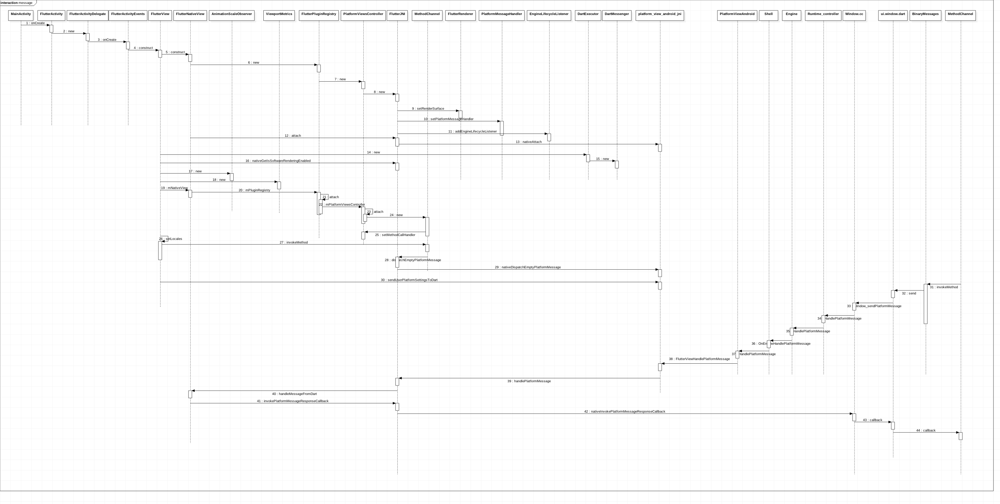
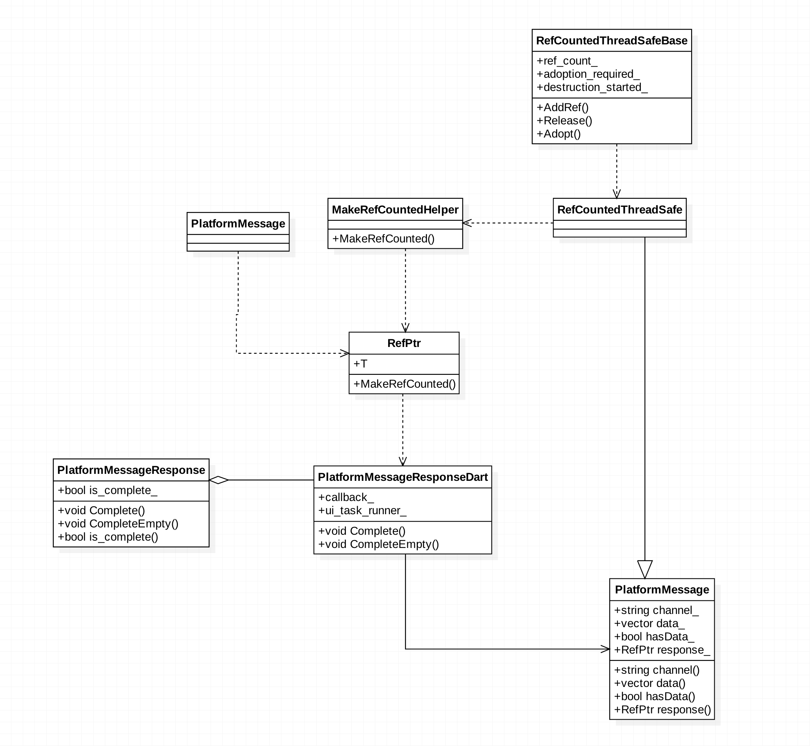
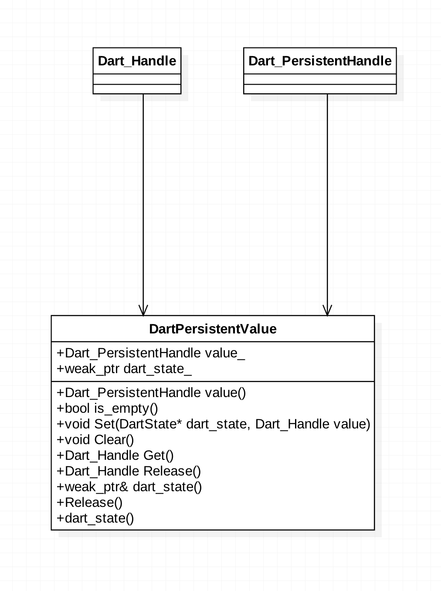
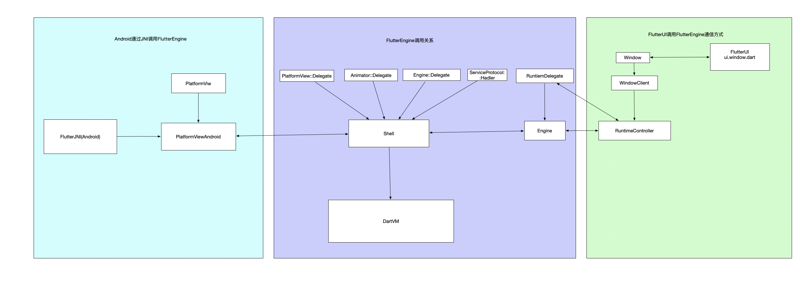

# Flutter Platform channel 源码分析

## 概述

Flutter是一个跨平台的方案，在UI、触控及基本的网络请求上已经基本做到平台无关，但是在某些平台特性的功能上，还是必须要对不同的平台做处理。这就涉及到与Native的通信。

Flutter提供了一套Platform Channel的机制，来满足与Native通信的功能要求。


!!! info "Platform Channel分类"

    * BasicMessageChannel
    * MethodChannel
    * EventChannel


其各自的主要用途如下：

  * BasicMessageChannel: 用于传递数据。Flutter与原生项目的资源是不共享的，可以通过BasicMessageChannel来获取Native项目的图标等资源。
  * MethodChannel: 传递方法调用。Flutter主动调用Native的方法，并获取相应的返回值。比如获取系统电量，发起Toast等调用系统API，可以通过这个来完成。
  * EventChannel: 传递事件。这里是Native将事件通知到Flutter。比如Flutter需要监听网络情况，这时候MethodChannel就无法胜任这个需求了。EventChannel可以将Flutter的一个监听交给Native，Native去做网络广播的监听，当收到广播后借助EventChannel调用Flutter注册的监听，完成对Flutter的事件通知。
其实可以看到，无论传方法还是传事件，其本质上都是数据的传递，不过上层包的一些逻辑不同而已。所以这三个Channel的通信实现基本是一致的，只是EventChannel在处理消息处理时会有一些特殊的附加逻辑，这个后文会做分析。


[用官方的Demo，Flutter获取设备电量](https://github.com/flutter/flutter.git)

## Platform Channel架构逻辑


## 调用时序逻辑

在分析Flutter Platform channel源码之前，先来了解一下在整个过程中Android端和FlutterUI端调用的过程时序图:


## 源码调用

在Native项目的Activity中，注册插件：

`flutter/bin/cache/pkg/sky_engine/lib/ui/window.dart`
`engine/src/flutter/lib/ui/window.dart`

然后在Flutter项目中，直接通过ChannelName实例化MethodChannel，然后调用方法即可。

```java

class _PlatformChannelState extends State<PlatformChannel> {
  static const MethodChannel methodChannel =  MethodChannel('samples.flutter.io/battery');
  static const EventChannel eventChannel = EventChannel('samples.flutter.io/charging');

  Future<void> _getBatteryLevel() async {
    String batteryLevel;
    try {
      final int result = await methodChannel.invokeMethod('getBatteryLevel');
      batteryLevel = 'Battery level: $result%.';
    } on PlatformException {
      batteryLevel = 'Failed to get battery level.';
    }
    setState(() {
      _batteryLevel = batteryLevel;
    });
  }
..............
}
```

Flutter在Native上是用一个SurfaceView承载的，getFlutterView()获取到这个View
BATTERY_CHANNEL是channel名称，必须唯一一般用包名加功能命名，如："com.qq.fm/battery"
```java

new MethodChannel(getFlutterView(), BATTERY_CHANNEL).setMethodCallHandler(
    new MethodCallHandler() {
      @Override
      public void onMethodCall(MethodCall call, Result result) {
        if (call.method.equals("getBatteryLevel")) {
          int batteryLevel = getBatteryLevel(); // 调系统API获取电量

          if (batteryLevel != -1) {
            result.success(batteryLevel);
          } else {
            result.error("UNAVAILABLE", "Battery level not available.", null);
          }
        } else {
          result.notImplemented();
        }
      }
    }
);
```

FlutterUI层调用ui.window中的方法`_sendPlatformMessage`调用native方法进入本地方法调用

```java
  String _sendPlatformMessage(String name,
  PlatformMessageResponseCallback callback,
  ByteData data) native 'Window_sendPlatformMessage';

  /// Called whenever this window receives a message from a platform-specific
  /// plugin.
  ///
  /// The `name` parameter determines which plugin sent the message. The `data`
  /// parameter is the payload and is typically UTF-8 encoded JSON but can be
  /// arbitrary data.
  ///
  /// Message handlers must call the function given in the `callback` parameter.
  /// If the handler does not need to respond, the handler should pass null to
  /// the callback.
  ///
  /// The framework invokes this callback in the same zone in which the
  /// callback was set.
  PlatformMessageCallback get onPlatformMessage => _onPlatformMessage;
  PlatformMessageCallback _onPlatformMessage;
  Zone _onPlatformMessageZone;
  set onPlatformMessage(PlatformMessageCallback callback) {
  _onPlatformMessage = callback;
  _onPlatformMessageZone = Zone.current;
  }

  /// Called by [_dispatchPlatformMessage].
  void _respondToPlatformMessage(int responseId, ByteData data)
  native 'Window_respondToPlatformMessage';
```


可以看到，这里就是在Native项目中注册一下MethodChannel，然后就可以在Flutter中用同样的ChannelName实例化一个MethodChannel，然后发起调用。
需要补充的是invokeMethod方法除了函数名，还可以带上参数传递过去。Native层则是通过Result类的相关方法，将结果回传给Flutter。

## Window.cc注册本地方法

Window.cc类对应FlutterUI层的ui.windown在创建DartVM虚拟机的时候会创建一个Dart_UI类，调用Window::RegisterNatives方法进行本地方法注册操作。

```c++

// 注册本地方法到虚拟机
void Window::RegisterNatives(tonic::DartLibraryNatives* natives) {
   natives->Register({
       {"Window_defaultRouteName", DefaultRouteName, 1, true},
       {"Window_scheduleFrame", ScheduleFrame, 1, true},
      //  保存flutter的数据到内存中，使用共享内存的方式保存
       {"Window_sendPlatformMessage", _SendPlatformMessage, 4, true},
       // so本地方法传输数据到flutter层
       {"Window_respondToPlatformMessage", _RespondToPlatformMessage, 3, true},
       {"Window_render", Render, 2, true},
       {"Window_updateSemantics", UpdateSemantics, 2, true},
       {"Window_setIsolateDebugName", SetIsolateDebugName, 2, true},
       {"Window_reportUnhandledException", ReportUnhandledException, 2, true},
   });
 }

}  // namespace blink
```
## main.dart`invoke`

在main.dart中调用`methodChannel.invokeMethod('getBatteryLevel');`方法最终会调用ui.window.dart中的本地方法调用Window.cc中的本地方法
```java
/// Sends a message to a platform-specific plugin.
///
/// The `name` parameter determines which plugin receives the message. The
/// `data` parameter contains the message payload and is typically UTF-8
/// encoded JSON but can be arbitrary data. If the plugin replies to the
/// message, `callback` will be called with the response.
///
/// The framework invokes [callback] in the same zone in which this method
/// was called.
void sendPlatformMessage(String name,
                         ByteData data,
                         PlatformMessageResponseCallback callback) {
  final String error =
      _sendPlatformMessage(name, _zonedPlatformMessageResponseCallback(callback), data);
  if (error != null)
    throw new Exception(error);
}
String _sendPlatformMessage(String name,
                            PlatformMessageResponseCallback callback,
                            ByteData data) native 'Window_sendPlatformMessage';

```

## Window.cc本地方法实现

```c++

// 本地句柄在当前Isolate内分配（参见Dart_EnterScope）并在当前范围退出时消失。除非
// 另有说明，调用者应该假设所有功能都在Dart嵌入api返回本地句柄。
// 持久句柄在当前隔离内分配。他们可用于跨范围存储对象。持久句柄有当前隔离的生命周期，除非它们是明确的
// deallocated（请参阅Dart_DeletePersistentHandle）。Dart_Handle类型表示句柄（本地和持久）。
// Dart_PersistentHandle类型是Dart_Handle，用于记录期望持久句柄作为调用的参数
//或来自调用的返回值是持久句柄。
Dart_Handle SendPlatformMessage(Dart_Handle window,//window对象在Ioslate中保存的对象
                                const std::string& name,//chinel名称
                                Dart_Handle callback,//ui.window.dart回调函数
                                const tonic::DartByteData& data) {//使用关联引用保存FlutterUI层传入的数据
  UIDartState* dart_state = UIDartState::Current();
  .....
  // 保存Dart层回调信息到持久化数据层
  if (!Dart_IsNull(callback)) {
    response = fml::MakeRefCounted<PlatformMessageResponseDart>(
        // Dart对Value的持久化处理的类，避免内存泄漏
        tonic::DartPersistentValue(dart_state, callback),
        dart_state->GetTaskRunners().GetUITaskRunner());
  }
  if (Dart_IsNull(data.dart_handle())) {
    dart_state->window()->client()->HandlePlatformMessage(
        fml::MakeRefCounted<PlatformMessage>(name, response));
  } else {
    dart_state->window()->client()->HandlePlatformMessage(
        fml::MakeRefCounted<PlatformMessage>()
            name, std::vector<uint8_t>(buffer, buffer + data.length_in_bytes()),
            response));
  }
  ....
}
```
## SendPlatformMessage函数

!!! info "在`SendPlatformMessage`方法中主要做了3个功能"

    * 1.获取当前Isolate对应的`UIDartState`,获取对应的Isolate中的数据`/engine/src/flutter/runtime/dart_isolate.cc`
    * 2.调用`:MakeRefCounted<PlatformMessageResponseDart>`保存DartVM虚拟机中的数据和运行环境进行封装和保存
    * 3.调用`fml::MakeRefCounted<PlatformMessage>(name, response)`创建一个在平台层传递的消息的封装

接下来，进一步分析上面三个步骤具体实现细节：

### PlatformMessageResponseDart

调用`:MakeRefCounted<PlatformMessageResponseDart>`保存DartVM虚拟机中的数据和运行环境进行封装和保存



`PlatformMessageResponseDart`主要功能就是保存FlutterUI 层的回调对象，和ui线程任务管理对象，定义两个变量`tonic::DartPersistentValue callback_;`封装了Dart_api中的句柄对象，主要是对DartVM中的对象`引用`保存，关联到当前的Isolate避免内存泄漏，`fml::RefPtr<fml::TaskRunner> ui_task_runner_;`保存Engine中的TaskRunner任务运行器索引对象。
```c++
namespace blink {

class PlatformMessageResponseDart : public PlatformMessageResponse {
  // 确保构造函数私有
  FML_FRIEND_MAKE_REF_COUNTED(PlatformMessageResponseDart);
  ...
  tonic::DartPersistentValue callback_;
  fml::RefPtr<fml::TaskRunner> ui_task_runner_;
};
}  // namespace blink

#endif  // FLUTTER_LIB_UI_PLATFORM_PLATFORM_MESSAGE_RESPONSE_DART_H_
```
### DartPersistentValue

DartVM中使用持久化对象来进行保存，在JNI代码中使用`DartPersistentValue`,`/engine/src/third_party/tonic/dart_persistent_value.h`对Isolate相关联的对象进行管理操作，封装了`Dart_Handle`和`Dart_PersistentHandle`两个对象是操作DartVm中的数据的引用`engine/src/third_party/dart/runtime/include/dart_api.h`




    * Dart_Handle:

     Local and persistent handles ---
     *
     * Local handles are allocated within the current scope (see
     * Dart_EnterScope) and go away when the current scope exits. Unless
     * otherwise indicated, callers should assume that all functions in
     * the Dart embedding api return local handles.
     *
     * Persistent handles are allocated within the current isolate. They
     * can be used to store objects across scopes. Persistent handles have
     * the lifetime of the current isolate unless they are explicitly
     * deallocated (see Dart_DeletePersistentHandle).
     * The type Dart_Handle represents a handle (both local and persistent).
     * The type Dart_PersistentHandle is a Dart_Handle and it is used to
     * document that a persistent handle is expected as a parameter to a call
     * or the return value from a call is a persistent handle.

```c++
#ifndef LIB_TONIC_DART_PERSISTENT_VALUE_H_
#define LIB_TONIC_DART_PERSISTENT_VALUE_H_

#include <memory>

#include "third_party/dart/runtime/include/dart_api.h"
#include "tonic/common/macros.h"

namespace tonic {
class DartState;

// DartPersistentValue is a bookkeeping class to help pair calls to
// Dart_NewPersistentHandle with Dart_DeletePersistentHandle. Consider using
// this class instead of holding a Dart_PersistentHandle directly so that you
// don't leak the Dart_PersistentHandle.
class DartPersistentValue {

  std::weak_ptr<DartState> dart_state_;
  Dart_PersistentHandle value_;

  TONIC_DISALLOW_COPY_AND_ASSIGN(DartPersistentValue);
};
}  // namespace tonic

#endif  // LIB_TONIC_DART_PERSISTENT_VALUE_H_
```
### PlatformMessageResponseDart

本地方法通过当前类回调到DartVM虚拟机中，当前的类是在Engine的UI线程执行
```c++
void PlatformMessageResponseDart::Complete(std::unique_ptr<fml::Mapping> data) {
  if (callback_.is_empty())
    return;
  FML_DCHECK(!is_complete_);
  is_complete_ = true;
  ui_task_runner_->PostTask(fml::MakeCopyable(
      [callback = std::move(callback_), data = std::move(data)]() mutable {
        std::shared_ptr<tonic::DartState> dart_state =
            callback.dart_state().lock();
        if (!dart_state)
          return;
        tonic::DartState::Scope scope(dart_state);

        Dart_Handle byte_buffer = WrapByteData(std::move(data));
        tonic::DartInvoke(callback.Release(), {byte_buffer});
      }));
}
```

### dart_invoke

`engine/src/third_party/tonic/logging/dart_invoke.cc`调用`DartInvoke`全局方法调用DartVM,真正和、DartVM交互的地方

```c++
Dart_Handle DartInvoke(Dart_Handle closure,
                       std::initializer_list<Dart_Handle> args) {
  int argc = args.size();
  Dart_Handle* argv = const_cast<Dart_Handle*>(args.begin());
  Dart_Handle handle = Dart_InvokeClosure(closure, argc, argv);
  LogIfError(handle);
  return handle;
}
```

### Dart_InvokeClosure

最终回调回DartVM中的FlutterUI中的ui.window对象的Callback方法，返回到main.dart中

```c++

/**
 * Invokes a Closure with the given arguments.
 *
 * May generate an unhandled exception error.
 *
 * \return If no error occurs during execution, then the result of
 *   invoking the closure is returned. If an error occurs during
 *   execution, then an error handle is returned.
 */
DART_EXPORT DART_WARN_UNUSED_RESULT Dart_Handle
Dart_InvokeClosure(Dart_Handle closure,
                   int number_of_arguments,
                   Dart_Handle* arguments);
```

走完上面的流程，已经保存了FlutterUI层回调相关的句柄，也就是DartVM中保存的对象，定义了一个在本地传递的消息对象，接下来就可以在本地调用传递Message到Platform层的代码。

### PlatformMessage

调用`fml::MakeRefCounted<PlatformMessage>(name, response)`创建一个在平台层传递的消息的封装

`PlatformMessage`在平台上传递的数据通过`PlatformMessage`封装统一传递，包括通道名称，需要传递的数据，FlutterUI层回调对象的关联应用定义4个变量:

  * 1.channel_
  * 2.data_
  * 3.hasData_
  * 4.response_
```c++
namespace blink {

class PlatformMessage : public fml::RefCountedThreadSafe<PlatformMessage> {
  FML_FRIEND_REF_COUNTED_THREAD_SAFE(PlatformMessage);
  FML_FRIEND_MAKE_REF_COUNTED(PlatformMessage);
  ....
  std::string channel_;   //自定义的channel名称
  std::vector<uint8_t> data_;//传入的数据(调用的方法，参数等一系列的参数)
  bool hasData_;//判断是否传入数据
  fml::RefPtr<PlatformMessageResponse> response_;//FlutterUI层的回调句柄封装关联索引
};

}  // namespace blink

#endif  // FLUTTER_LIB_UI_PLATFORM_PLATFORM_MESSAGE_H_
```

### 传输数据的大小限制

`engine/src/flutter/lib/ui/window/platform_message_response_dart.cc`，数据的大小

// Avoid copying the contents of messages beyond a certain size.
const int kMessageCopyThreshold = 1000;

下图表示在FlutteUI层调用到Android层的执行路径和相关的类集成关系:



我们可以找到对应的方法是_SendPlatformMessage，这个方法会调到`SendPlatformMessage`

调到WindowClient的HandlePlatformMessage方法，WindowClient的具体实现是RuntimeController，然后RuntimeController会将方法交给RuntimeDelegate来实现，而RuntimeDelegate的具体实现则是Engine类，这个类中的方法实现如下：
```c++
static constexpr char kAssetChannel[] = "flutter/assets";

void Engine::HandlePlatformMessage(
    fml::RefPtr<blink::PlatformMessage> message) {
  if (message->channel() == kAssetChannel) {
    HandleAssetPlatformMessage(std::move(message));
  } else {
    delegate_.OnEngineHandlePlatformMessage(std::move(message));
  }
}
```

这个方法会首先检查是否是Flutter获取平台资源的，如果是就转到获取资源的逻辑里去，否则走Delegate的逻辑，这里Delegate是的实现类是Shell。

```c++
// |shell::Engine::Delegate|
void Shell::OnEngineHandlePlatformMessage(
    fml::RefPtr<blink::PlatformMessage> message) {
  FML_DCHECK(is_setup_);
  FML_DCHECK(task_runners_.GetUITaskRunner()->RunsTasksOnCurrentThread());

  task_runners_.GetPlatformTaskRunner()->PostTask(
      [view = platform_view_->GetWeakPtr(), message = std::move(message)]() {
        if (view) {
          view->HandlePlatformMessage(std::move(message));
        }
      });
}
```

可以看到，在Shell类里，会在PlatformTaskRunner中添加一个task，这时候执行会切换到Platform task，之前都是在UI task中执行的。PlatformView的HandlePlatformMessage是一个虚函数，可以看PlatformViewAndroid中对其的实现。

```c++
// |shell::PlatformView|
void PlatformViewAndroid::HandlePlatformMessage(
    fml::RefPtr<blink::PlatformMessage> message) {
  JNIEnv* env = fml::jni::AttachCurrentThread();
  fml::jni::ScopedJavaLocalRef<jobject> view = java_object_.get(env);
  // ...
  auto java_channel = fml::jni::StringToJavaString(env, message->channel()); // (1)
  if (message->hasData()) {
    fml::jni::ScopedJavaLocalRef<jbyteArray> message_array(env, env->NewByteArray(message->data().size()));
    env->SetByteArrayRegion(
        message_array.obj(), 0, message->data().size(),
        reinterpret_cast<const jbyte*>(message->data().data()));
    message = nullptr;

    // This call can re-enter in InvokePlatformMessageXxxResponseCallback.
    FlutterViewHandlePlatformMessage(env, view.obj(), java_channel.obj(),
                                     message_array.obj(), response_id);  // (2)
  } else {
    message = nullptr;

    // This call can re-enter in InvokePlatformMessageXxxResponseCallback.
    FlutterViewHandlePlatformMessage(env, view.obj(), java_channel.obj(),
                                     nullptr, response_id);             // (3)
  }
}
```

这里，可以看到，已经开始进行JNI相关的操作了。注释(1)处从message结构中，拿到ChannelName，然后(2)和(3)的区别就是一个带参数，一个不带参数，通过FlutterViewHandlePlatformMessage发起调用。

```c++
static jmethodID g_handle_platform_message_method = nullptr;
void FlutterViewHandlePlatformMessage(JNIEnv* env,
                                      jobject obj,
                                      jstring channel,
                                      jobject message,
                                      jint responseId) {
  env->CallVoidMethod(obj, g_handle_platform_message_method, channel, message,
                      responseId); // (1)
  FML_CHECK(CheckException(env));
}
// ...
bool PlatformViewAndroid::Register(JNIEnv* env) {
  // ...
  g_flutter_native_view_class = new fml::jni::ScopedJavaGlobalRef<jclass>(
      env, env->FindClass("io/flutter/view/FlutterNativeView")); // (2)
  // ...
  g_handle_platform_message_method =
    env->GetMethodID(g_flutter_native_view_class->obj(),
                     "handlePlatformMessage", "(Ljava/lang/String;[BI)V"); // (3)
  // ...
}
```
从(1)处可以看到，开始通过JNI调Java方法，注释(2)和(3)处，指定了Java类和方法。调用了FlutterNativeView的handlePlatformMessage方法，看这里的源码：

```c++
private void handlePlatformMessage(final String channel, byte[] message, final int replyId) {
    this.assertAttached();
    BinaryMessageHandler handler = (BinaryMessageHandler)this.mMessageHandlers.get(channel); // (1)
    if (handler != null) {
        try {
            ByteBuffer buffer = message == null ? null : ByteBuffer.wrap(message);
            handler.onMessage(buffer, new BinaryReply() {
                // ...
            });
        } catch (Exception var6) {
            // ...
        }
    } else {
        Log.e("FlutterNativeView", "Uncaught exception in binary message listener", var6);
        nativeInvokePlatformMessageEmptyResponseCallback(this.mNativePlatformView, replyId);
    }
}
```

看注释(1)处，就是从之前存入的map中取出相应的handler，如果找不到，则回调Native表示失败。否则调用BinaryMessageHandler的onMessage方法，将方法信息传递过去。

然后就回到了最开始的逻辑，通过IncomingMethodCallHandler处理message数据，然后将结果通过nativeInvokePlatformMessageResponseCallback回调给Flutter。

总结分析
跟完MethodChannel的源码，会发现整个通信机制还挺简单的，先去不去理解Codec的话，等于就是将dart的变量，传到dart Native，然后交到java Native， 再传到java。然后相反的路径，再从java到dart。

然后再去看BasicMessageChannel就是没有MethodCall这个结构的，其他的也是走的BinaryMessages.send方法。然后在Android端，没有IncomingMethodCallHandler这个类，直接就是BinaryMessageHandler。所以了解了MethodChannel，BasicMessageChannel原理自然就懂了。（可以说MethodChannel就是借助BasicMessageChannel实现的）

同样的EventChannel则是基于MethodChannel来实现的，只是两端的handler会有一些特殊的处理方式，这个倒是与通信没有多大关系了，不过设计的也很简单，比较有意思。之后另起一文细表。


## 知识点:

原子性操作:
include <atomic>
/usr/include/c++/v1/atomic
/Users/cuco/engine/src/flutter/fml/memory/ref_counted_internal.h
提供的一个引用计数类:
static_cast<const T*>(this);
vector<uint8_t>


## 参考连接:

[Flutter与Native通信 - PlatformChannel源码分析](https://cloud.tencent.com/developer/article/1366113)
[Flutter官网](https://flutter.dev/docs/development/platform-integration/platform-channels)
