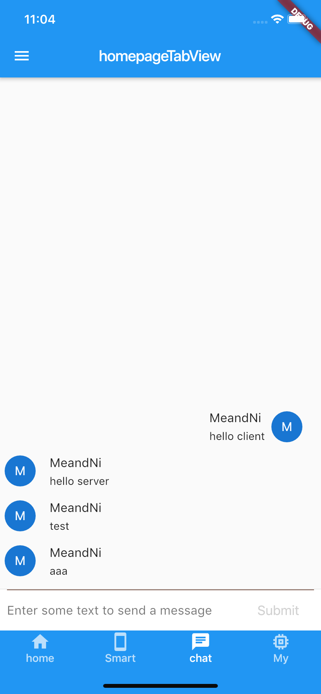
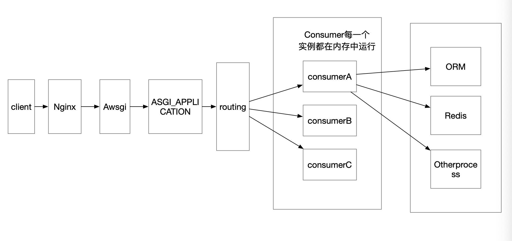

# Flutter Websocket+Django  Channels 完成Websocket前后端聊天室


## 前言
### WebSocket 与 HTTP

WebSocket 协议在2008年诞生，2011年成为国际标准。现在所有浏览器都已经支持了。WebSocket 的最大特点就是，服务器可以主动向客户端推送信息，客户端也可以主动向服务器发送信息，是真正的双向平等对话。

HTTP 有 1.1 和 1.0 之说，也就是所谓的 keep-alive ，把多个 HTTP 请求合并为一个，但是 Websocket 其实是一个新协议，跟 HTTP 协议基本没有关系，只是为了兼容现有浏览器，所以在握手阶段使用了 HTTP 。

### WebSocket 的其他特点：

建立在 TCP 协议之上，服务器端的实现比较容易。
与 HTTP 协议有着良好的兼容性。默认端口也是80和443，并且握手阶段采用 HTTP 协议，因此握手时不容易屏蔽，能通过各种 HTTP 代理服务器。
数据格式比较轻量，性能开销小，通信高效。
可以发送文本，也可以发送二进制数据。
没有同源限制，客户端可以与任意服务器通信。
协议标识符是ws（如果加密，则为wss），服务器网址就是 URL。

### WebSocket 是什么样的协议，具体有什么优点
首先，WebSocket 是一个持久化的协议，相对于 HTTP 这种非持久的协议来说。简单的举个例子吧，用目前应用比较广泛的 PHP 生命周期来解释。

HTTP 的生命周期通过 Request 来界定，也就是一个 Request 一个 Response ，那么在 HTTP1.0 中，这次 HTTP 请求就结束了。

在 HTTP1.1 中进行了改进，使得有一个 keep-alive，也就是说，在一个 HTTP 连接中，可以发送多个 Request，接收多个 Response。但是请记住 Request = Response， 在 HTTP 中永远是这样，也就是说一个 Request 只能有一个 Response。而且这个 Response 也是被动的，不能主动发起。

### WebSocket 有什么关系呢？

首先 WebSocket 是基于 HTTP 协议的，或者说借用了 HTTP 协议来完成一部分握手。

首先我们来看个典型的 WebSocket 握手

    GET /chat HTTP/1.1
    Host: server.example.com
    Upgrade: websocket
    Connection: Upgrade
    Sec-WebSocket-Key: x3JJHMbDL1EzLkh9GBhXDw==
    Sec-WebSocket-Protocol: chat, superchat
    Sec-WebSocket-Version: 13
    Origin: http://example.com

熟悉 HTTP 的童鞋可能发现了，这段类似 HTTP 协议的握手请求中，多了这么几个东西。

    Upgrade: websocket
    Connection: Upgrade

这个就是 WebSocket 的核心了，告诉 Apache 、 Nginx 等服务器：注意啦，我发起的请求要用 WebSocket 协议，快点帮我找到对应的助理处理~而不是那个老土的 HTTP。

    Sec-WebSocket-Key: x3JJHMbDL1EzLkh9GBhXDw==
    Sec-WebSocket-Protocol: chat, superchat
    Sec-WebSocket-Version: 13

首先， Sec-WebSocket-Key 是一个 Base64 encode 的值，这个是浏览器随机生成的，告诉服务器：泥煤，不要忽悠我，我要验证你是不是真的是 WebSocket 助理。

然后， Sec_WebSocket-Protocol 是一个用户定义的字符串，用来区分同 URL 下，不同的服务所需要的协议。简单理解：今晚我要服务A，别搞错啦~

最后， Sec-WebSocket-Version 是告诉服务器所使用的 WebSocket Draft （协议版本），在最初的时候，WebSocket 协议还在 Draft 阶段，各种奇奇怪怪的协议都有，而且还有很多期奇奇怪怪不同的东西，什么 Firefox 和 Chrome 用的不是一个版本之类的，当初 WebSocket 协议太多可是一个大难题。。不过现在还好，已经定下来啦~大家都使用同一个版本： 服务员，我要的是13岁的噢→_→

然后服务器会返回下列东西，表示已经接受到请求， 成功建立 WebSocket 啦！

    HTTP/1.1 101 Switching Protocols
    Upgrade: websocket
    Connection: Upgrade
    Sec-WebSocket-Accept: HSmrc0sMlYUkAGmm5OPpG2HaGWk=
    Sec-WebSocket-Protocol: chat

这里开始就是 HTTP 最后负责的区域了，告诉客户，我已经成功切换协议啦~

    Upgrade: websocket
    Connection: Upgrade

依然是固定的，告诉客户端即将升级的是 WebSocket 协议，而不是 mozillasocket，lurnarsocket 或者 shitsocket。

然后， Sec-WebSocket-Accept 这个则是经过服务器确认，并且加密过后的 Sec-WebSocket-Key 。 服务器：好啦好啦，知道啦，给你看我的 ID CARD 来证明行了吧。

后面的， Sec-WebSocket-Protocol 则是表示最终使用的协议。

至此，HTTP 已经完成它所有工作了，接下来就是完全按照 WebSocket 协议进行了。

### WebSocket 的作用

在讲 WebSocket之前，我就顺带着讲下 ajax轮询 和 long poll 的原理。

#### ajax轮询
ajax轮询的原理非常简单，让浏览器隔个几秒就发送一次请求，询问服务器是否有新信息。

#### long poll
long poll 其实原理跟 ajax轮询 差不多，都是采用轮询的方式，不过采取的是阻塞模型（一直打电话，没收到就不挂电话），也就是说，客户端发起请求后，如果没消息，就一直不返回 Response 给客户端。直到有消息才返回，返回完之后，客户端再次建立连接，周而复始。

#### WebSocket
通过上面这两个例子，我们可以看出，这两种方式都不是最好的方式，需要很多资源。

一种需要更快的速度，一种需要更多的’电话’。这两种都会导致’电话’的需求越来越高。

哦对了，忘记说了 HTTP 还是一个无状态协议。通俗的说就是，服务器因为每天要接待太多客户了，是个健忘鬼，你一挂电话，他就把你的东西全忘光了，把你的东西全丢掉了。你第二次还得再告诉服务器一遍。

所以在这种情况下出现了 WebSocket 。他解决了 HTTP 的这几个难题。首先，被动性，当服务器完成协议升级后（HTTP->Websocket），服务端就可以主动推送信息给客户端啦。所以上面的情景可以做如下修改。

## 监听端口处理

    lsof -i:端口号
    kill -9 进程号

## 项目截图



## 需要的类库
Django Channels

Channels是一个扩展Django并将其能力扩展到HTTP以外的项目 - 用于处理WebSockets，聊天协议，IoT协议等。它建立在一个名为ASGI的Python规范之上。
它通过获取Django的核心并在下面分层完全异步层来实现这一点，在同步模式下运行Django本身，但异步处理连接和套接字，并允许您选择以任一样式编写。
要开始了解Channels，请阅读我们的简介，其中将介绍工作原理。如果您从频道1升级，请查看频道2中的新功能？了解变化; 事情大不相同。

    channels
    channels-redis


## 服务器端代码集成
1.安装Channels

    pip install -U channels

2.配置

```Python
INSTALLED_APPS = (
    'django.contrib.auth',
    'django.contrib.contenttypes',
    'django.contrib.sessions',
    'django.contrib.sites',
    ...
    'channels',
)
```

3.定义路由

    Django认证系统
    Django会话系统

```Python
from channels.routing import ProtocolTypeRouter

application = ProtocolTypeRouter({
    # (http->django views is added by default)
    'websocket': AuthMiddlewareStack(
        URLRouter([
            path('channels/<str:room_name>/', ChatConsumer),
            path("chat/stream/", ChatRoomConsumer),
        ]

        )
    ),
})

服务器调动入口
class ProtocolTypeRouter:
    """
    Takes a mapping of protocol type names to other Application instances,
    and dispatches to the right one based on protocol name (or raises an error)
    """

    def __init__(self, application_mapping):
        self.application_mapping = application_mapping
        if "http" not in self.application_mapping:
        如果是http服务调用AsgiHandler处理
            self.application_mapping["http"] = AsgiHandler

    def __call__(self, scope):
        if scope["type"] in self.application_mapping:
            return self.application_mapping[scope["type"]](scope)
        else:
            raise ValueError(
                "No application configured for scope type %r" % scope["type"]
            )

#在入口处理WebSocket认证服务
# Handy shortcut for applying all three layers at once
AuthMiddlewareStack = lambda inner: CookieMiddleware(
    SessionMiddleware(AuthMiddleware(inner))
)

```
4.setting 中配置Aswgi转发的入口

```Python
ASGI_APPLICATION = "myproject.routing.application"
```


5.调用路由功能把请求发送到不同的消费者

Channels通道:[Channels](https://github.com/andrewgodwin/channels-examples)
核心类(两大类同步和异步):


1.同步类型:

    class WebsocketConsumer(SyncConsumer):
    class JsonWebsocketConsumer(WebsocketConsumer):

2.异步类型

    class AsyncWebsocketConsumer(AsyncConsumer):
    class AsyncJsonWebsocketConsumer(AsyncWebsocketConsumer):

[Channels](https://github.com/andrewgodwin/channels-examples)
```Python
from django.conf import settings

from channels.generic.websocket import AsyncJsonWebsocketConsumer

from .exceptions import ClientError
from .utils import get_room_or_error


class ChatRoomConsumer(AsyncJsonWebsocketConsumer):
    """
    This chat consumer handles websocket connections for chat clients.

    It uses AsyncJsonWebsocketConsumer, which means all the handling functions
    must be async functions, and any sync work (like ORM access) has to be
    behind database_sync_to_async or sync_to_async. For more, read
    http://channels.readthedocs.io/en/latest/topics/consumers.html
    """

    ##### WebSocket event handlers

    async def connect(self):
        """
        Called when the websocket is handshaking as part of initial connection.
        """
        # Are they logged in?
        if self.scope["user"].is_anonymous:
            # Reject the connection
            await self.close()
        else:
            # Accept the connection
            await self.accept()
        # Store which rooms the user has joined on this connection
        self.rooms = set()

    async def receive_json(self, content):
        """
        Called when we get a text frame. Channels will JSON-decode the payload
        for us and pass it as the first argument.
        """
        # Messages will have a "command" key we can switch on
        command = content.get("command", None)
        try:
            if command == "join":
                # Make them join the room
                await self.join_room(content["room"])
            elif command == "leave":
                # Leave the room
                await self.leave_room(content["room"])
            elif command == "send":
                await self.send_room(content["room"], content["message"])
        except ClientError as e:
            # Catch any errors and send it back
            await self.send_json({"error": e.code})

    async def disconnect(self, code):
        """
        Called when the WebSocket closes for any reason.
        """
        # Leave all the rooms we are still in
        for room_id in list(self.rooms):
            try:
                await self.leave_room(room_id)
            except ClientError:
                pass

    ##### Command helper methods called by receive_json

    async def join_room(self, room_id):
        """
        Called by receive_json when someone sent a join command.
        """
        # The logged-in user is in our scope thanks to the authentication ASGI middleware
        room = await get_room_or_error(room_id, self.scope["user"])
        # Send a join message if it's turned on
        if settings.NOTIFY_USERS_ON_ENTER_OR_LEAVE_ROOMS:
            await self.channel_layer.group_send(
                room.group_name,
                {
                    "type": "chat.join",
                    "room_id": room_id,
                    "username": self.scope["user"].username,
                }
            )
        # Store that we're in the room
        self.rooms.add(room_id)
        # Add them to the group so they get room messages
        await self.channel_layer.group_add(
            room.group_name,
            self.channel_name,
        )
        # Instruct their client to finish opening the room
        await self.send_json({
            "join": str(room.id),
            "title": room.title,
        })

    async def leave_room(self, room_id):
        """
        Called by receive_json when someone sent a leave command.
        """
        # The logged-in user is in our scope thanks to the authentication ASGI middleware
        room = await get_room_or_error(room_id, self.scope["user"])
        # Send a leave message if it's turned on
        if settings.NOTIFY_USERS_ON_ENTER_OR_LEAVE_ROOMS:
            await self.channel_layer.group_send(
                room.group_name,
                {
                    "type": "chat.leave",
                    "room_id": room_id,
                    "username": self.scope["user"].username,
                }
            )
        # Remove that we're in the room
        self.rooms.discard(room_id)
        # Remove them from the group so they no longer get room messages
        await self.channel_layer.group_discard(
            room.group_name,
            self.channel_name,
        )
        # Instruct their client to finish closing the room
        await self.send_json({
            "leave": str(room.id),
        })

    async def send_room(self, room_id, message):
        """
        Called by receive_json when someone sends a message to a room.
        """
        # Check they are in this room
        if room_id not in self.rooms:
            raise ClientError("ROOM_ACCESS_DENIED")
        # Get the room and send to the group about it
        room = await get_room_or_error(room_id, self.scope["user"])
        await self.channel_layer.group_send(
            room.group_name,
            {
                "type": "chat.message",
                "room_id": room_id,
                "username": self.scope["user"].username,
                "message": message,
            }
        )

    ##### Handlers for messages sent over the channel layer

    # These helper methods are named by the types we send - so chat.join becomes chat_join
    async def chat_join(self, event):
        """
        Called when someone has joined our chat.
        """
        # Send a message down to the client
        await self.send_json(
            {
                "msg_type": settings.MSG_TYPE_ENTER,
                "room": event["room_id"],
                "username": event["username"],
            },
        )

    async def chat_leave(self, event):
        """
        Called when someone has left our chat.
        """
        # Send a message down to the client
        await self.send_json(
            {
                "msg_type": settings.MSG_TYPE_LEAVE,
                "room": event["room_id"],
                "username": event["username"],
            },
        )

    async def chat_message(self, event):
        """
        Called when someone has messaged our chat.
        """
        # Send a message down to the client
        await self.send_json(
            {
                "msg_type": settings.MSG_TYPE_MESSAGE,
                "room": event["room_id"],
                "username": event["username"],
                "message": event["message"],
            },
        )


```

## 异常类的使用
类路径:
venv/lib/python3.7/site-packages/channels/exceptions.py

class RequestAborted(Exception):
class RequestTimeout(RequestAborted):
class InvalidChannelLayerError(ValueError):
class AcceptConnection(Exception):
class DenyConnection(Exception):
class ChannelFull(Exception):
class MessageTooLarge(Exception):
class StopConsumer(Exception):

## Flutter 代码

[web_socket_channel](https://pub.dev/packages/web_socket_channel#-example-tab-)
```Dart

initWebsocket() {
  if (channel == null) {
    ///初始化WebSocket
    channel =
        IOWebSocketChannel.connect('ws://127.0.0.1:8000/channels/rooms/');
  }
  ///设置WebSocket监听
  channel.stream.listen((data) {
    print(json.decode(data)["message"]);
    accetpMsg(json.decode(data)["message"]["message"],
        json.decode(data)["message"]["type"]);
  });
}
///处理发送
void _submitMsg(String txt) {
  _textController.clear();
  setState(() {
    _isWriting = false;
  });
  Msg msg = new Msg(
    txt: txt,
    animationController: new AnimationController(
        vsync: this, duration: new Duration(milliseconds: 800)),
  );
  setState(() {
    _messages.insert(0, msg);
  });
  if (txt.isNotEmpty) {
    channel.sink.add(json.encode({
      "message": {"message": txt, "type": "send"}
    }));
  }
  msg.animationController.forward();
}
///处理接收消息
void accetpMsg(String txt, String type) {
  if (type == "send") {
    return;
  }
  Msg msg = new Msg(
    txt: txt,
    animationController: new AnimationController(
        vsync: this, duration: new Duration(milliseconds: 800)),
    messageType: MessageType.accept,
  );
  setState(() {
    _messages.insert(0, msg);
  });
  msg.animationController.forward();
}

@override
void dispose() {
  channel.sink.close();
  super.dispose();
}

```

## 需要的类库

Django Channels

Channels是一个扩展Django并将其能力扩展到HTTP以外的项目 - 用于处理WebSockets，聊天协议，IoT协议等。它建立在一个名为ASGI的Python规范之上。
它通过获取Django的核心并在下面分层完全异步层来实现这一点，在同步模式下运行Django本身，但异步处理连接和套接字，并允许您选择以任一样式编写。
要开始了解Channels，请阅读我们的简介，其中将介绍工作原理。如果您从频道1升级，请查看频道2中的新功能？了解变化; 事情大不相同。

    channels
    channels-redis

### Channels 1和Channels 2 有什么

## AWsgi

Python实现WSGI，主要用于解决Python异步框架和服务之间的通信标准接口

在WSGI为同步Python应用程序提供标准的地方，ASGI为异步和同步应用程序提供了一个标准，具有WSGI向后兼容性实现以及多个服务器和应用程序框架。

### `WSGI兼容性`

ASGI也被设计为WSGI的超集，并且在两者之间有一种定义的转换方式，允许WSGI应用程序通过转换包装器（在asgiref 库中提供）在ASGI服务器内运行。线程池可用于远离异步事件循环运行同步WSGI应用程序。

[AWSGI](https://asgi.readthedocs.io/en/latest/)


## django-websocket-redis
[django-websocket-redis](https://github.com/jrief/django-websocket-redis)

## 参考案例
[multichat](https://github.com/andrewgodwin/channels-examples/tree/master/multichat)


## websocket 开发调试工具

https://www.npmjs.com/package/wscat
http://coolaf.com:1010/tool/chattest

## websocket官网

[websocket](http://www.websocket.org/echo.html)


## Usage
###  项目地址
[SkyRoad](https://github.com/cangchengkun/SkyRoad)

[PythonProjectSample](https://github.com/cangchengkun/PythonProjectSample.git)

### Install

    pip install -r requirements.txt

Then, you'll need Redis running locally; the settings are configured to
point to ``localhost``, port ``6379``, but you can change this in the
``CHANNEL_LAYERS`` setting in ``settings.py``.

Finally, run::

    python manage.py migrate
    python manage.py runserver
-----

Make yourself a superuser account::

    python manage.py createsuperuser

然后，登录http：// localhost：8000 / admin /并制作几个Room对象。一定要制作一个设置为“仅限员工”的，

最后，在管理员中创建一个没有员工权限的第二个用户帐户。您将使用它在第二个窗口中登录聊天，并在仅限员工的房间上测试身份验证。

现在，在另一个浏览器或“隐身”模式下打开第二个窗口 - 您将使用两个用户帐户登录同一站点。在两个浏览器中导航到 http：// localhost：8000并打开相同的聊天室。

现在，您可以输入消息并立即在两个屏幕上显示消息。您可以加入其他房间并在那里尝试，看看您如何从您目前加入的所有房间收到消息。

如果您尝试让非工作人员用户加入您的员工聊天室，则应该看到服务器端身份验证代码启动时出现错误。

### 工作原理
有一个普通的Django视图，只提供普通@login_required装饰器后面的HTML页面 ，这基本上是一个单页应用程序，所有JS都加载到index.html文件中（因为这是一个例子）。

有一个消费者，您可以看到路由到multichat/routing.py，它包含在渠道认证ASGI中间件中，因此它可以检查您的用户是否已登录并检索它以检查您要求加入会议室时的访问权限。

您在哪个房间跟踪self.rooms消费者，以便在断开连接时可以保持干净。

每当客户端要求加入房间，离开房间或发送消息时，它都会发送带有JSON编码命令的WebSocket文本框架。我们使用通用使用者为我们处理JSON的解码，然后根据命令调度到三个处理函数之一。

所有房间都有一个关联的组，对于连接，离开和消息，事件通过通道层发送到该组。组中的消费者将接收这些消息，并且消费者还具有用于那些（例如chat_join）的处理程序功能，其用于在将事件发送到客户端之前将事件编码为WebSocket有线格式。

### 建议的练习
如果您想尝试进行一些更改并了解频道，请参阅以下有关如何进行操作的一些想法和提示：

使自己的消息具有不同的消息类型。您需要编辑该chat_message函数，以根据chat.message其获取的事件是否来自您向客户端发送不同的数据包。

添加消息持久性。已发送消息以使用户加入房间，因此您可以使用该消息发送一些以前的消息; 但是，你需要制作一个模型来保存消息。

在添加和删除房间时，使房间列表动态更改。您可以添加每个套接字加入的公共组，并在创建/删除房间时向其发送事件。

添加邮件编辑和删除。你需要先让它们持久化; 确保您随每条消息发送消息ID，以便客户端可以跟踪它们。然后，编写一些代码来处理编辑，并在发生这种情况时触发发送新消息的消息ID。

## 进一步阅读
---------------

You can find the Channels documentation at http://channels.readthedocs.org
