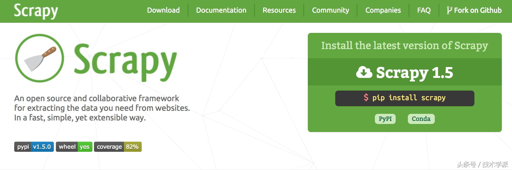

# 8个最高效的Python爬虫框架，你用过几个？

## Scrapy

Scrapy是一个为了爬取网站数据，提取结构性数据而编写的应用框架。 可以应用在包括数据挖掘，信息处理或存储历史数据等一系列的程序中。。用这个框架可以轻松爬下来如亚马逊商品信息之类的数据。

项目地址: [https://scrapy.org/](https://scrapy.org/)

## PySpider

pyspider 是一个用python实现的功能强大的网络爬虫系统，能在浏览器界面上进行脚本的编写，功能的调度和爬取结果的实时查看，后端使用常用的数据库进行爬取结果的存储，还能定时设置任务与任务优先级等。

项目地址: [https://github.com/binux/pyspider](https://github.com/binux/pyspider)

## Crawley

Crawley可以高速爬取对应网站的内容，支持关系和非关系数据库，数据可以导出为JSON、XML等。

项目地址: [http://project.crawley-cloud.com/](http://project.crawley-cloud.com/)

## Portia

Portia是一个开源可视化爬虫工具，可让您在不需要任何编程知识的情况下爬取网站！简单地注释您感兴趣的页面，Portia将创建一个蜘蛛来从类似的页面提取数据。

项目地址：[https://github.com/scrapinghub/portia](https://github.com/scrapinghub/portia)

## Newspaper

Newspaper可以用来提取新闻、文章和内容分析。使用多线程，支持10多种语言等。

项目地址：[https://github.com/codelucas/newspaper](https://github.com/codelucas/newspaper)

## Beautiful Soup

Beautiful Soup 是一个可以从HTML或XML文件中提取数据的Python库.它能够通过你喜欢的转换器实现惯用的文档导航,查找,修改文档的方式.Beautiful Soup会帮你节省数小时甚至数天的工作时间。

项目地址：[https://www.crummy.com/software/BeautifulSoup/bs4/doc/](https://www.crummy.com/software/BeautifulSoup/bs4/doc/)

## Grab

Grab是一个用于构建Web刮板的Python框架。借助Grab，您可以构建各种复杂的网页抓取工具，从简单的5行脚本到处理数百万个网页的复杂异步网站抓取工具。Grab提供一个API用于执行网络请求和处理接收到的内容，例如与HTML文档的DOM树进行交互。

项目地址：[http://docs.grablib.org/en/latest/#grab-spider-user-manual](http://docs.grablib.org/en/latest/#grab-spider-user-manual)

## Cola

Cola是一个分布式的爬虫框架，对于用户来说，只需编写几个特定的函数，而无需关注分布式运行的细节。任务会自动分配到多台机器上，整个过程对用户是透明的。

项目地址：[https://github.com/chineking/cola](https://github.com/chineking/cola)

## Python 爬虫项目

[23个Python爬虫开源项目代码：爬取微信、淘宝、豆瓣、知](https://ask.julyedu.com/article/323)

[scrapy框架的使用方法](https://blog.csdn.net/guifei010/article/details/79415531)

[使用python抓取京东全站数据（商品，店铺，分类，评论）](https://blog.csdn.net/Kandy_Ye/article/details/70183110)

[小白进阶之Scrapy第一篇](https://cuiqingcai.com/3472.html)

[基于 Python 实现微信公众号爬虫](https://juejin.im/book/5a157c155188254a701eb3c1)
