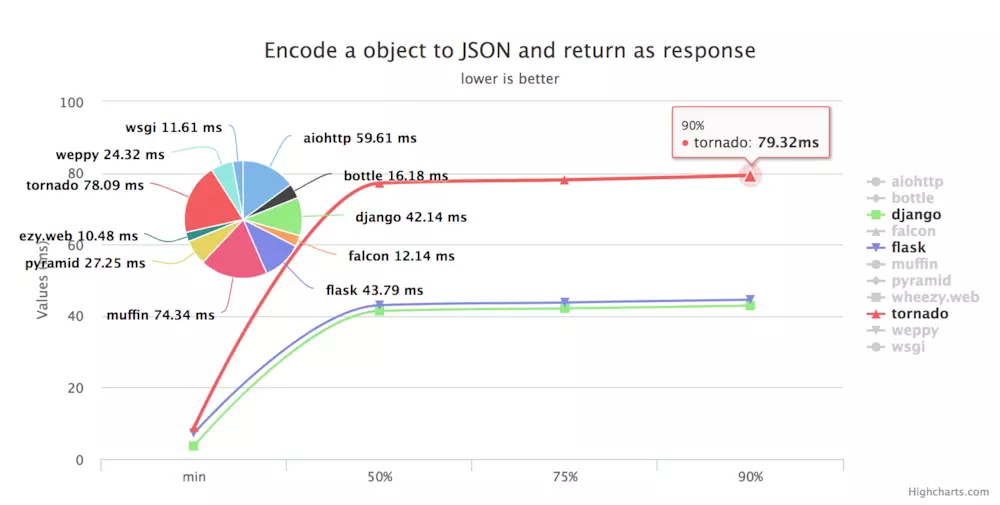
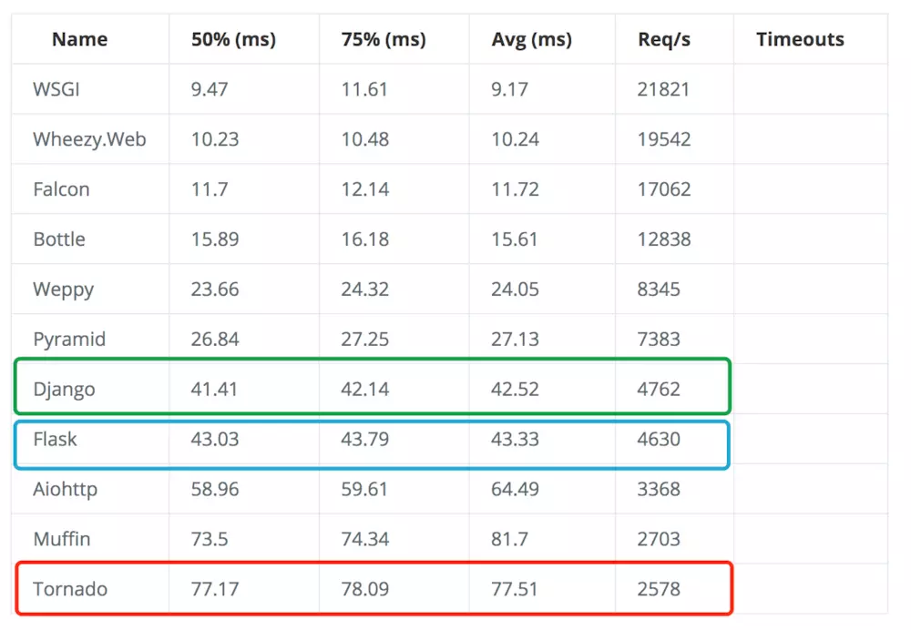
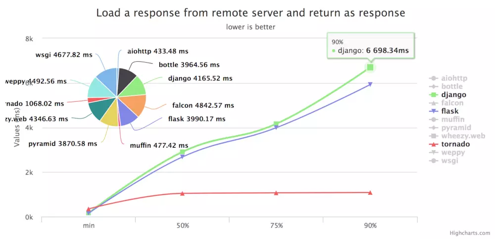
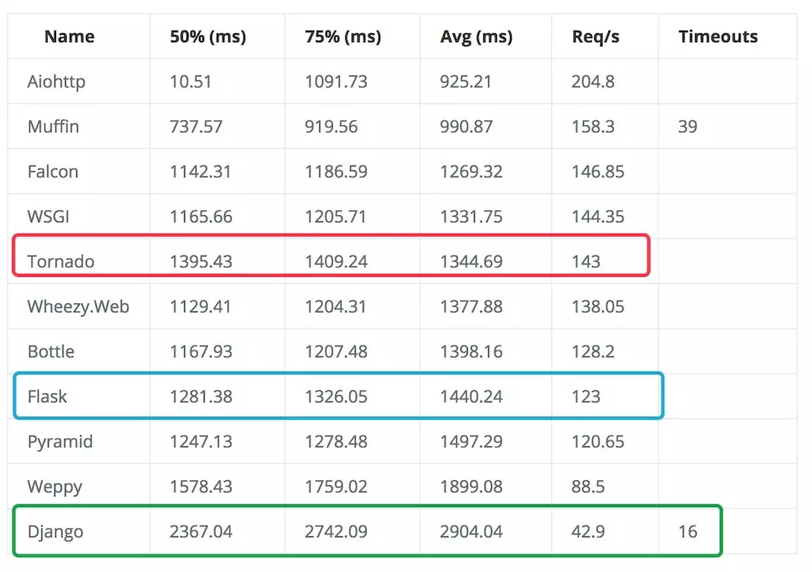

# Python Web 三大主流框架

## Python 语言能够做什么

Python语言适用性广、简单易懂，在各领域中全能发展：图形处理、数学处理、文本处理、数据库编程、网络编程、Web编程、多媒体应用、pymo引擎、黑客编程、爬虫编写、人工智能等

Google 的tenserflow也是使用Python作为上层开发语言,学习什么语言并不重要，重要的是能够使用语言来完成自己的想法。

## Python Web 目前主流的框架主要有三大框架。各有优势:

!!! info "Flask、Django、Tornado"

    * Django:大而全使用的组合:`Django/Flask + Celery + Redis/Memchaned/RabbitMQ`
    * Flask：小而精
    * Tornado：高性能，需要自己处理的东西比较多

这里使用 2016 年 6 月 9 日的报告数据： [Python's Web Framework Benchmarks](http://klen.github.io/py-frameworks-bench/)。本文仅关注目前最常用的三大 Python 框架：Django、 Flask 以及 Tornado。

!!! info "报告主要比较三点："

    * JSON：序列化一个对象，并返回一个 json。
    * 远程性能：从远程服务器上返回 http response 的时间
    * 数据库性能：使用 ORM（对象关系映射）从数据库获取数据，并渲染到模板上的时间

### 最基本的 json 测试：Django 与 Flask 占优

单纯在本地测试 json 的序列化，Django 完成一次 json 序列化的平均时间 42.52 毫秒，每秒请求量 4762 次。Flask 在此项测试中，与 Django 的比较不相上下，Flask 平均时间 43.33 毫秒，每秒请求量 4630 次。Tornado 完成 json 序列化的平均时间高达 77.51 毫秒，是所有框架中耗时最长的，每秒请求数是 2578 次，也是低于 Django 与 Flask 的水准。这仅仅说明框架在本地处理 json 的速度。框架还涉及 http request/response 以及数据库的读写，后面还需要综合来分析框架的性能。

### 处理远程 http 请求的能力：Tornado 占绝对优势

从这项测试开始，Tornado 的强悍开始显现。Tornado 完成 http 请求的平均时间是 1.04 秒，而 Flask 是 3.34 秒，Django 是 3.48 秒，http 响应速度 Tornado 比 Flask 以及 Django 快三倍。
值得注意是，如果综合考虑 http 相应速度以及json 处理速度，如果把两项指标的平均时间相加：Tornado 耗时 1114.48 毫秒，Flask 是 3387.60 毫秒，Django 是 3519.88 毫秒。
Tornado 的好成绩得益于其自带的异步特性，而 Django 与 Flask 是同步框架，在处理请求时性能受限。但是实际使用中，一般是 `Django/Flask + Celery + Redis/Memchaned/RabbitMQ` 的模式，由此带上了异步处理的能力。

### 数据库与模板处理性能：Tornado 与 Flask 旗鼓相当

Django 饱受诟病的地方就是 Django ORM 确实很慢，加上模板处理时间，Django 的平均时间 2904.04 毫秒，每秒处理请求量 42.9 次。然而 Django 的大部分功能是建立在其 Django ORM 基础上，比如 models, admin, forms 甚至第三方框架 django-rest-framework。Django 的开发效率与维护非常棒，然而 Django ORM 深度绑定了该框架，如果你需要把 Django ORM 换成其它轮子，那么也意味着 Django 的诸多优秀特性将从此告别。
Flask 事实上的 ORM 是 SQLAlchemy，根据[董伟明](https://book.douban.com/subject/26852057/)的估计，SQLAlchemy 比 MySQLdb 的耗时多 5% 左右，所以是性能相当不错的数据库 ORM。得益于 SQLAlchemy 的优异性能，Flask 的每秒处理请求数为 123 次，平均处理时间 1440.24 秒，与 Tornado 性能相当。
Tornado 的每秒处理请求数为 143 次，平均处理时间 1344.69 秒。对于数据库与模板的处理，Tornado 与 Flask 不相上下。

Django：Python 界最全能的 web 开发框架，battery-include 各种功能完备，可维护性和开发速度一级棒。常有人说 Django 慢，其实主要慢在 Django ORM 与数据库的交互上，所以是否选用 Django，取决于项目对数据库交互的要求以及各种优化。而对于 Django 的同步特性导致吞吐量小的问题，其实可以通过 Celery 等解决，倒不是一个根本问题。Django 的项目代表：Instagram，Guardian。

Flask：微框架的典范，号称 Python 代码写得最好的项目之一。Flask 的灵活性，也是双刃剑：能用好 Flask 的，可以做成 Pinterest，用不好就是灾难（显然对任何框架都是这样）。Flask 虽然是微框架，但是也可以做成规模化的 Flask。加上 Flask 可以自由选择自己的数据库交互组件（通常是 Flask-SQLAlchemy），而且加上 celery +redis 等异步特性以后，Flask 的性能相对 Tornado 也不逞多让，也许Flask 的灵活性可能是某些团队更需要的。

Tornado：天生异步，性能强悍是 Tornado 的名片，然而 Tornado 相比 Django 是较为原始的框架，诸多内容需要自己去处理。当然，随着项目越来越大，框架能够提供的功能占比越来越小，更多的内容需要团队自己去实现，而大项目往往需要性能的保证，这时候 Tornado 就是比较好的选择。Tornado项目代表：知乎。
