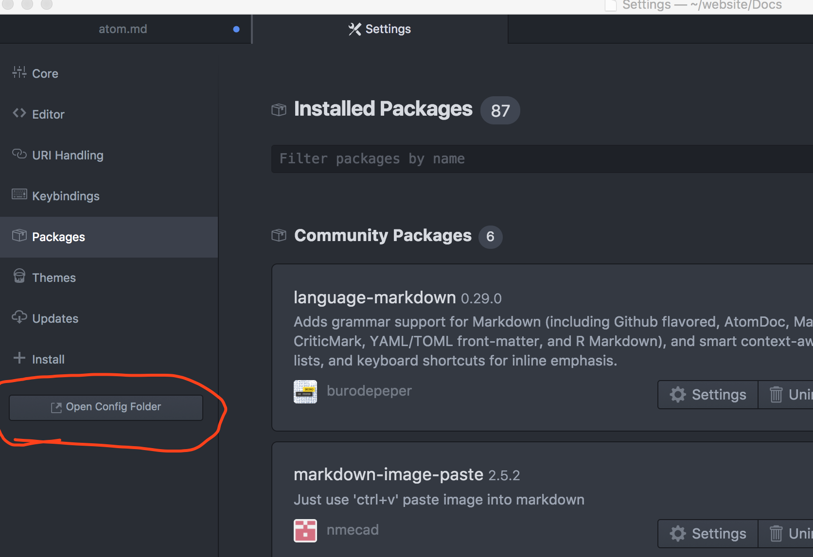
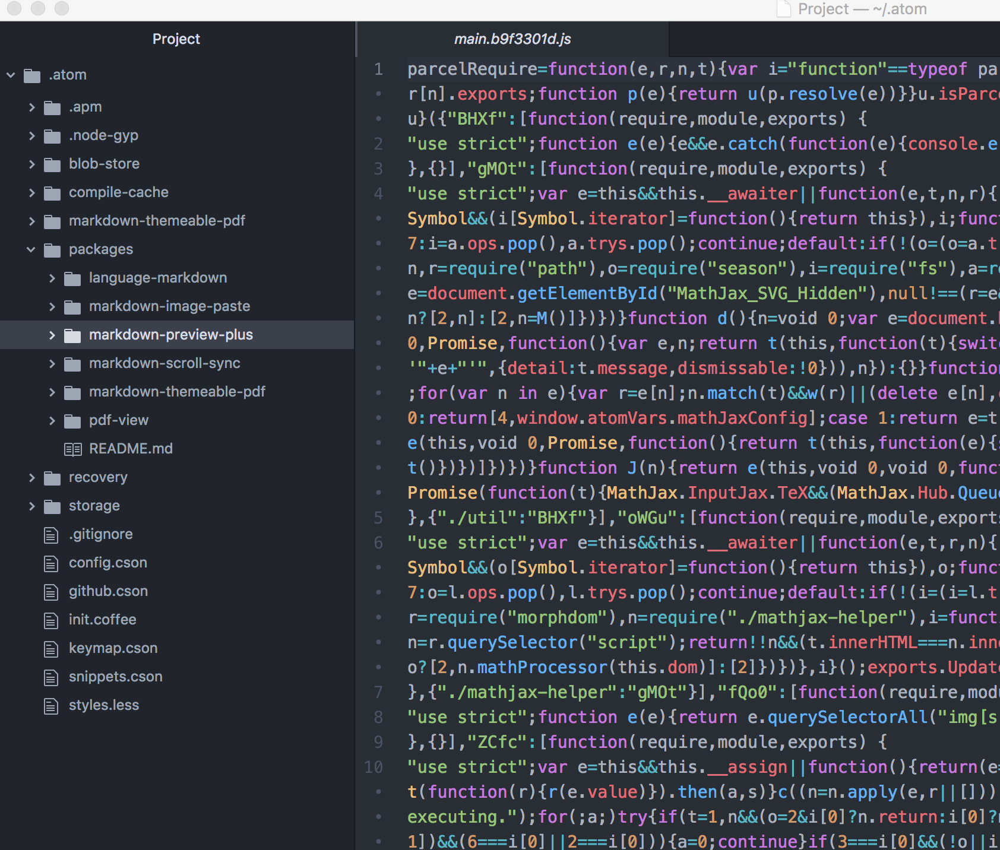
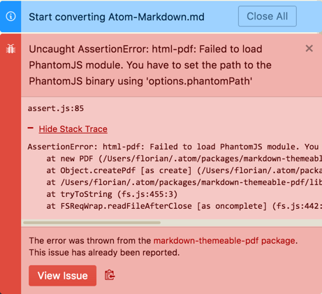

# Atom使用总结
Atom 官网[Atom][1]:

Atom Mac package 安装目录:

```
/Users/cangck/.atom/packages
```
[atom、Api][2] 文档路径:
Atom 讨论社区[atom.io/docs][3]

Atom 文档[flight-manual.atom.io/][4]

Atom Github使用[Github][5]

Proxy and Firewall Settings
```sh
apm config set https-proxy YOUR_PROXY_ADDRESS
```

If you are using a HTTP(S) proxy you can configure apm to use it by running:
```sh
apm config set https-proxy YOUR_PROXY_ADDRESS
```
You can run apm config get https-proxy to verify it has been set correctly.

Atom 包管理工具的使用:
```sh
apm help install
```


## atom软件整体配置:
cmd+,打开Atom设置界面:

该目录下包含了所有的Atom的配置:


## Atom快捷命令:
cmd-shift-p:打开命令面板输入需要执行的命令：
Atom Selections
Text selections in Atom support a number of actions, such as scoping deletion, indentation and search actions, and marking text for actions such as quoting and bracketing.

Selections mirror many of the movement commands. They're actually exactly the same keybindings as the movement commands, but with a Shift key added in.

* Shift+Up or Ctrl+Shift+P - Select up
* Shift+Down or Ctrl+Shift+N - Select down
* Shift+Left or Ctrl+Shift+B - Select previous character
* Shift+Right or Ctrl+Shift+F - Select next character
* Alt+Shift+Left or Alt+Shift+B - Select to beginning of word
* Alt+Shift+Right or Alt+Shift+F - Select to end of word
* Cmd+Shift+Right or Ctrl+Shift+E - Select to end of line
* Cmd+Shift+Left or Ctrl+Shift+A - Select to first character of line
* Cmd+Shift+Up - Select to top of file
* Cmd+Shift+Down - Select to bottom of file
In addition to the cursor movement selection commands, there are also a few commands that help with selecting specific areas of content.

* Cmd+A - Select the entire contents of the file
* Cmd+L - Select the entire line
* Ctrl+Shift+W - Select the current word

## Atom markdown 编辑器配置:

Atom的Markdown插件，基本上满足了我对一个Markdown编辑器的所有幻想，实时渲染、同步滚动，公式、代码、图片、表格的快捷操作与支持，以及pdf文件导出、预览等。

1.增强预览(markdown-preview-plus)
Atom自带的Markdown预览插件markdown-preview功能比较简单，markdown-preview-plus对其做了功能扩展和增强。
```
支持预览实时渲染。(Ctrl + Shift + M)
支持Latex公式。(Ctrl + Shift + X)
```
注:使用该插件前，需要先禁用markdown-preview

2.同步滚动(markdown-scroll-sync)
同步滚动是Markdown编辑器的必备功能，方便翻阅文档修改时能快速定位到预览的位置。

markdown-scroll-sync不仅支持同步滚动，在光标位置发生变更时也会同步滚动，这个功能在很多Markdown编辑器中不具备。

3.代码增强(language-markdown)
一般的Markdown编辑器提供了代码着色等基本功能，language-markdown除了能给代码着色，还提供了快捷的代码片段生成等功能。

4图片粘贴(markdown-image-paste)
图片功能支持的好坏直接决定了我是否选择使用一个Markdown编辑器。也有不少编辑器和在线的图床绑定，但是这种方式受限于网络。虽然Markdown支持插入本地图片，但是每次插入新图片都是一堆重复操作：截图－命名－保存－插入。markdown-image-paste将这些操作一步完成：

使用截图工具将图片复制到系统剪切板。
在Markdown新起一行输入文件名。
Ctrl + V 会自动把图片保存到Markdown文件相同目录下(因此要求Markdown文件应该先保存)，并命名为刚输入的文件名，同时在刚才输入文件名行处生成img标签。

4.表格编辑(markdown-table-editor)
一直对Markdown的table语法很无爱，直到遇到了markdown-table-editor，这操作效率简直炸了！文字已经不能表达我的激动之情了，直接看图吧。

5.pdf导出(markdown-themeable-pdf、pdf-view)
不少Markdown编辑器都会提供pdf导出功能，甚至将其作为收费功能。而Atom的markdown-themeable-pdf、pdf-view插件可以轻松实现pdf导出和预览功能。

安装markdown-themeable-pdf时遇到了一些坑，在此分享一下：

由于GFW的问题，导致该插件使用的phantomjs模块无法安装成功，从而导出pdf报告错误。


解决办法是：

从官网下载phantomjs二进制安装包：http://phantomjs.org/download.html
解压下载的phantomjs-2.1.1-macosx.zip压缩文件。
添加index.js文件到解压后的目录。
将整个目录的内容拷贝到：~/.atom/packages/markdown-themeable-pdf/node_modules/phantomjs-prebuilt，注意目录phantomjs-2.1.1-macosx被重命名为phantomjs-prebuilt
重启Atom，右键->Markdown to PDF即可，生成的pdf文件在Markdown文件同目录。
其中index.js文件内容为：
```javascript
module.exports = {
  path : __dirname + '/bin/phantomjs'
}
```
## Link


[1]:https://atom.io/
[2]:https://atom.io/docs
[3]:https://atom.io/docs
[4]:https://flight-manual.atom.io/
[5]:https://flight-manual.atom.io/using-atom/sections/github-package/
